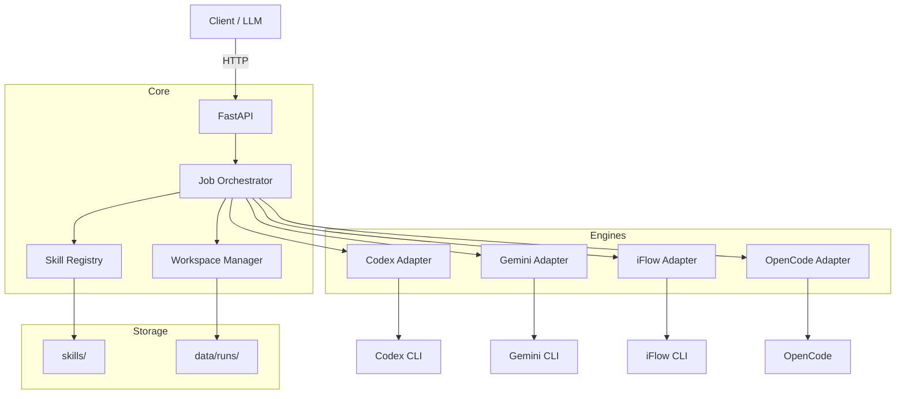

<p align="center">
  
</p>

<h1 align="center">Skill Runner</h1>

<p align="center">
  <strong>A unified execution framework for AI agent skills</strong>
</p>

<p align="center">
  <a href="https://github.com/leike0813/Skill-Runner/releases"></a>
  <a href="https://www.python.org/"></a>
  <a href="LICENSE"></a>
  <a href="https://hub.docker.com/r/leike0813/skill-runner"></a>
</p>

<p align="center">
  <a href="README_CN.md">中文</a> ·
  <a href="README_FR.md">Français</a> ·
  <a href="README_JA.md">日本語</a>
</p>

---

Skill Runner wraps mature AI agent CLIs — **Codex**, **Gemini CLI**, **iFlow CLI**, and **OpenCode** — behind a unified Skill protocol, providing deterministic execution, structured artifact management, and a built-in web admin UI.

## ✨ Highlights

<table>
<tr>
<td align="center" width="25%"><strong>🧩 Pluggable Skills</strong><br/>Drop-in skill packages<br/><sub>Schema-validated I/O</sub></td>
<td align="center" width="25%"><strong>🤖 Multi-Engine</strong><br/>Codex · Gemini · iFlow · OpenCode<br/><sub>Unified adapter protocol</sub></td>
<td align="center" width="25%"><strong>🔄 Dual Mode</strong><br/>Auto &amp; Interactive execution<br/><sub>Multi-turn conversations</sub></td>
<td align="center" width="25%"><strong>📦 Structured Output</strong><br/>JSON + artifacts + bundle<br/><sub>Isolated, contract-driven runs</sub></td>
</tr>
</table>

## 🧩 Pluggable Skill Design

Skill Runner's core advantage is its **pluggable skill architecture** — every automation task is packaged as a self-contained, engine-agnostic skill that can be installed, shared, and executed without modification.

### What is a Skill?

Skill Runner skills are built on the [Open Agent Skills](https://agentskills.io) standard — the same format used by Claude Code, Codex CLI, Cursor, and more.
Skill Runner extends this standard into an **AutoSkill** superset by adding an execution contract (`runner.json`) and schema validation files:

```
my-skill/
├── SKILL.md                 # Prompt instructions (Open Agent Skills standard)
├── assets/
│   ├── runner.json          # Execution contract (Skill Runner extension)
│   ├── input.schema.json    # Input schema (JSON Schema)
│   ├── parameter.schema.json
│   └── output.schema.json   # Output schema — validated after execution
├── references/              # Reference documents (optional)
└── scripts/                 # Helper scripts (optional)
```

> Any standard Open Agent Skills package (a folder with `SKILL.md`) can run on Skill Runner.
> Adding `assets/runner.json` + schemas promotes it to an **AutoSkill** — enabling automatic execution, schema validation, and reproducible results.

### Why It Matters

- **Standards-based**: Compatible with the Open Agent Skills ecosystem — skills are portable across platforms.
- **Engine-agnostic**: Write once, run on any supported engine. The same skill works with Codex, Gemini, iFlow, or OpenCode.
- **Schema-driven I/O**: Input, parameter, and output are all defined by JSON Schema — the runner validates automatically.
- **Isolated execution**: Each run gets its own workspace with standardized I/O contracts — no cross-run interference.
- **Zero-integration install**: Drop a skill directory into `skills/` (or upload via API/UI) and it's immediately available.
- **Cache reuse**: Identical inputs and parameters can reuse previous results — no redundant engine invocations.

### Execution Modes

Every skill declares its supported execution modes in `runner.json`:

- **`auto`** — Fully autonomous. The engine runs the prompt to completion without human intervention.
- **`interactive`** — Multi-turn conversation. The engine may pause to ask questions; the user (or an upstream system) provides replies via the interaction API.

> 📖 Full specification: [AutoSkill Package Guide](docs/autoskill_package_guide.md) · [File Protocol](docs/file_protocol.md)

## 🚀 Quick Start

### Docker (recommended)

```bash
mkdir -p skills data
docker compose up -d --build
```

- **API**: http://localhost:9813/v1
- **Admin UI**: http://localhost:9813/ui

Or run independently:

```bash
docker run --rm -p 9813:9813 -p 17681:17681 \
  -v "$(pwd)/skills:/app/skills" \
  -v skillrunner_cache:/opt/cache \
  leike0813/skill-runner:latest
```

### Local Deployment

```bash
# Linux / macOS
./scripts/deploy_local.sh

# Windows (PowerShell)
.\scripts\deploy_local.ps1
```

Prerequisites:

- `uv`
- `Node.js` and `npm`
- `ttyd` (optional, required only for Inline TUI in `/ui/engines`)

Plugin-oriented control CLI:

```bash
# Linux / macOS
./scripts/skill-runnerctl status --mode local --json
./scripts/skill-runnerctl up --mode local --json
./scripts/skill-runnerctl down --mode local --json
sh ./scripts/skill-runner-uninstall.sh --json
sh ./scripts/skill-runner-uninstall.sh --clear-data --clear-agent-home --json

# Windows (PowerShell)
.\scripts\skill-runnerctl.ps1 status --mode local --json
.\scripts\skill-runner-uninstall.ps1 -Json
.\scripts\skill-runner-uninstall.ps1 -ClearData -ClearAgentHome -Json
```

`skill-runnerctl` local mode defaults to a platform local root (`$HOME/.local/share/skill-runner` on Linux/macOS, `%LOCALAPPDATA%\SkillRunner` on Windows), with data under `<LocalRoot>/data`.  
`skill-runnerctl` local mode default port is `29813` with fallback scan `29813-29823` (configurable via `SKILL_RUNNER_LOCAL_PORT` / `SKILL_RUNNER_LOCAL_PORT_FALLBACK_SPAN`).  
Service general default port remains `9813` (for `deploy_local.*` / container entrypoint when `PORT` is not set).  
`deploy_local.*` keeps its existing `PROJECT_ROOT/data` default unless overridden by env vars.

Release installers (for fixed-tag assets + SHA256 verification):

```bash
# Linux / macOS
./scripts/skill-runner-install.sh --version v0.4.3

# Windows (PowerShell)
.\scripts\skill-runner-install.ps1 -Version v0.4.3
```

The installers download these GitHub Release assets for the selected tag:

- `skill-runner-<version>.tar.gz`
- `skill-runner-<version>.tar.gz.sha256`

Deploy directly from a release compose asset:

```bash
VERSION=v0.4.3
curl -fL -o docker-compose.release.yml \
  "https://github.com/leike0813/Skill-Runner/releases/download/${VERSION}/docker-compose.release.yml"
curl -fL -o docker-compose.release.yml.sha256 \
  "https://github.com/leike0813/Skill-Runner/releases/download/${VERSION}/docker-compose.release.yml.sha256"
# Optional integrity check:
sha256sum -c docker-compose.release.yml.sha256
docker compose -f docker-compose.release.yml up -d
```

Containerized harness entrypoint:

- TUI Mode
```bash
./scripts/agent_harness_container.sh start codex
```

- Non-interactive Mode (or requiring parameter passthrough)
```bash
./scripts/agent_harness_container.sh start codex -- --json --full-auto "hello"
```

<details>
<summary>📋 <strong>Advanced Configuration</strong></summary>

#### Environment Variables

| Variable | Description | Default |
|----------|-------------|---------|
| `SKILL_RUNNER_DATA_DIR` | Run data directory | `skill-runnerctl`: `<LocalRoot>/data`; `deploy_local.*`: `data/` |
| `SKILL_RUNNER_AGENT_HOME` | Isolated agent config home | auto |
| `SKILL_RUNNER_AGENT_CACHE_DIR` | Agent cache root | auto |
| `SKILL_RUNNER_NPM_PREFIX` | Managed CLI install prefix | auto |
| `SKILL_RUNNER_RUNTIME_MODE` | `local` or `container` | auto |
| `SKILL_RUNNER_LOCAL_PORT` | `skill-runnerctl` local default port | `29813` |
| `SKILL_RUNNER_LOCAL_PORT_FALLBACK_SPAN` | `skill-runnerctl` local fallback span | `10` |

#### UI Basic Auth

```bash
docker run --rm -p 9813:9813 -p 17681:17681 \
  -v "$(pwd)/skills:/app/skills" \
  -v skillrunner_cache:/opt/cache \
  -e UI_BASIC_AUTH_ENABLED=true \
  -e UI_BASIC_AUTH_USERNAME=admin \
  -e UI_BASIC_AUTH_PASSWORD=change-me \
  leike0813/skill-runner:latest
```

</details>

## 🖥️ Web Admin UI

Access the built-in management interface at `/ui`:

- **Skill Browser** — View installed skills, inspect package structure and files
- **Engine Management** — Monitor engine status, trigger upgrades, view logs
- **Model Catalog** — Browse and manage engine model snapshots
- **Inline TUI** — Launch engine terminals directly in the browser (single managed session, requires `ttyd`)

## 🔑 Engine Authentication

Skill Runner provides multiple authentication methods, from fully managed to manual.

### Recommended: OAuth Proxy (via Admin UI)

The preferred approach — authenticate engines through the built-in OAuth Proxy in the Admin UI (`/ui/engines`):

1. Open the engine management page.
2. Select an engine and choose **OAuth Proxy** as the auth method.
3. Complete the browser-based OAuth flow.
4. Credentials are automatically stored and managed.

This also works during active runs: if an engine requires authentication mid-execution, the frontend can present an **in-session auth challenge** — the run pauses, the user completes OAuth, and execution resumes automatically.

> ⚠️ **High-risk notice (OpenCode + Google/Antigravity):**  
> For `opencode` with `provider_id=google` (Antigravity path, using third-party plugin `opencode-antigravity-auth`), both `oauth_proxy` and `cli_delegate` are considered a high-risk third-party login route. This path may violate Google policy and could lead to account suspension.

### Alternative: CLI Delegate

CLI Delegate orchestration launches the engine's native login flow. Compared to OAuth Proxy, it offers:
- **Native fidelity** — uses the engine's built-in auth exactly as designed.
- **Lower risk** — no proxy layer; credentials flow directly to the engine.

Available from the same Admin UI engine management interface.

### Other Methods

<details>
<summary>Click to expand legacy methods</summary>

**Inline TUI** — The Admin UI embeds engine terminals (`/ui/engines`) where you can run CLI login commands directly in the browser (requires `ttyd`).

**Container CLI login**:
```bash
docker exec -it <container_id> /bin/bash
# Run the CLI login flow inside the container
```

**Import credential files via UI** — In `/ui/engines`, open the engine auth menu and choose **Import Credentials**.
Skill Runner validates the uploaded files and writes them into the isolated Agent Home paths automatically.

</details>

## 📡 API & Client Design

```bash
# List available skills
curl -sS http://localhost:9813/v1/skills

# Create a job
curl -sS -X POST http://localhost:9813/v1/jobs \
  -H "Content-Type: application/json" \
  -d '{
    "skill_id": "demo-bible-verse",
    "engine": "gemini",
    "parameter": { "language": "en" },
    "model": "gemini-3-pro-preview"
  }'

# Get results
curl -sS http://localhost:9813/v1/jobs/<request_id>/result
```

### Building a Frontend

Skill Runner exposes **two SSE channels** for real-time run observation:

| Channel | Endpoint | Purpose |
|---------|----------|---------|
| **Chat** | `GET /v1/jobs/{id}/chat?cursor=N` | Pre-projected chat bubbles — ideal for conversation UIs |
| **Events** | `GET /v1/jobs/{id}/events?cursor=N` | Full FCMP protocol events — ideal for admin/debugger tools |

Both channels support **cursor-based reconnection** and **history queries** (`/chat/history`, `/events/history`) for disconnect compensation.

The typical frontend flow:

```
POST /v1/jobs → (optional upload) → SSE /chat → render bubbles
                                   ↕ waiting_user → POST /interaction/reply
                                   → terminal → GET /result + /bundle
```

> 📖 Full frontend design guide: [Frontend Design Guide](docs/developer/frontend_design_guide.md)
> 📖 API reference: [API Reference](docs/api_reference.md)

## 🏗️ Architecture



**Execution Flow**: `POST /v1/jobs` → input upload → engine execution → output validation → `GET /v1/jobs/{id}/result`

## 🔌 Supported Engines

| Engine | Package |
|--------|---------|
| **Codex** | `@openai/codex` |
| **Gemini CLI** | `@google/gemini-cli` |
| **iFlow CLI** | `@iflow-ai/iflow-cli` |
| **OpenCode** | `opencode-ai` |

> All engines support both **Auto** and **Interactive** execution modes.

## 📖 Documentation

| Document | Description |
|----------|-------------|
| [Architecture Overview](docs/architecture_overview.md) | System design and component map |
| [AutoSkill Package Guide](docs/autoskill_package_guide.md) | Building skill packages |
| [Adapter Design](docs/adapter_design.md) | Engine adapter protocol (5-phase pipeline) |
| [Execution Flow](docs/execution_flow.md) | End-to-end run lifecycle |
| [API Reference](docs/api_reference.md) | REST API specification |
| [Frontend Design Guide](docs/developer/frontend_design_guide.md) | Building frontend clients |
| [Containerization](docs/containerization.md) | Docker deployment guide |
| [Zotero Plugin Integration Contract](docs/zotero_plugin_integration_contract.md) | One-click deploy and local lease lifecycle contract |
| [Developer Guide](docs/dev_guide.md) | Contributing and development |

## ⚠️ Disclaimer

Codex, Gemini CLI, iFlow CLI, and OpenCode are fast-evolving tools. Their config formats, CLI behavior, and API details may change in short cycles. If you encounter compatibility issues with newer CLI versions, please [open an issue](https://github.com/leike0813/Skill-Runner/issues).

---

<p align="center">
  <sub>Made with ❤️ by <a href="https://github.com/leike0813">Joshua Reed</a></sub>
</p>
