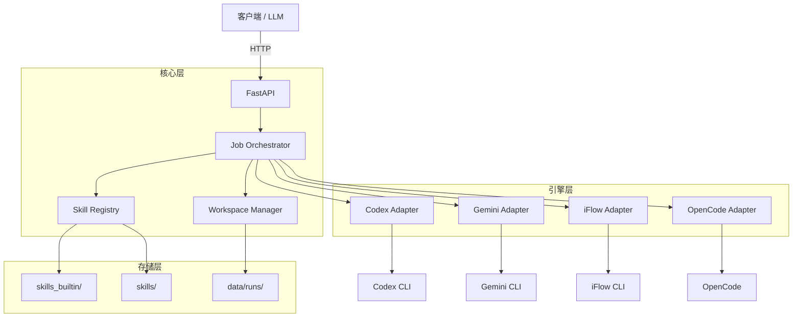

<p align="center">
  
</p>

<h1 align="center">Skill Runner</h1>

<p align="center">
  <strong>AI Agent 技能统一执行框架</strong>
</p>

<p align="center">
  <a href="https://github.com/leike0813/Skill-Runner/releases"></a>
  <a href="https://www.python.org/"></a>
  <a href="LICENSE"></a>
  <a href="https://hub.docker.com/r/leike0813/skill-runner"></a>
</p>

<p align="center">
  <a href="README.md">English</a> ·
  <a href="README_FR.md">Français</a> ·
  <a href="README_JA.md">日本語</a>
</p>

---

Skill Runner 将成熟的 AI Agent CLI 工具 — **Codex**、**Gemini CLI**、**iFlow CLI** 与 **OpenCode** — 统一封装在标准化的 Skill 协议之下，提供确定性执行、结构化产物管理和内置 Web 管理界面。

## ✨ 核心亮点

<table>
<tr>
<td align="center" width="25%"><strong>🧩 可插拔技能</strong><br/>即插即用的技能包<br/><sub>Schema 驱动的输入输出</sub></td>
<td align="center" width="25%"><strong>🤖 多引擎</strong><br/>Codex · Gemini · iFlow · OpenCode<br/><sub>统一适配协议</sub></td>
<td align="center" width="25%"><strong>🔄 双模式</strong><br/>全自动 &amp; 交互式执行<br/><sub>支持多轮对话</sub></td>
<td align="center" width="25%"><strong>📦 结构化输出</strong><br/>JSON + 产物 + Bundle<br/><sub>隔离的合同驱动执行</sub></td>
</tr>
</table>

## 🧩 可插拔技能设计

Skill Runner 的核心优势在于其**可插拔技能架构** — 每个自动化任务都被打包为自包含、引擎无关的技能包，可以直接安装、共享和执行，无需任何修改。

### 什么是 Skill？

Skill Runner 的技能基于 [Open Agent Skills](https://agentskills.io) 开放标准构建 — 与 Claude Code、Codex CLI、Cursor 等工具使用相同的格式。
Skill Runner 在此标准上扩展为 **AutoSkill** 超集，增加了执行合同（`runner.json`）和 Schema 校验文件：

```
my-skill/
├── SKILL.md                 # 提示词指令（Open Agent Skills 标准）
├── assets/
│   ├── runner.json          # 执行合同（Skill Runner 扩展）
│   ├── input.schema.json    # 输入 schema（JSON Schema）
│   ├── parameter.schema.json
│   └── output.schema.json   # 输出 schema — 执行后自动校验
├── references/              # 参考文档（可选）
└── scripts/                 # 辅助脚本（可选）
```

> 任何标准的 Open Agent Skills 包（包含 `SKILL.md` 的文件夹）都可以在 Skill Runner 上运行。
> 添加 `assets/runner.json` + Schema 文件即可升级为 **AutoSkill** — 支持自动执行、Schema 校验和可复现结果。

### 设计优势

- **标准化**：兼容 Open Agent Skills 生态 — 技能可跨平台移植。
- **引擎无关**：一次编写，在任意支持的引擎上运行。同一个 Skill 可以在 Codex、Gemini、iFlow 或 OpenCode 上执行。
- **Schema 驱动的 I/O**：输入、参数和输出均由 JSON Schema 定义 — Runner 自动校验。
- **隔离执行**：每次 Run 拥有独立的工作区和标准化的输入输出合同 — 不存在跨 Run 干扰。
- **零集成安装**：将 Skill 目录放入用户目录 `skills/`（或通过 API/UI 上传）即可立即使用；内建 skills 位于 `skills_builtin/`。
- **缓存复用**：相同输入和参数可以复用已有结果 — 无需重复调用引擎。

### 执行模式

每个 Skill 在 `runner.json` 中声明其支持的执行模式：

- **`auto`** — 全自动模式：引擎将提示词执行到底，无需人工干预。
- **`interactive`** — 交互模式：引擎可能暂停并提出问题；用户（或上游系统）通过交互 API 提交回复。

> 📖 完整规范：[AutoSkill 构建指南](docs/autoskill_package_guide.md) · [文件协议](docs/file_protocol.md)

## 🚀 快速开始

### Docker（推荐）

```bash
mkdir -p data
docker compose up -d --build
```

- **API 地址**：http://localhost:8000/v1
- **管理界面**：http://localhost:8000/ui
- Docker Compose 默认使用 bind mount：`./skills:/app/skills`（用户 skills 目录）。
- 镜像内建 skills 固定在 `/app/skills_builtin`，不受该挂载路径覆盖。

或独立运行：

```bash
docker run --rm -p 8000:8000 -p 17681:17681 \
  -v "$(pwd)/skills:/app/skills" \
  -v skillrunner_cache:/opt/cache \
  leike0813/skill-runner:latest
```

### 本地部署

```bash
# Linux / macOS
./scripts/deploy_local.sh

# Windows (PowerShell)
.\scripts\deploy_local.ps1
```

本地部署依赖：

- `uv`
- `Node.js` 与 `npm`
- `ttyd`（可选，仅在 `/ui/engines` 使用内嵌 TUI 时需要）

容器化部署下的 harness 正式入口：

- TUI模式
```bash
./scripts/agent_harness_container.sh start codex
```

- 非交互模式（或需要透传参数）
```bash
./scripts/agent_harness_container.sh start codex -- --json --full-auto "hello"
```

<details>
<summary>📋 <strong>进阶配置</strong></summary>

#### 环境变量

| 变量 | 说明 | 默认值 |
|------|------|--------|
| `SKILL_RUNNER_DATA_DIR` | 运行数据目录 | `data/` |
| `SKILL_RUNNER_AGENT_HOME` | Agent 隔离配置目录 | 自动 |
| `SKILL_RUNNER_AGENT_CACHE_DIR` | Agent 缓存根目录 | 自动 |
| `SKILL_RUNNER_NPM_PREFIX` | 受管 CLI 安装前缀 | 自动 |
| `SKILL_RUNNER_RUNTIME_MODE` | `local` 或 `container` | 自动 |

#### UI Basic Auth

```bash
docker run --rm -p 8000:8000 -p 17681:17681 \
  -v "$(pwd)/skills:/app/skills" \
  -v skillrunner_cache:/opt/cache \
  -e UI_BASIC_AUTH_ENABLED=true \
  -e UI_BASIC_AUTH_USERNAME=admin \
  -e UI_BASIC_AUTH_PASSWORD=change-me \
  leike0813/skill-runner:latest
```

</details>

直接下载 release 版 compose 文件并部署：

```bash
VERSION=v0.4.3
curl -fL -o docker-compose.release.yml \
  "https://github.com/leike0813/Skill-Runner/releases/download/${VERSION}/docker-compose.release.yml"
curl -fL -o docker-compose.release.yml.sha256 \
  "https://github.com/leike0813/Skill-Runner/releases/download/${VERSION}/docker-compose.release.yml.sha256"
# 可选：完整性校验
sha256sum -c docker-compose.release.yml.sha256
docker compose -f docker-compose.release.yml up -d
```

## 🖥️ Web 管理界面

通过 `/ui` 访问内置管理界面：

- **Skill 浏览器** — 查看已安装技能，浏览包结构与文件内容
- **引擎管理** — 监控引擎状态，对未安装引擎执行安装、对已安装引擎触发升级，并查看任务日志
- **模型目录** — 浏览和管理引擎模型快照
- **内嵌 TUI** — 在浏览器中直接启动引擎终端（受控单会话，需要 `ttyd`）

## 🔑 引擎鉴权

Skill Runner 提供多种鉴权方式，从全托管到手动均可。

### 推荐方式：OAuth Proxy（通过管理 UI）

首选方案 — 通过管理 UI（`/ui/engines`）内置的 OAuth Proxy 进行鉴权：

1. 打开引擎管理页面。
2. 选择引擎，选择 **OAuth Proxy** 作为鉴权方式。
3. 完成基于浏览器的 OAuth 授权流程。
4. 凭据自动存储和管理。

这同样支持运行中的会话式鉴权：如果引擎在执行过程中需要鉴权，前端可以展示**会话内鉴权挑战** — Run 暂停，用户完成 OAuth，执行自动恢复。

> ⚠️ **高风险提示（OpenCode + Google/Antigravity）：**  
> 对于 `opencode` 且 `provider_id=google`（Antigravity 链路，使用第三方插件 `opencode-antigravity-auth`），`oauth_proxy` 和 `cli_delegate` 都属于高风险第三方登录路径。该链路可能违反 Google 政策，并可能导致账号被封禁。

### 备选方式：CLI Delegate

CLI Delegate（委托编排）启动引擎的原生登录流程。与 OAuth Proxy 相比：
- **原生保真** — 使用引擎内置的鉴权方式，完全原生。
- **更低风险** — 无代理层；凭据直接流向引擎。

同样在管理 UI 的引擎管理界面中可用。

### 其他方式

<details>
<summary>点击展开传统鉴权方式</summary>

**内嵌 TUI** — 管理 UI 内嵌了引擎终端（`/ui/engines`），可以直接在浏览器中运行 CLI 登录命令（需要 `ttyd`）。

**容器内 CLI 登录**：
```bash
docker exec -it <container_id> /bin/bash
# 在容器内运行对应 CLI 登录流程
```

**通过 UI 导入凭据文件** — 在 `/ui/engines` 的鉴权菜单中选择 **Import Credentials**。
服务会自动校验上传文件并写入隔离的 Agent Home 目标路径。

</details>

## 📡 API 与客户端设计

```bash
# 列出可用 Skill
curl -sS http://localhost:8000/v1/skills

# 创建任务
curl -sS -X POST http://localhost:8000/v1/jobs \
  -H "Content-Type: application/json" \
  -d '{
    "skill_id": "demo-bible-verse",
    "engine": "gemini",
    "parameter": { "language": "en" },
    "model": "gemini-3-pro-preview"
  }'

# 获取结果
curl -sS http://localhost:8000/v1/jobs/<request_id>/result
```

### 构建前端

Skill Runner 提供**双 SSE 通道**用于实时 Run 观测：

| 通道 | 端点 | 用途 |
|------|------|------|
| **Chat** | `GET /v1/jobs/{id}/chat?cursor=N` | 预投影的聊天气泡 — 适用于对话式 UI |
| **Events** | `GET /v1/jobs/{id}/events?cursor=N` | 完整 FCMP 协议事件 — 适用于管理/调试工具 |

两个通道均支持**基于 cursor 的重连**和**历史查询**（`/chat/history`、`/events/history`）以补偿断连。

典型的前端交互流程：

```
POST /v1/jobs → (可选上传) → SSE /chat → 渲染气泡
                            ↕ waiting_user → POST /interaction/reply
                            → terminal → GET /result + /bundle
```

> 📖 前端设计指南：[Frontend Design Guide](docs/developer/frontend_design_guide.md)
> 📖 API 参考：[API Reference](docs/api_reference.md)

## 🏗️ 系统架构



**执行流程**：`POST /v1/jobs` → 上传输入 → 引擎执行 → 输出校验 → `GET /v1/jobs/{id}/result`

## 🔌 支持的引擎

| 引擎 | 包名 |
|------|------|
| **Codex** | `@openai/codex` |
| **Gemini CLI** | `@google/gemini-cli` |
| **iFlow CLI** | `@iflow-ai/iflow-cli` |
| **OpenCode** | `opencode-ai` |

> 所有引擎均支持 **Auto** 和 **Interactive** 两种执行模式。

## 📖 文档导航

| 文档 | 说明 |
|------|------|
| [架构总览](docs/architecture_overview.md) | 系统设计与组件说明 |
| [AutoSkill 构建指南](docs/autoskill_package_guide.md) | Skill 包构建规范 |
| [适配器设计](docs/adapter_design.md) | 引擎适配协议（5 阶段管线） |
| [执行流程](docs/execution_flow.md) | 端到端 Run 生命周期 |
| [API 参考](docs/api_reference.md) | REST API 接口规范 |
| [前端设计指南](docs/developer/frontend_design_guide.md) | 构建前端客户端 |
| [容器化部署](docs/containerization.md) | Docker 部署指南 |
| [开发者指南](docs/dev_guide.md) | 贡献与开发说明 |

## ⚠️ 免责声明

Codex、Gemini CLI、iFlow CLI 和 OpenCode 目前迭代较快，配置格式、命令行为或接口细节可能在短时间内发生变化。如果你遇到与新版 CLI 的兼容性问题，请直接 [提交 Issue](https://github.com/leike0813/Skill-Runner/issues)。

---

<p align="center">
  <sub>Made with ❤️ by <a href="https://github.com/leike0813">Joshua Reed</a></sub>
</p>
