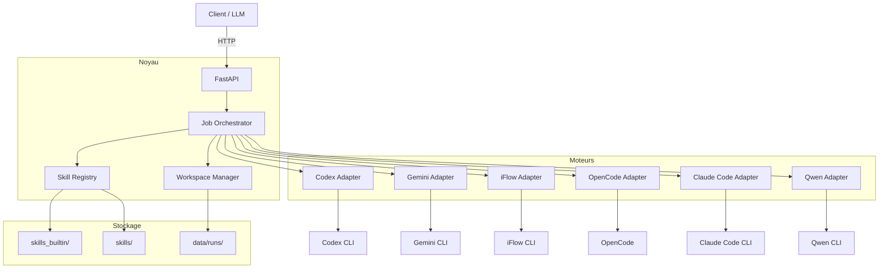

<p align="center">
  
</p>

<h1 align="center">Skill Runner</h1>

<p align="center">
  <strong>Framework d'exécution unifié pour les compétences d'agents IA</strong>
</p>

<p align="center">
  <a href="https://github.com/leike0813/Skill-Runner/releases"></a>
  <a href="https://www.python.org/"></a>
  <a href="LICENSE"></a>
  <a href="https://hub.docker.com/r/leike0813/skill-runner"></a>
</p>

<p align="center">
  <a href="README.md">English</a> ·
  <a href="README_CN.md">中文</a> ·
  <a href="README_JA.md">日本語</a>
</p>

---

Skill Runner encapsule des outils CLI d'agents IA matures — **Codex**, **Gemini CLI**, **iFlow CLI**, **OpenCode**, **Claude Code** et **Qwen** — derrière un protocole Skill unifié, offrant une exécution déterministe, une gestion structurée des artefacts et une interface d'administration web intégrée.

## ✨ Points Forts

<table>
<tr>
<td align="center" width="25%"><strong>🧩 Skills modulaires</strong><br/>Packages plug-and-play<br/><sub>E/S validées par schéma</sub></td>
<td align="center" width="25%"><strong>🤖 Multi-moteur</strong><br/>Codex · Gemini · iFlow · OpenCode · Claude Code · Qwen<br/><sub>Protocole d'adaptation unifié</sub></td>
<td align="center" width="25%"><strong>🔄 Double mode</strong><br/>Automatique &amp; Interactif<br/><sub>Conversations multi-tours</sub></td>
<td align="center" width="25%"><strong>📦 Sortie structurée</strong><br/>JSON + artefacts + bundle<br/><sub>Exécutions isolées par contrat</sub></td>
</tr>
</table>

## 🧩 Architecture de Skills Modulaires

L'avantage principal de Skill Runner est son **architecture de skills modulaires** — chaque tâche d'automatisation est empaquetée comme un skill autonome et indépendant du moteur, qui peut être installé, partagé et exécuté sans modification.

### Qu'est-ce qu'un Skill ?

Les skills de Skill Runner sont construits sur la norme [Open Agent Skills](https://agentskills.io) — le même format utilisé par Claude Code, Codex CLI, Cursor et d'autres.
Skill Runner étend cette norme en un surensemble **AutoSkill** en ajoutant un contrat d'exécution (`runner.json`) et des fichiers de validation par schéma :

```
my-skill/
├── SKILL.md                 # Instructions de prompt (norme Open Agent Skills)
├── assets/
│   ├── runner.json          # Contrat d'exécution (extension Skill Runner)
│   ├── input.schema.json    # Schéma d'entrée (JSON Schema)
│   ├── parameter.schema.json
│   └── output.schema.json   # Schéma de sortie — validé après exécution
├── references/              # Documents de référence (optionnel)
└── scripts/                 # Scripts auxiliaires (optionnel)
```

> Tout package Open Agent Skills standard (un dossier avec `SKILL.md`) peut s'exécuter sur Skill Runner.
> L'ajout de `assets/runner.json` + schémas le promeut en **AutoSkill** — permettant l'exécution automatique, la validation par schéma et des résultats reproductibles.

### Avantages

- **Basé sur les standards** : Compatible avec l'écosystème Open Agent Skills — les skills sont portables entre plateformes.
- **Indépendant du moteur** : Écrire une fois, exécuter sur n'importe quel moteur supporté.
- **E/S pilotées par schéma** : Entrée, paramètres et sortie définis par JSON Schema — validation automatique.
- **Exécution isolée** : Chaque exécution obtient son propre espace de travail avec des contrats d'E/S standardisés — aucune interférence entre exécutions.
- **Installation sans intégration** : Déposer un répertoire skill dans le répertoire utilisateur `skills/` (ou téléverser via API/UI) et il est immédiatement disponible. Les skills intégrés sont fournis dans `skills_builtin/`.
- **Réutilisation du cache** : Les entrées identiques peuvent réutiliser les résultats précédents.

### Modes d'exécution

Chaque skill déclare ses modes supportés dans `runner.json` :

- **`auto`** — Entièrement autonome. Le moteur exécute le prompt jusqu'à la fin sans intervention humaine.
- **`interactive`** — Conversation multi-tours. Le moteur peut se mettre en pause pour poser des questions ; l'utilisateur répond via l'API d'interaction.

> 📖 Spécification complète : [Guide AutoSkill](docs/autoskill_package_guide.md) · [Protocole de fichiers](docs/file_protocol.md)

## 🚀 Démarrage Rapide

### Docker (recommandé)

```bash
mkdir -p data
docker compose up -d --build
```

- **API** : http://localhost:9813/v1
- **Interface d'admin** : http://localhost:9813/ui
- Docker Compose utilise par défaut le bind mount `./skills:/app/skills` pour les skills utilisateur.
- Les skills intégrés de l'image sont fournis sous `/app/skills_builtin` et ne sont pas écrasés par ce chemin.

Ou exécution indépendante :

```bash
docker run --rm -p 9813:9813 -p 17681:17681 \
  -v "$(pwd)/skills:/app/skills" \
  -v skillrunner_cache:/opt/cache \
  leike0813/skill-runner:latest
```

### Déploiement local

```bash
# Linux / macOS
./scripts/deploy_local.sh

# Windows (PowerShell)
.\scripts\deploy_local.ps1
```

Prérequis du déploiement local :

- `uv`
- `Node.js` et `npm`
- `ttyd` (optionnel, requis uniquement pour le TUI intégré dans `/ui/engines`)

Entrée officielle du harness en déploiement conteneurisé :

- Mode TUI
```bash
./scripts/agent_harness_container.sh start codex
```

- Mode non interactif (ou nécessite le passage de paramètres)）
```bash
./scripts/agent_harness_container.sh start codex -- --json --full-auto "hello"
```

<details>
<summary>📋 <strong>Configuration avancée</strong></summary>

#### Variables d'environnement

| Variable | Description | Défaut |
|----------|-------------|--------|
| `SKILL_RUNNER_DATA_DIR` | Répertoire des données d'exécution | `data/` |
| `SKILL_RUNNER_AGENT_HOME` | Répertoire de config agent isolé | auto |
| `SKILL_RUNNER_AGENT_CACHE_DIR` | Racine du cache agent | auto |
| `SKILL_RUNNER_NPM_PREFIX` | Préfixe d'installation CLI géré | auto |
| `SKILL_RUNNER_RUNTIME_MODE` | `local` ou `container` | auto |

#### Authentification UI Basic Auth

```bash
docker run --rm -p 9813:9813 -p 17681:17681 \
  -v "$(pwd)/skills:/app/skills" \
  -v skillrunner_cache:/opt/cache \
  -e UI_BASIC_AUTH_ENABLED=true \
  -e UI_BASIC_AUTH_USERNAME=admin \
  -e UI_BASIC_AUTH_PASSWORD=change-me \
  leike0813/skill-runner:latest
```

</details>

Déployer directement depuis le fichier compose de release :

```bash
VERSION=v0.4.3
curl -fL -o docker-compose.release.yml \
  "https://github.com/leike0813/Skill-Runner/releases/download/${VERSION}/docker-compose.release.yml"
curl -fL -o docker-compose.release.yml.sha256 \
  "https://github.com/leike0813/Skill-Runner/releases/download/${VERSION}/docker-compose.release.yml.sha256"
# Vérification d'intégrité (optionnelle) :
sha256sum -c docker-compose.release.yml.sha256
docker compose -f docker-compose.release.yml up -d
```

## 🖥️ Interface d'Administration Web

Accédez à l'interface de gestion intégrée via `/ui` :

- **Navigateur de Skills** — Visualiser les skills installés, inspecter la structure et les fichiers
- **Gestion des moteurs** — Surveiller l'état, déclencher les mises à jour, consulter les journaux
- **Catalogue de modèles** — Parcourir et gérer les instantanés de modèles
- **TUI intégré** — Lancer des terminaux moteur directement dans le navigateur (session unique gérée, nécessite `ttyd`)

## 🔑 Authentification des Moteurs

Skill Runner propose plusieurs méthodes d'authentification, du totalement géré au manuel.

### Recommandé : OAuth Proxy (via l'UI d'administration)

L'approche privilégiée — authentifier les moteurs via le proxy OAuth intégré dans l'UI d'administration (`/ui/engines`) :

1. Ouvrir la page de gestion des moteurs.
2. Sélectionner un moteur et choisir **OAuth Proxy** comme méthode d'authentification.
3. Compléter le flux OAuth dans le navigateur.
4. Les identifiants sont automatiquement stockés et gérés.

Cela fonctionne également pendant les exécutions actives : si un moteur nécessite une authentification en cours d'exécution, le frontend peut présenter un **défi d'authentification en session** — l'exécution se met en pause, l'utilisateur complète OAuth, et l'exécution reprend automatiquement.

> ⚠️ **Avertissement à haut risque (OpenCode + Google/Antigravity) :**  
> Pour `opencode` avec `provider_id=google` (voie Antigravity, via le plugin tiers `opencode-antigravity-auth`), `oauth_proxy` et `cli_delegate` sont tous deux considérés comme des voies de connexion tierce à haut risque. Cette voie peut enfreindre les politiques Google et entraîner une suspension de compte.

### Alternative : CLI Delegate

L'orchestration CLI Delegate lance le flux de connexion natif du moteur. Par rapport à OAuth Proxy :
- **Fidélité native** — utilise l'authentification intégrée du moteur telle quelle.
- **Risque moindre** — pas de couche proxy ; les identifiants vont directement au moteur.

Disponible depuis la même interface de gestion des moteurs.

### Autres méthodes

<details>
<summary>Cliquer pour afficher les méthodes alternatives</summary>

**TUI intégré** — L'UI d'administration embarque des terminaux moteur (`/ui/engines`) où vous pouvez exécuter des commandes de connexion CLI directement dans le navigateur (nécessite `ttyd`).

**Connexion CLI dans le conteneur** :
```bash
docker exec -it <container_id> /bin/bash
# Exécuter le flux de connexion CLI dans le conteneur
```

**Importer les identifiants via l'UI** — Dans `/ui/engines`, ouvrez le menu d'authentification et choisissez **Import Credentials**.  
Le service valide les fichiers envoyés puis les écrit automatiquement dans les chemins cibles de l'Agent Home isolé.

</details>

## 📡 API & Conception Client

```bash
# Lister les skills disponibles
curl -sS http://localhost:9813/v1/skills

# Créer une tâche
curl -sS -X POST http://localhost:9813/v1/jobs \
  -H "Content-Type: application/json" \
  -d '{
    "skill_id": "demo-bible-verse",
    "engine": "gemini",
    "parameter": { "language": "en" },
    "model": "gemini-3-pro-preview"
  }'

# Obtenir les résultats
curl -sS http://localhost:9813/v1/jobs/<request_id>/result
```

### Construire un Frontend

Skill Runner expose **deux canaux SSE** pour l'observation en temps réel :

| Canal | Endpoint | Usage |
|-------|----------|-------|
| **Chat** | `GET /v1/jobs/{id}/chat?cursor=N` | Bulles de chat pré-projetées — idéal pour les UI conversationnelles |
| **Events** | `GET /v1/jobs/{id}/events?cursor=N` | Événements FCMP complets — idéal pour les outils admin/debug |

Les deux canaux supportent la **reconnexion par curseur** et les **requêtes d'historique** (`/chat/history`, `/events/history`).

Flux typique d'un frontend :

```
POST /v1/jobs → (upload optionnel) → SSE /chat → rendu des bulles
                                    ↕ waiting_user → POST /interaction/reply
                                    → terminal → GET /result + /bundle
```

> 📖 Guide de conception frontend : [Frontend Design Guide](docs/developer/frontend_design_guide.md)
> 📖 Référence API : [API Reference](docs/api_reference.md)

## 🏗️ Architecture



**Flux d'exécution** : `POST /v1/jobs` → téléversement → exécution moteur → validation → `GET /v1/jobs/{id}/result`

## 🔌 Moteurs Supportés

| Moteur | Paquet |
|--------|--------|
| **Codex** | `@openai/codex` |
| **Gemini CLI** | `@google/gemini-cli` |
| **iFlow CLI** | `@iflow-ai/iflow-cli` |
| **OpenCode** | `opencode-ai` |
| **Claude Code** | `@anthropic-ai/claude-code` |
| **Qwen** | `@qwen-code/qwen-cli` |

> Tous les moteurs supportent les modes d'exécution **Auto** et **Interactif**.

## 📖 Documentation

| Document | Description |
|----------|-------------|
| [Vue d'ensemble de l'architecture](docs/architecture_overview.md) | Conception système et composants |
| [Guide AutoSkill](docs/autoskill_package_guide.md) | Construction de paquets Skill |
| [Conception des adaptateurs](docs/adapter_design.md) | Protocole d'adaptation moteur (pipeline 5 phases) |
| [Flux d'exécution](docs/execution_flow.md) | Cycle de vie d'exécution de bout en bout |
| [Référence API](docs/api_reference.md) | Spécification de l'API REST |
| [Guide de conception frontend](docs/developer/frontend_design_guide.md) | Construction de clients frontend |
| [Conteneurisation](docs/containerization.md) | Guide de déploiement Docker |
| [Guide du développeur](docs/dev_guide.md) | Contribution et développement |

## ⚠️ Avertissement

Codex, Gemini CLI, iFlow CLI et OpenCode sont des outils en évolution rapide. Leurs formats de configuration, comportements CLI et détails d'API peuvent changer fréquemment. Si vous rencontrez des problèmes de compatibilité avec des versions CLI plus récentes, veuillez [ouvrir une issue](https://github.com/leike0813/Skill-Runner/issues).

---

<p align="center">
  <sub>Fait avec ❤️ par <a href="https://github.com/leike0813">Joshua Reed</a></sub>
</p>
