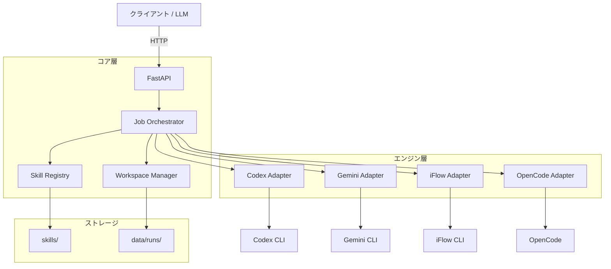

<p align="center">
  
</p>

<h1 align="center">Skill Runner</h1>

<p align="center">
  <strong>AI エージェントスキル統合実行フレームワーク</strong>
</p>

<p align="center">
  <a href="https://github.com/leike0813/Skill-Runner/releases"></a>
  <a href="https://www.python.org/"></a>
  <a href="LICENSE"></a>
  <a href="https://hub.docker.com/r/leike0813/skill-runner"></a>
</p>

<p align="center">
  <a href="README.md">English</a> ·
  <a href="README_CN.md">中文</a> ·
  <a href="README_FR.md">Français</a>
</p>

---

Skill Runner は、成熟した AI エージェント CLI ツール — **Codex**、**Gemini CLI**、**iFlow CLI**、**OpenCode** — を統一された Skill プロトコルで包み、決定論的な実行、構造化された成果物管理、内蔵 Web 管理 UI を提供します。

## ✨ ハイライト

<table>
<tr>
<td align="center" width="25%"><strong>🧩 プラグイン型スキル</strong><br/>ドロップイン型スキルパッケージ<br/><sub>スキーマ駆動の入出力</sub></td>
<td align="center" width="25%"><strong>🤖 マルチエンジン</strong><br/>Codex · Gemini · iFlow · OpenCode<br/><sub>統一アダプタプロトコル</sub></td>
<td align="center" width="25%"><strong>🔄 デュアルモード</strong><br/>自動 &amp; 対話型実行<br/><sub>マルチターン会話対応</sub></td>
<td align="center" width="25%"><strong>📦 構造化出力</strong><br/>JSON + 成果物 + バンドル<br/><sub>コントラクト駆動の分離実行</sub></td>
</tr>
</table>

## 🧩 プラグイン型スキル設計

Skill Runner の最大の強みは、その**プラグイン型スキルアーキテクチャ**です — すべての自動化タスクは、自己完結型でエンジンに依存しないスキルパッケージとしてパッケージ化され、修正なしでインストール、共有、実行できます。

### スキルとは？

Skill Runner のスキルは [Open Agent Skills](https://agentskills.io) オープンスタンダードに基づいて構築されています — Claude Code、Codex CLI、Cursor などと同じ形式です。
Skill Runner はこの標準を **AutoSkill** スーパーセットに拡張し、実行コントラクト（`runner.json`）とスキーマ検証ファイルを追加しています：

```
my-skill/
├── SKILL.md                 # プロンプト指示（Open Agent Skills 標準）
├── assets/
│   ├── runner.json          # 実行コントラクト（Skill Runner 拡張）
│   ├── input.schema.json    # 入力スキーマ（JSON Schema）
│   ├── parameter.schema.json
│   └── output.schema.json   # 出力スキーマ — 実行後に自動検証
├── references/              # 参考ドキュメント（オプション）
└── scripts/                 # ヘルパースクリプト（オプション）
```

> 標準の Open Agent Skills パッケージ（`SKILL.md` を含むフォルダ）はそのまま Skill Runner で実行できます。
> `assets/runner.json` + スキーマファイルを追加すると **AutoSkill** に昇格 — 自動実行、スキーマ検証、再現可能な結果が有効になります。

### 設計上の利点

- **標準準拠**：Open Agent Skills エコシステムと互換 — スキルはプラットフォーム間で移植可能。
- **エンジン非依存**：一度書けば、任意のサポートエンジンで実行可能。同じスキルが Codex、Gemini、iFlow、OpenCode で動作。
- **スキーマ駆動 I/O**：入力、パラメータ、出力すべてが JSON Schema で定義 — Runner が自動検証。
- **分離実行**：各 Run は独自のワークスペースと標準化された I/O コントラクトを取得 — Run 間の干渉なし。
- **ゼロ統合インストール**：スキルディレクトリを `skills/` に配置（または API/UI でアップロード）するだけで即座に利用可能。
- **キャッシュ再利用**：同一入力・パラメータの場合、以前の結果を再利用 — エンジンの重複呼び出しなし。

### 実行モード

各スキルは `runner.json` でサポートする実行モードを宣言します：

- **`auto`** — 完全自動。エンジンはプロンプトを最後まで実行し、人的介入は不要。
- **`interactive`** — マルチターン会話。エンジンが一時停止して質問する場合があり、ユーザーが対話 API を通じて回答。

> 📖 完全な仕様：[AutoSkill パッケージガイド](docs/autoskill_package_guide.md) · [ファイルプロトコル](docs/file_protocol.md)

## 🚀 クイックスタート

### Docker（推奨）

```bash
mkdir -p skills data
docker compose up --build
```

- **API**: http://localhost:8000/v1
- **管理 UI**: http://localhost:8000/ui

または単独で実行：

```bash
docker run --rm -p 8000:8000 -p 17681:17681 leike0813/skill-runner:v0.4.0
```

### ローカル開発

```bash
# Linux / macOS
./scripts/deploy_local.sh

# Windows (PowerShell)
.\scripts\deploy_local.ps1
```

<details>
<summary>📋 <strong>詳細設定</strong></summary>

#### 環境変数

| 変数 | 説明 | デフォルト |
|------|------|----------|
| `SKILL_RUNNER_DATA_DIR` | 実行データディレクトリ | `data/` |
| `SKILL_RUNNER_AGENT_HOME` | エージェント分離設定ディレクトリ | 自動 |
| `SKILL_RUNNER_AGENT_CACHE_DIR` | エージェントキャッシュルート | 自動 |
| `SKILL_RUNNER_NPM_PREFIX` | 管理対象 CLI インストールプレフィックス | 自動 |
| `SKILL_RUNNER_RUNTIME_MODE` | `local` または `container` | 自動 |

#### UI Basic Auth

```bash
docker run --rm -p 8000:8000 -p 17681:17681 \
  -e UI_BASIC_AUTH_ENABLED=true \
  -e UI_BASIC_AUTH_USERNAME=admin \
  -e UI_BASIC_AUTH_PASSWORD=change-me \
  leike0813/skill-runner:v0.4.0
```

</details>

## 🖥️ Web 管理 UI

`/ui` から内蔵管理インターフェースにアクセス：

- **スキルブラウザ** — インストール済みスキルの閲覧、パッケージ構造とファイルの検査
- **エンジン管理** — エンジン状態の監視、アップグレードの実行、ログの確認
- **モデルカタログ** — エンジンモデルスナップショットの閲覧と管理
- **インライン TUI** — ブラウザ内でエンジンターミナルを直接起動（管理された単一セッション）

## 🔑 エンジン認証

Skill Runner は、フルマネージドからマニュアルまで、複数の認証方法を提供します。

### 推奨：OAuth Proxy（管理 UI 経由）

推奨アプローチ — 管理 UI（`/ui/engines`）の内蔵 OAuth Proxy でエンジンを認証：

1. エンジン管理ページを開く。
2. エンジンを選択し、認証方法として **OAuth Proxy** を選択。
3. ブラウザベースの OAuth フローを完了。
4. 認証情報は自動的に保存・管理。

これはアクティブな実行中にも機能します：エンジンが実行中に認証を必要とする場合、フロントエンドは**セッション内認証チャレンジ**を提示でき、実行が一時停止し、ユーザーが OAuth を完了すると自動的に再開します。

> ⚠️ **高リスク警告（OpenCode + Google/Antigravity）：**  
> `opencode` かつ `provider_id=google`（Antigravity 経路、サードパーティプラグイン `opencode-antigravity-auth` を使用）の場合、`oauth_proxy` と `cli_delegate` はいずれも高リスクなサードパーティログイン経路です。この経路は Google ポリシーに違反する可能性があり、アカウント停止につながるおそれがあります。

### 代替手段：CLI Delegate

CLI Delegate オーケストレーションは、エンジンのネイティブログインフローを起動します。OAuth Proxy と比較して：
- **ネイティブ忠実性** — エンジン内蔵の認証をそのまま使用。
- **低リスク** — プロキシ層なし；認証情報はエンジンに直接流れる。

同じ管理 UI のエンジン管理インターフェースから利用可能。

### その他の方法

<details>
<summary>クリックして従来の方法を表示</summary>

**インライン TUI** — 管理 UI はエンジンターミナル（`/ui/engines`）を埋め込んでおり、ブラウザ内で直接 CLI ログインコマンドを実行できます。

**コンテナ内 CLI ログイン**：
```bash
docker exec -it <container_id> /bin/bash
# コンテナ内で CLI ログインフローを実行
```

**UI から認証情報ファイルをインポート** — `/ui/engines` の認証メニューで **Import Credentials** を選択します。  
サービスがアップロードファイルを検証し、分離された Agent Home の所定パスへ自動保存します。

</details>

## 📡 API & クライアント設計

```bash
# 利用可能なスキルの一覧
curl -sS http://localhost:8000/v1/skills

# ジョブの作成
curl -sS -X POST http://localhost:8000/v1/jobs \
  -H "Content-Type: application/json" \
  -d '{
    "skill_id": "demo-bible-verse",
    "engine": "gemini",
    "parameter": { "language": "en" },
    "model": "gemini-3-pro-preview"
  }'

# 結果の取得
curl -sS http://localhost:8000/v1/jobs/<request_id>/result
```

### フロントエンドの構築

Skill Runner はリアルタイム Run 観測のための**2 つの SSE チャネル**を公開しています：

| チャネル | エンドポイント | 用途 |
|---------|-------------|------|
| **Chat** | `GET /v1/jobs/{id}/chat?cursor=N` | 事前投影されたチャットバブル — 会話型 UI に最適 |
| **Events** | `GET /v1/jobs/{id}/events?cursor=N` | 完全な FCMP プロトコルイベント — 管理/デバッグツールに最適 |

両チャネルとも**カーソルベースの再接続**と**履歴クエリ**（`/chat/history`、`/events/history`）による切断補償をサポート。

典型的なフロントエンドフロー：

```
POST /v1/jobs → (オプションアップロード) → SSE /chat → バブルレンダリング
                                        ↕ waiting_user → POST /interaction/reply
                                        → terminal → GET /result + /bundle
```

> 📖 フロントエンド設計ガイド：[Frontend Design Guide](docs/developer/frontend_design_guide.md)
> 📖 API リファレンス：[API Reference](docs/api_reference.md)

## 🏗️ アーキテクチャ



**実行フロー**: `POST /v1/jobs` → 入力アップロード → エンジン実行 → 出力検証 → `GET /v1/jobs/{id}/result`

## 🔌 サポートエンジン

| エンジン | パッケージ |
|---------|-----------|
| **Codex** | `@openai/codex` |
| **Gemini CLI** | `@google/gemini-cli` |
| **iFlow CLI** | `@iflow-ai/iflow-cli` |
| **OpenCode** | `opencode-ai` |

> すべてのエンジンが **Auto** と **Interactive** の両方の実行モードをサポートしています。

## 📖 ドキュメント

| ドキュメント | 説明 |
|------------|------|
| [アーキテクチャ概要](docs/architecture_overview.md) | システム設計とコンポーネント |
| [AutoSkill パッケージガイド](docs/autoskill_package_guide.md) | スキルパッケージの構築 |
| [アダプタ設計](docs/adapter_design.md) | エンジンアダプタプロトコル（5 段階パイプライン） |
| [実行フロー](docs/execution_flow.md) | エンドツーエンド Run ライフサイクル |
| [API リファレンス](docs/api_reference.md) | REST API 仕様 |
| [フロントエンド設計ガイド](docs/developer/frontend_design_guide.md) | フロントエンドクライアントの構築 |
| [コンテナ化](docs/containerization.md) | Docker デプロイメントガイド |
| [開発者ガイド](docs/dev_guide.md) | 貢献と開発 |

## ⚠️ 免責事項

Codex、Gemini CLI、iFlow CLI、OpenCode は急速に進化しているツールです。設定形式、CLI の動作、API の詳細は短期間で変更される可能性があります。新しい CLI バージョンとの互換性の問題が発生した場合は、[Issue を作成](https://github.com/leike0813/Skill-Runner/issues)してください。

---

<p align="center">
  <sub>Made with ❤️ by <a href="https://github.com/leike0813">Joshua Reed</a></sub>
</p>
