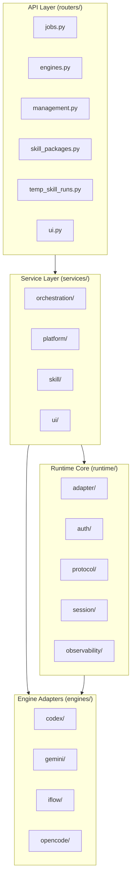

# Skill-Runner 项目全面评审报告

> **审查时间**: 2026-03-01  
> **项目版本**: 0.2.0  
> **代码规模**: Server 174 files / 28,376 LOC | Tests 130 files / 25,607 LOC (704 test functions) | Agent Harness 1,476 LOC | E2E Client 2,213 LOC

---

## 1. 架构评估

### 1.1 总体架构风格

Skill-Runner 采用 **分层 + 领域服务** 架构，以 FastAPI 为 HTTP 骨架，通过 Adapter Pattern 对接多引擎后端（Codex / Gemini / iFlow / OpenCode），核心编排逻辑由 `JobOrchestrator` 集中驱动。



### 1.2 架构亮点

| 维度 | 评价 |
|------|------|
| **SSOT 治理** | ⭐⭐⭐⭐⭐ 以 `AGENTS.md` + JSON Schema + YAML invariants 三层合同驱动开发，行业罕见的严格程度 |
| **引擎抽象** | ⭐⭐⭐⭐ `BaseExecutionAdapter` (830 LOC) 提供统一抽象，4 引擎各有独立适配实现 |
| **协议分层** | ⭐⭐⭐⭐ FCMP 事件流 + RASP 审计内核分离清晰，`protocol/factories.py` 禁止业务层直拼 payload |
| **Runtime 模块化** | ⭐⭐⭐⭐ `runtime/` 下分 adapter / auth / protocol / session / observability 五个关注点 |

### 1.3 架构风险

| 风险 | 严重度 | 说明 |
|------|--------|------|
| **God Object** | 🔴 高 | `job_orchestrator.py` 达 **2,088 行 / 52 个方法**，承担了生命周期管理、文件系统快照、bundle 打包、done-marker 检测、状态分类等过多职责 |
| **模块级单例** | 🟡 中 | `run_store`、`skill_registry`、`workspace_manager` 等在模块作用域实例化，无法注入替换，增大测试 mock 成本 |
| **同步 SQLite** | 🟡 中 | `RunStore` (1,040 LOC) 在 async FastAPI 中使用同步 `sqlite3`，高并发下存在线程阻塞隐患 |
| **Runtime port 安装时机** | 🟡 中 | `install_runtime_protocol_ports()` 在 `lifespan` 和 router 模块顶层各调用一次，存在初始化顺序逆变风险 |

---

## 2. 代码组织合理性

### 2.1 目录结构评分: ⭐⭐⭐⭐ (4/5)

```
server/
├── main.py              # 入口，仅 93 行，职责清晰
├── models.py            # 942 行，82+ Pydantic/Enum 定义 → ⚠️ 考虑拆分
├── core_config.py       # yacs 配置系统，环境感知
├── routers/             # 8 路由模块，按资源划分，合理
├── services/
│   ├── orchestration/   # 22 文件，核心编排逻辑
│   ├── platform/        # 6 文件，横切关注点（cache/schema/concurrency）
│   ├── skill/           # 12 文件，技能生命周期管理
│   └── ui/              # 3 文件，管理界面
├── runtime/             # 深层子包结构，协议与适配分离
├── engines/             # 4 引擎 × (adapter/ + auth/) 子包
└── assets/              # configs/ models/ schemas/ templates/
```

### 2.2 优点

- **领域边界清晰**: `orchestration` / `platform` / `skill` / `ui` 四象限划分合理
- **Engine 隔离好**: 每个引擎有独立的 `adapter/` 和 `auth/` 子包，不交叉污染
- **Assets 集中管理**: schema、模板、配置全部在 `server/assets/` 下，便于维护

### 2.3 待改进

- `models.py` (942 行, 82+ 类) 应按领域拆为 `models/run.py`、`models/skill.py`、`models/engine.py`、`models/protocol.py`
- `routers/ui.py` (888 行) 和 `routers/management.py` (601 行) 过大，建议按子功能拆分
- `runtime/` 下的 `__init__.py` 导出规则不统一：有的重导出核心类型，有的为空

---

## 3. 代码规范性

### 3.1 整体评分: ⭐⭐⭐⭐ (4/5)

| 维度 | 评价 |
|------|------|
| **类型注解** | ✅ 全面使用 Python 3.11+ 类型提示，Pydantic v2 模型严格 |
| **Docstring** | ⚠️ 模块级文档完善，但大部分内部方法缺少 docstring |
| **命名规范** | ✅ 类名 PascalCase，方法名 snake_case，常量 UPPER_CASE，一致性好 |
| **import 规范** | ⚠️ 存在 39 个 `type: ignore` 注解；`job_orchestrator.py` 中有延迟 import (L160, L649, L695) |
| **TODO/FIXME** | ✅ 生产代码中未发现 TODO/FIXME 标记，说明技术债务管理有意识 |

### 3.2 值得肯定

- 无裸 `except:` (bare except) — 所有 231 个异常捕获至少指定 `Exception`
- Enum 定义完整（`RunStatus`、`ExecutionMode`、`InteractiveErrorCode` 等），无 magic string
- `AGENTS.md` 定义了**禁止项**清单，强制代码路径约束

### 3.3 建议改进

- 231 个 `except Exception` 是一个偏高的数字，部分应收窄为具体异常类型（如 `FileNotFoundError`、`json.JSONDecodeError`）
- `job_orchestrator.py` 中 3 处延迟 import 建议统一抽取为懒加载辅助或在 `__init__` 中注入
- 建议引入 `ruff` 或 `flake8` + `mypy --strict` 作为 CI 门禁

---

## 4. 测试门禁覆盖率、测试冗余度

### 4.1 测试规模

| 指标 | 数值 |
|------|------|
| 测试文件数 | **130** |
| 测试函数数 | **704** |
| 测试代码量 | **25,607 LOC** |
| 测试 / 源码比 | **0.90** (优秀；业界基准 0.5~1.0) |

### 4.2 测试层次分布

| 层次 | 覆盖情况 |
|------|----------|
| **单元测试** | 124 文件，覆盖 orchestration / adapter / protocol / auth / model / routing |
| **API 集成测试** | 6 文件，覆盖 jobs / management / skill-packages / temp-runs / UI |
| **引擎集成测试** | 10 YAML 测试套件，参数化驱动 |
| **E2E 测试** | 3 运行器（local / container / general），覆盖完整链路 |

### 4.3 测试质量亮点

- **合同测试**（Contract Tests）: `test_session_invariant_contract.py`、`test_protocol_state_alignment.py` 等直接验证 YAML 不变量
- **属性测试**: `test_session_state_model_properties.py`、`test_fcmp_mapping_properties.py` 验证模型属性
- **架构防护测试**: `test_runtime_core_import_boundaries.py`、`test_runtime_no_orchestration_imports.py` 等用 import graph 验证模块边界
- **最大测试文件**: `test_job_orchestrator.py` (105KB) — 覆盖深度极好

### 4.4 覆盖缺口

| 缺口 | 优先级 |
|------|--------|
| `run_observability.py` (1,029 LOC) 的观测路径边界场景 | 🟡 中 |
| `ui_shell_manager.py` (645 LOC) 的 WebSocket shell 交互 | 🟡 中 |
| `engine_auth_flow_manager.py` 的并发锁竞争场景 | 🟡 中 |
| 缺少行级覆盖率门禁 (无 `coverage.py` 集成) | 🔴 高 |

### 4.5 潜在冗余

- `test_v1_routes.py` (39,689B) 与 `test_jobs_interaction_routes.py` (11,309B) 可能存在路由测试重合
- `test_ui_routes.py` (40,526B) 与 `test_ui_management_pages.py` (4,425B) 存在 UI 路由测试重叠区域
- 多个 OAuth proxy 测试文件（codex/gemini/iflow/opencode 各一）存在模板化重复，可考虑参数化合并

---

## 5. 代码健壮性

### 5.1 整体评分: ⭐⭐⭐⭐ (4/5)

### 5.2 防御性编程亮点

- ✅ `protocol_factories.py` 作为唯一事件构造入口，防止 payload 格式漂移
- ✅ `ProtocolSchemaViolation` 异常类型用于协议违规检测
- ✅ `run_folder_trust_manager.py` 做运行目录信任验证
- ✅ Statechart 设计确保状态迁移的合法性（`session/statechart.py`）
- ✅ 启动时 `recover_incomplete_runs_on_startup()` 恢复孤立执行

### 5.3 健壮性风险

| 风险 | 严重度 | 位置 | 说明 |
|------|--------|------|------|
| **宽泛异常吞没** | 🟡 中 | 全局 231 处 | 部分 `except Exception` 仅 log + pass，可能掩盖关键错误 |
| **SQLite 并发** | 🟡 中 | `run_store.py` | 无连接池，每次操作 `sqlite3.connect()`，高并发时可能 `database is locked` |
| **subprocess 管道** | 🟡 中 | `base_execution_adapter.py` | 依赖 subprocess 与外部 CLI 交互，管道 hang 只靠硬超时兜底 |
| **global 语句** | 🟡 中 | `run_observability.py:97`, `run_read_facade.py:32` | 使用 `global` 替代依赖注入，存在竞态风险 |
| **文件系统竞态** | 🟠 低 | `workspace_manager.py` | 并发创建/删除工作区时可能存在 TOCTOU 竞态 |

---

## 6. 可维护性及可扩展性

### 6.1 可维护性评分: ⭐⭐⭐⭐ (4/5)

**优势**:
- 📚 文档体系完备: `docs/` 下 26 篇文档，涵盖架构、API、协议、测试框架
- 📋 SSOT 漂移自检清单 (AGENTS.md) 提供 10 项 PR 检查
- 🔄 OpenSpec 变更管理体系（`openspec/` 含 515 个文件）
- 🏗️ 合同/Schema 驱动确保文档与代码同步

**劣势**:
- `job_orchestrator.py` 的 2,088 行对新开发者是重大认知负担
- `models.py` 单文件过大，修改一个模型可能触发大量 diff
- `conftest.py` 中的 config 覆盖模式冗长（手动 save/restore 12 个字段），应封装为 context manager

### 6.2 可扩展性评分: ⭐⭐⭐⭐ (4/5)

**良好扩展点**:
- ✅ 新增引擎只需在 `engines/` 下建子包 + 注册 adapter（已有 4 引擎为证）
- ✅ 新增技能通过文件系统 `skills/` 目录；runtime 自发现
- ✅ 事件类型通过 JSON Schema 定义，新增事件有完整协议保护
- ✅ 认证流程通过 `driver_registry` 模式，新增 OAuth 流程可插拔

**扩展瓶颈**:
- ⚠️ `JobOrchestrator` 未使用策略模式，新增执行模式需修改核心类
- ⚠️ 单 SQLite 文件存储，无法水平扩展到多实例
- ⚠️ 缺少插件/钩子机制，扩展需直接修改源码

---

## 7. 主要脆弱风险点

### 7.1 Top 5 风险清单

| # | 风险 | 所在文件 | 影响 | 修复难度 |
|---|------|----------|------|----------|
| 1 | **JobOrchestrator God Object** | [job_orchestrator.py](file:///home/joshua/Workspace/Code/Python/Skill-Runner/server/services/orchestration/job_orchestrator.py) | 2,088 行单类承担过多职责，任何改动都有连锁风险 | 🔴 高 |
| 2 | **同步 SQLite + async FastAPI** | [run_store.py](file:///home/joshua/Workspace/Code/Python/Skill-Runner/server/services/orchestration/run_store.py) | 高并发下阻塞事件循环，影响全局吞吐 | 🟡 中 |
| 3 | **宽泛异常处理** | 全局 231 处 | 掩盖根因，影响故障排查效率 | 🟢 低 |
| 4 | **模块级全局状态** | `run_observability.py`、`run_read_facade.py` | `global` 语句导致测试隔离困难 | 🟡 中 |
| 5 | **subprocess 管道挂死** | [base_execution_adapter.py](file:///home/joshua/Workspace/Code/Python/Skill-Runner/server/runtime/adapter/base_execution_adapter.py) | 外部 CLI 异常时仅靠硬超时，无 graceful drain 机制 | 🟡 中 |

### 7.2 安全风险

- `_load_local_env_file()` 在 import 阶段执行文件读取 + `os.environ.setdefault()`，攻击者控制 `.env.engine_auth.local` 文件可注入环境变量
- UI Basic Auth 密码以明文存储在环境变量 (`UI_BASIC_AUTH_USERNAME` / `UI_BASIC_AUTH_PASSWORD`)
- `workspace_manager` 在 `data/runs/` 下创建目录未做路径遍历防护（`../` 注入）

---

## 8. 技术债务评估

### 8.1 债务清单

| 类别 | 债务项 | 偿还优先级 | 预估工时 |
|------|--------|-----------|---------|
| **架构** | `JobOrchestrator` 拆分为编排核心 + Bundle 管理 + FS 快照 + 完成分类等子服务 | P0 | 3-5 天 |
| **架构** | `models.py` 拆分为领域模型包 | P1 | 1 天 |
| **基础设施** | 引入 `coverage.py` + CI 行级覆盖率门禁 (目标 ≥ 80%) | P0 | 0.5 天 |
| **基础设施** | 同步 SQLite 迁移到 `aiosqlite` 或 `run_in_executor` 包装 | P1 | 2 天 |
| **代码质量** | 收窄 231 处 `except Exception` 为具体异常类型 | P2 | 2 天 |
| **代码质量** | 消除 `global` 语句，改用依赖注入端口 | P2 | 1 天 |
| **测试** | 参数化合并 4 个 OAuth proxy 测试文件 | P3 | 0.5 天 |
| **测试** | `conftest.py` config 覆盖重构为 context manager | P3 | 0.5 天 |
| **工具链** | 引入 `ruff` lint + `mypy --strict` 到 CI | P1 | 0.5 天 |
| **文档** | 内部方法 docstring 补全（尤其 orchestrator 和 protocol） | P2 | 1-2 天 |

### 8.2 债务健康度

项目当前**技术债务整体可控**。最关键的债务集中在 `JobOrchestrator` 的膨胀和 SQLite 并发限制上。得益于 SSOT 治理体系和合同测试，重构的安全性有较好保障。

---

## 9. 重构建议

### 9.1 高优先级 (P0)

#### 9.1.1 拆分 `JobOrchestrator`

`job_orchestrator.py` (2,088 LOC / 52 methods) 违反了单一职责原则。建议拆为：

```
services/orchestration/
├── job_orchestrator.py         # 核心编排循环 (~500 LOC)
├── run_lifecycle.py            # 状态更新、恢复、取消
├── run_bundle_builder.py       # Bundle 打包逻辑
├── fs_snapshot_manager.py      # 文件系统快照差异
├── completion_classifier.py    # Done-marker 检测 + 完成分类
└── interactive_session.py      # 交互式会话恢复注入
```

#### 9.1.2 引入覆盖率门禁

```bash
# 建议加入 CI pipeline
pytest --cov=server --cov-report=term-missing --cov-fail-under=80
```

### 9.2 中优先级 (P1)

#### 9.2.1 `models.py` 拆分

```
server/models/
├── __init__.py     # re-export all (backward compat)
├── enums.py        # RunStatus, ExecutionMode, etc.
├── run.py          # RunCreateRequest, RunResponse, etc.
├── skill.py        # SkillManifest, ManifestArtifact, etc.
├── engine.py       # EngineSessionHandle, AdapterTurnOutcome, etc.
└── protocol.py     # FCMP/RASP 相关事件模型
```

#### 9.2.2 SQLite 异步化

```python
# 方案 A: aiosqlite
import aiosqlite
async with aiosqlite.connect(self.db_path) as db:
    await db.execute(...)

# 方案 B: 最小改动 - run_in_executor 包装
from concurrent.futures import ThreadPoolExecutor
_db_pool = ThreadPoolExecutor(max_workers=4)
result = await loop.run_in_executor(_db_pool, self._sync_query, ...)
```

#### 9.2.3 依赖注入改造

将模块级单例改为 FastAPI 依赖注入：

```python
# Before
from server.services.orchestration.run_store import run_store

# After
from fastapi import Depends
def get_run_store() -> RunStore:
    return RunStore()

@router.post("/jobs")
async def create_run(store: RunStore = Depends(get_run_store)):
    ...
```

### 9.3 低优先级 (P2-P3)

- 收窄 `except Exception` 为具体异常类型（逐步 review 231 处）
- 将 `conftest.py` 的 config save/restore 模式封装为 `@contextmanager config_override(**overrides)`
- 参数化合并 codex/gemini/iflow/opencode 的 OAuth 测试（使用 `@pytest.mark.parametrize`）
- 为 `runtime/` 包的 `__init__.py` 统一公共 API 导出规则

---

## 总评

| 维度 | 评分 | 等级 |
|------|------|------|
| 架构设计 | ⭐⭐⭐⭐ | 良好 |
| 代码组织 | ⭐⭐⭐⭐ | 良好 |
| 代码规范 | ⭐⭐⭐⭐ | 良好 |
| 测试体系 | ⭐⭐⭐⭐☆ | 优秀 |
| 代码健壮性 | ⭐⭐⭐⭐ | 良好 |
| 可维护性 | ⭐⭐⭐⭐ | 良好 |
| 可扩展性 | ⭐⭐⭐⭐ | 良好 |

**综合评价**: Skill-Runner 是一个 **工程成熟度较高** 的项目。其最突出的优势在于 **SSOT 合同治理体系** 和 **极高的测试覆盖密度**（测试/源码比 0.90）。最主要的技术债务在于 `JobOrchestrator` 的膨胀和 SQLite 同步瓶颈。项目在 0.2.0 版本阶段呈现出的规范意识和架构防护措施（import 边界测试、合同测试、statechart 约束），在同等规模的个人/小团队项目中属于 **上等水平**。
