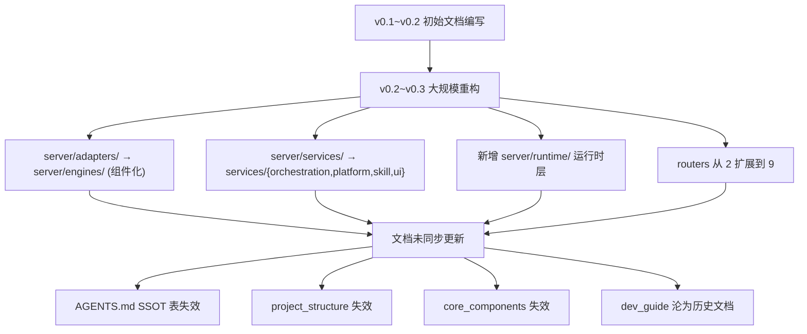

# 文档一致性核验报告 & 文档对齐方案

**项目**: Skill-Runner  
**核验时间**: 2026-03-01T00:50:15+08:00  
**核验范围**: 15 篇文档 × 实际代码交叉比对

---

## 一、核验总览

| 分级 | 数量 | 说明 |
|------|------|------|
| 🔴 **严重偏移** | 4 篇 | 结构树/组件路径整体过期，已无法指导开发 |
| 🟡 **局部过期** | 4 篇 | 个别路径/引用过期，核心语义仍准确 |
| 🟢 **一致** | 7 篇 | 内容与代码完全或高度对齐 |

---

## 二、逐文档核验结果

### 🔴 严重偏移

#### 2.1 `docs/project_structure.md`
**偏移程度**: 整篇结构树过期

| 文档描述 | 实际结构 |
|----------|----------|
| `server/adapters/` (4 flat files: `base.py`, `gemini_adapter.py`, `codex_adapter.py`, `iflow_adapter.py`) | `server/engines/{codex,gemini,iflow,opencode}/` (组件化子包) |
| `server/services/` (5 flat files) | `server/services/{orchestration,platform,skill,ui}/` (4 子包，共 44 模块) |
| 不存在 | `server/runtime/{adapter,auth,execution,observability,protocol,session}/` (全新运行时层，25 模块) |
| `server/routers/` (2 files: `jobs.py`, `skills.py`) | `server/routers/` (9 files: `engines`, `jobs`, `management`, `oauth_callback`, `skill_packages`, `skills`, `temp_skill_runs`, `ui`) |
| `data/runs.db` (sqlite) | 实际无 sqlite 文件，使用文件系统状态 |

> **结论**: 此文档仍停留在 ~v0.1 时代的扁平结构，完全无法反映当前的组件化/分层架构。

---

#### 2.2 `docs/core_components.md`
**偏移程度**: 10 个组件中 9 个路径过期

| # | 文档路径 | 实际路径 | 状态 |
|---|----------|----------|------|
| 1 | `server/services/skill_registry.py` | `server/services/skill/skill_registry.py` | ❌ |
| 2 | `server/services/workspace_manager.py` | `server/services/orchestration/workspace_manager.py` | ❌ |
| 3 | `server/services/job_orchestrator.py` | `server/services/orchestration/job_orchestrator.py` | ❌ |
| 4 | `server/adapters/gemini_adapter.py` | `server/engines/gemini/` (组件化子包) | ❌ |
| 5 | `server/adapters/codex_adapter.py` | `server/engines/codex/` (组件化子包) | ❌ |
| 6 | `server/services/codex_config_manager.py` | 已不存在（功能内嵌到 codex 组件） | ❌ |
| 7 | `server/services/schema_validator.py` | `server/services/platform/schema_validator.py` | ❌ |
| 8 | `server/adapters/iflow_adapter.py` | `server/engines/iflow/` (组件化子包) | ❌ |
| 9 | `server/adapters/opencode_adapter.py` | `server/engines/opencode/` (组件化子包) | ❌ |
| 10 | `server/core_config.py` + `server/config.py` | ✅ 路径不变 | ✅ |

**额外缺失**: 文档未覆盖以下当前核心组件：
- `server/runtime/session/statechart.py` (会话状态机)
- `server/runtime/protocol/` (FCMP/RASP 协议层)
- `server/runtime/adapter/base_execution_adapter.py` (统一适配器基类)
- `server/services/orchestration/run_execution_core.py` (执行核心)
- `server/services/orchestration/run_interaction_service.py` (交互服务)
- `server/services/platform/concurrency_manager.py` (并发管理)
- `server/services/platform/cache_manager.py` (缓存管理)

---

#### 2.3 `docs/dev_guide.md`
**偏移程度**: 全文停留在 v0.2.0 规划阶段

- 行 1 明确标注 `Version: v0.2.0`，而当前项目版本为 `v0.2.0`（pyproject.toml）但已有大量 v0.3+ 实现
- 保留了大量 v0 阶段的"待决问题"（Q1-Q6）和"里程碑计划"（M0-M5），这些已全部完成
- 引擎适配策略（§6）仍为"建议"口吻，实际已全部实现
- 规范化链（§7）的 N1-N3 阶段描述为"待实现"，但部分已落地
- 仍引用 `server/adapters/` 扁平结构
- 里程碑中 iFlow 标为 v0.3（已实现），OpenCode 未提及

> **结论**: 本文档性质已从"开发指南"退化为"历史规划文档"。但其中 §5（Skill 包结构规范）、§7（规范化链定义）的**规范性内容**本身仍有参考价值。

---

#### 2.4 `docs/test_framework_design.md`
**偏移程度**: 目录结构和组件名过期

- 单元测试目录规划引用 `test_gemini_adapter.py`, `test_schema_validator.py`, `test_workspace_manager.py`，实际测试目录包含 120+ 精细化测试文件
- "关键测试点"仅覆盖 3 个组件（SchemaValidator, GeminiAdapter, JobOrchestrator），实际测试已覆盖 statechart, FCMP, protocol, adapter profiles, interaction 等 20+ 组件
- 引用的集成测试结构基本准确（fixture → YAML suite → runner）

---

### 🟡 局部过期

#### 2.5 `AGENTS.md` SSOT 导航表
**偏移**: 7 个源代码路径过期

| 文档引用路径 | 实际路径 |
|-------------|----------|
| `server/services/session_statechart.py` | `server/runtime/session/statechart.py` |
| `server/services/job_orchestrator.py` | `server/services/orchestration/job_orchestrator.py` |
| `server/services/runtime_event_protocol.py` | `server/runtime/protocol/event_protocol.py` |
| `server/services/run_observability.py` | `server/runtime/observability/run_observability.py` |
| `server/services/protocol_factories.py` | `server/runtime/protocol/factories.py` |
| `server/services/protocol_schema_registry.py` | `server/runtime/protocol/schema_registry.py` |
| `server/services/run_store.py` | `server/services/orchestration/run_store.py` |

**语义层面**: SSOT 优先级、合同域定义、防漂移规则、验证命令等均仍有效。

---

#### 2.6 `docs/session_runtime_statechart_ssot.md`
**偏移**: 实现锚点路径过期

- 第 9 行: `server/services/session_statechart.py` → 实际 `server/runtime/session/statechart.py`
- 第 63 行: 同上
- 第 118 行: 引用同上

**语义验证** ✅:
- 6 个状态完全匹配（`queued/running/waiting_user/succeeded/failed/canceled`）
- 9 个事件完全匹配
- 13 条转移完全匹配
- Guards/Actions 完全匹配

---

#### 2.7 `docs/adapter_design.md`
**偏移**: 方法签名过期

- 文档定义的 5 阶段接口（`_construct_config`, `_setup_environment`, `_build_prompt`, `_execute_process`, `_parse_output`）为早期设计
- 实际采用组件模型（`base_execution_adapter.py` + 引擎子包内组件拆分），方法名和签名不同
- §3 "Implementation Plan (Refactoring)" 中的 3 条 Codex 重构计划已全部完成
- 设计语义（5 阶段生命周期、配置分层、Trust 管理）仍然有效

---

#### 2.8 `README.md`
**偏移**: 细节过期

| 项目 | 文档内容 | 实际状态 |
|------|----------|----------|
| 支持引擎列表 | "Codex / Gemini CLI / iFlow CLI"（3 个） | 实际 4 个，缺少 **OpenCode** |
| Docker run 示例标签 | `v0.3.3` | 可能已更新（与当前发布不一定同步） |
| Architecture brief | 仅提及 4 组件 | 缺少 Runtime 层、Protocol 层、Cache/Concurrency 等 |
| Supported engines §列表 | 3 个引擎 | 缺少 OpenCode |
| 鉴权文件说明 | 仅 Codex/Gemini/iFlow | 缺少 OpenCode |

---

### 🟢 一致

#### 2.9 `docs/contracts/session_fcmp_invariants.yaml` ✅
- 13 条转移、7 条 FCMP 映射、2 条配对事件、4 条排序规则 → 与 `statechart.py` 代码**完全一致**

#### 2.10 `docs/runtime_stream_protocol.md` ✅
- FCMP envelope 结构、10 种事件类型、SSE contract、cursor/history、raw_ref 回跳 → 与 `api_reference.md` 和 `event_protocol.py` 一致
- 引用路径 `server/assets/schemas/protocol/runtime_contract.schema.json` → ✅ 存在

#### 2.11 `docs/runtime_event_schema_contract.md` ✅
- Validation Policy（写入路径硬校验、内部桥接告警、读取兼容）→ 语义一致
- Canonical Payload 字段定义 → 与 YAML contract 一致

#### 2.12 `docs/session_event_flow_sequence_fcmp.md` ✅
- 4 个 Mermaid 时序图的事件流、不变量锚点引用（TR-xx / FM-xx / PE-xx / OR-xx）→ 与 YAML contract 完全对齐
- §5 Statechart 映射说明 → 准确

#### 2.13 `docs/api_reference.md` ✅
- 1059 行，覆盖 Management API、Skills、Jobs、Temp Skill Runs、Engines、UI 全部接口
- 请求/响应 schema、错误码、行为语义 → 最全面、最新的文档
- 有独立维护的 adapter 内部重构免责声明（行 5-6）

#### 2.14 `docs/execution_flow.md` 🟢 (基本一致)
- 5 阶段执行流程语义准确
- Trust 生命周期、缓存策略、周期清理 → 准确
- 仅 CLI 命令细节可能随版本微变（如 Codex `--yolo` vs `--full-auto`）

#### 2.15 `docs/architecture_overview.md` 🟢 (基本一致)
- 核心设计理念、分层描述 → 准确
- 组件名使用通用名（"Skill Registry", "Workspace Manager"）而非路径 → 不受重构影响

---

## 三、偏移根因分析

**核心原因**: v0.2→v0.3 期间进行了架构级重构（扁平→组件化、services 拆包、新增 runtime 层），但文档更新集中在**协议/合同层**（FCMP、statechart、schema contract），**代码结构映射类文档**整体欠更新。

---

## 四、文档对齐方案

### 阶段 1: 关键路径修正（P0，建议立即执行）

> 修正 SSOT 导航表和状态机文档中的路径引用，消除开发者查找歧义。

| 文档 | 修改内容 | 工作量 |
|------|----------|--------|
| `AGENTS.md` | 更新 SSOT 表中 7 个 `server/services/xxx.py` → 实际路径 | 小 |
| `docs/session_runtime_statechart_ssot.md` | 更新 3 处 `server/services/session_statechart.py` → `server/runtime/session/statechart.py` | 极小 |

---

### 阶段 2: 结构类文档重写（P1，建议 1 周内完成）

> 完整重写已整体失效的结构/组件文档，使之反映当前架构。

| 文档 | 动作 | 工作量 |
|------|------|--------|
| `docs/project_structure.md` | **重写**: 生成当前实际目录树，标注各层职责 | 中 |
| `docs/core_components.md` | **重写**: 以当前分层架构（runtime/services/engines/routers）为主线重新描述组件 | 中 |
| `README.md` | **更新**: 添加 OpenCode 引擎、更新 Architecture brief、更新鉴权说明 | 小 |

---

### 阶段 3: 设计类文档归档与更新（P2，建议 2 周内完成）

> 将历史规划文档标记为存档，提取其中仍有效的规范内容到当前文档。

| 文档 | 动作 | 工作量 |
|------|------|--------|
| `docs/dev_guide.md` | **归档**: 在文件头添加 `> ⚠️ ARCHIVED: 本文档为 v0.2 时期规划，仅供历史参考。当前开发请参考 docs/api_reference.md 和 AGENTS.md`；提取 §5 Skill 包规范到独立的 `docs/autoskill_package_guide.md`（如尚未涵盖） | 中 |
| `docs/adapter_design.md` | **更新**: 将方法签名更新为当前组件模型接口；标记 §3 重构计划为"已完成" | 小 |
| `docs/test_framework_design.md` | **更新**: 将单元测试目录规划更新为当前 120+ 测试文件的分类方式 | 小 |

---

### 阶段 4: 长效防漂移机制（P3，持续改进）

建议在已有的 AGENTS.md 防漂移规则基础上补充：

1. **CI 路径检查**: 在 CI 中添加脚本，自动提取 `docs/*.md` 和 `AGENTS.md` 中的 `.py` 路径引用，校验每个路径是否在文件系统中存在
2. **文档变更触发规则**: 在 AGENTS.md checklist 中增加一条：
   > 是否移动/重命名了 Python 模块？若是，`grep -r "旧路径" docs/ AGENTS.md` 并更新所有引用
3. **结构文档自动生成**: 编写脚本从实际 `server/` 目录树生成 `project_structure.md` 的代码块部分，减少手动维护成本

---

## 五、总结

| 指标 | 结果 |
|------|------|
| 核验文档数 | 15 篇 |
| 完全一致 | 7 篇 (47%) |
| 局部过期 | 4 篇 (27%) |
| 严重偏移 | 4 篇 (27%) |
| 协议/合同文档一致率 | **100%** (5/5) |
| 代码结构映射文档一致率 | **10%** (1/10) |

**核心发现**: 项目在**协议层（FCMP/RASP/statechart/schema contract）** 维护了极高的文档-代码一致性，SSOT 驱动的合同文档体系运作良好。但**代码结构映射类文档**（目录树、组件清单、开发指南）整体未随架构重构同步更新，已形成显著的知识落差。

**建议优先级**: P0（SSOT 路径修正）→ P1（结构文档重写）→ P2（历史文档归档）→ P3（防漂移机制）。
