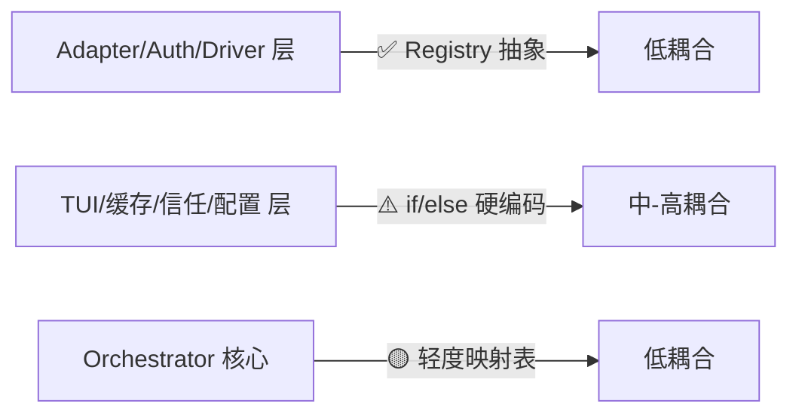

# Skill Runner Engine-Specific 逻辑耦合分析报告

> **项目**: Skill Runner v0.2.0  
> **分析日期**: 2026-03-06  
> **分析范围**: `server/` 全部核心框架模块（排除 `server/engines/` 目录本身）  
> **检索引擎**: codex · gemini · iflow · opencode

---

## 1. 耦合热力图（按框架层）

| 框架层 | 耦合程度 | 涉及文件 | 说明 |
|---|:---:|---:|---|
| `server/runtime/` | 🟡 轻度 | 2 | `auth_detection/service.py` 直接 import 4 引擎 detector；`profile_loader.py` 定义 `SUPPORTED_ENGINES` |
| `server/services/engine_management/` | 🟢 预期内 | 6+ | 专管引擎的包，耦合属于职责边界内 |
| `server/services/orchestration/` | 🟠 中度 | 3 | `job_orchestrator.py`、`run_folder_trust_manager.py`、`run_filesystem_snapshot_service.py` |
| `server/services/platform/` | 🟡 轻度 | 2 | `cache_key_builder.py`、`data_reset_service.py` |
| `server/services/ui/` | 🔴 显著 | 1 | `ui_shell_manager.py` — 最大问题点 |
| `server/routers/` | 🟠 中度 | 1 | `ui.py` 直接 import opencode catalog/provider，有 opencode-specific 路由 |
| `server/models/` | 🟡 轻度 | 1 | `run.py` 默认引擎值硬编码 `"codex"` |
| `server/config.py` | 🟡 轻度 | 1 | 5 个 `OPENCODE_MODELS_*` 专有配置项 |
| `server/main.py` | 🟠 中度 | 1 | `lifespan` 中直接启动/停止 `opencode_model_catalog` |

---

## 2. 五大关键耦合热点

### ❶ `ui_shell_manager.py` — 核心业务中嵌入大量 engine 分支

**严重度**: 🔴 **显著**  
**位置**: [ui_shell_manager.py](file:///home/joshua/Workspace/Code/Python/Skill-Runner/server/services/ui/ui_shell_manager.py)

**问题表现**：

```python
# 硬编码 per-engine 命令参数 (L196-234)
self._command_specs = {
    "codex": CommandSpec("codex-tui", "Codex TUI", "codex",
        ("--sandbox", "workspace-write", "--ask-for-approval", "never", ...)),
    "gemini": CommandSpec("gemini-tui", "Gemini TUI", "gemini",
        ("--sandbox", "--approval-mode", "default")),
    "iflow": CommandSpec("iflow-tui", "iFlow TUI", "iflow", ()),
    "opencode": CommandSpec("opencode-tui", "OpenCode TUI", "opencode", ()),
}
```

```python
# 4 条 if engine == "xxx" 分支处理沙箱检测 (L285-340)
def _probe_sandbox_status(self, engine):
    if engine == "codex":   # LANDLOCK 检测
    if engine == "gemini":  # docker/podman 检测
    if engine == "iflow":   # 无沙箱
    if engine == "opencode": # 无沙箱
```

```python
# per-engine 安全配置写入 (L391-437)
def _prepare_session_security(self, engine, session_dir, env, ...):
    if engine == "gemini":   # 写 .gemini/settings.json
    if engine == "iflow":    # 写 .iflow/settings.json
    if engine == "opencode": # 写 opencode.json
```

```python
# gemini-specific 私有方法 (L342-367)
def _read_gemini_selected_auth_type(self): ...
def _is_gemini_api_key_auth(self): ...
```

**影响**：添加新引擎需修改本文件 5+ 个方法。沙箱、安全、认证逻辑应下沉到 engine adapter profile 或各自的 Strategy 类中。

---

### ❷ `cache_key_builder.py` — engine config 文件名泄漏到平台层

**严重度**: 🟠 **中度**  
**位置**: [cache_key_builder.py](file:///home/joshua/Workspace/Code/Python/Skill-Runner/server/services/platform/cache_key_builder.py#L75-L83)

```python
# L75-82: 每个引擎的配置文件名硬编码在平台层
if engine == "gemini":
    engine_cfg = skill.path / "assets" / "gemini_settings.json"
elif engine == "iflow":
    engine_cfg = skill.path / "assets" / "iflow_settings.json"
elif engine == "opencode":
    engine_cfg = skill.path / "assets" / "opencode_config.json"
else:
    engine_cfg = skill.path / "assets" / "codex_config.toml"
```

**影响**：config 文件名属于 engine-specific 知识，应由 adapter profile 声明（如用 `adapter_profile.json` 中的一个字段），而非在平台层 if/else。

---

### ❸ `job_orchestrator.py` — engine dotfile 路径映射

**严重度**: 🟡 **轻度**  
**位置**: [job_orchestrator.py](file:///home/joshua/Workspace/Code/Python/Skill-Runner/server/services/orchestration/job_orchestrator.py#L313-L318)

```python
# L313-318: workspace prefix 映射
workspace_prefix = {
    "codex": ".codex",
    "gemini": ".gemini",
    "iflow": ".iflow",
    "opencode": ".opencode",
}.get(engine_name, f".{engine_name}")
```

**缓解因素**：有 fallback `f".{engine_name}"`，新引擎不强制修改此处。但映射更适合放在 adapter profile 中。

---

### ❹ `run_folder_trust_manager.py` + `trust_registry.py` — codex/gemini 路径硬编码

**严重度**: 🟡 **轻度**  
**位置**: [run_folder_trust_manager.py](file:///home/joshua/Workspace/Code/Python/Skill-Runner/server/services/orchestration/run_folder_trust_manager.py#L11-L27) · [trust_registry.py](file:///home/joshua/Workspace/Code/Python/Skill-Runner/server/engines/common/trust_registry.py)

```python
# run_folder_trust_manager.py L12-21
self.codex_config_path = codex_config_path or (profile.agent_home / ".codex" / "config.toml")
self.gemini_trusted_path = gemini_trusted_path or (
    profile.agent_home / ".gemini" / "trustedFolders.json"
)
```

**缓解因素**：底层 `TrustFolderStrategyRegistry` 使用 Strategy 模式 + `_NoopTrustFolderStrategy` 降级。iflow/opencode 不需要 trust 操作时自动走 Noop，不报错。这是有意识的设计。

---

### ❺ `main.py` + `routers/ui.py` — opencode 专属启动和路由逻辑

**严重度**: 🟠 **中度**  
**位置**: [main.py](file:///home/joshua/Workspace/Code/Python/Skill-Runner/server/main.py#L50-L99) · [routers/ui.py](file:///home/joshua/Workspace/Code/Python/Skill-Runner/server/routers/ui.py)

```python
# main.py lifespan — opencode 独有启动逻辑
from .engines.opencode.models.catalog_service import opencode_model_catalog
opencode_model_catalog.start()
if bool(config.SYSTEM.OPENCODE_MODELS_STARTUP_PROBE):
    await opencode_model_catalog.refresh(reason="startup")

# routers/ui.py — opencode 独有路由
@router.post("/engines/opencode/models/refresh")
async def ui_engine_models_refresh_opencode(request: Request): ...
```

**影响**：opencode 的 model catalog 是唯一一个在应用启动、全局配置、和路由中被特殊对待的引擎功能。其他引擎均无此类型的生命周期管理。如果未来其他引擎也需要类似的 catalog 服务，此模式不可复用。

---

## 3. 做得好的抽象（正面案例）

| 抽象模式 | 文件 | 设计 |
|---|---|---|
| **Adapter Registry** | [engine_adapter_registry.py](file:///home/joshua/Workspace/Code/Python/Skill-Runner/server/services/engine_management/engine_adapter_registry.py) | dict 注册所有 adapter，orchestrator 通过 `.get(engine)` 取用，完全不 if/else |
| **Auth Driver Registry** | [engine_auth_bootstrap.py](file:///home/joshua/Workspace/Code/Python/Skill-Runner/server/services/engine_management/engine_auth_bootstrap.py#L60-L72) | driver 注册完全 data-driven（从 strategy service 迭代） |
| **Trust Strategy** | [trust_registry.py](file:///home/joshua/Workspace/Code/Python/Skill-Runner/server/engines/common/trust_registry.py) | Strategy 模式 + Noop 降级，orchestrator 不感知具体 trust 实现 |
| **Auth Detector Protocol** | [auth_detection/contracts.py](file:///home/joshua/Workspace/Code/Python/Skill-Runner/server/runtime/auth_detection/contracts.py) | 定义 `AuthDetector` Protocol，各引擎实现统一接口 |
| **Base Execution Adapter** | [base_execution_adapter.py](file:///home/joshua/Workspace/Code/Python/Skill-Runner/server/runtime/adapter/base_execution_adapter.py) | 通用基类，各引擎仅覆盖差异部分 |

---

## 4. 耦合模式分类

### 4.1 ✅ 合理耦合（Registry / data-driven）

注册表模式 — engine-specific 类在 **一个集中点** 被注册，之后通过 engine name 字符串 key 动态分发。这种耦合是不可避免且设计良好的：

- `engine_adapter_registry.py` — 4 个 adapter 注册
- `engine_auth_bootstrap.py` — auth handler / driver / callback 注册
- `auth_detection/service.py` — 4 个 detector 注册

### 4.2 ⚠️ 问题耦合（hard-coded if/else 分支）

条件分支模式 — 业务逻辑中 `if engine == "xxx"` 散布在多个核心模块中。每添加一个引擎，必须扫描并修改所有这些分支：

| 文件 | if/else 分支数 |
|---|---:|
| `ui_shell_manager.py` | **~12** |
| `agent_cli_manager.py` | ~8 |
| `engine_auth_strategy_service.py` | ~6 |
| `cache_key_builder.py` | 4 |
| `routers/ui.py` | 3 |
| `job_orchestrator.py` | 1 |
| `run_filesystem_snapshot_service.py` | 1 |
| `model_registry.py` | 1 |
| `data_reset_service.py` | 1 |

---

## 5. 总结

### 总耦合度评分：**6/10（中等偏低）**



### 添加新引擎的改动面预估

如果要添加第 5 个引擎，需要修改：

| 必须修改 | 文件数 |
|---|---:|
| 引擎包自身（`server/engines/new_engine/`） | N/A（新建） |
| `engine_management/` 下的 registry 注册 | 4 |
| `ui_shell_manager.py` 的分支和命令定义 | 5+ 个方法 |
| `agent_cli_manager.py` 的 CLI 配置 | 3-5 处 |
| `cache_key_builder.py` 的 config 文件名 | 1 处 |
| `auth_detection/service.py` 的 detector 注册 | 1 处 |
| `run_filesystem_snapshot_service.py` 的排除列表 | 1 处 |
| **总改动文件数** | **~10-12 个** |

### 结论

> - **核心执行路径**（orchestrator ↔ adapter）的抽象做得好，engine 通过 registry 注入。
> - **周边服务**（TUI、缓存、信任、启动）中存在大量 `if engine == "xxx"` 硬编码。
> - **在"功能冻结不加引擎"的前提下，现有耦合不会造成实际问题。**
> - 若未来加新引擎，首先需要重构 `ui_shell_manager.py`（将 per-engine 的沙箱/安全/认证策略下沉到 engine adapter profile）和 `cache_key_builder.py`（让 adapter 自行声明 config 文件路径）。
