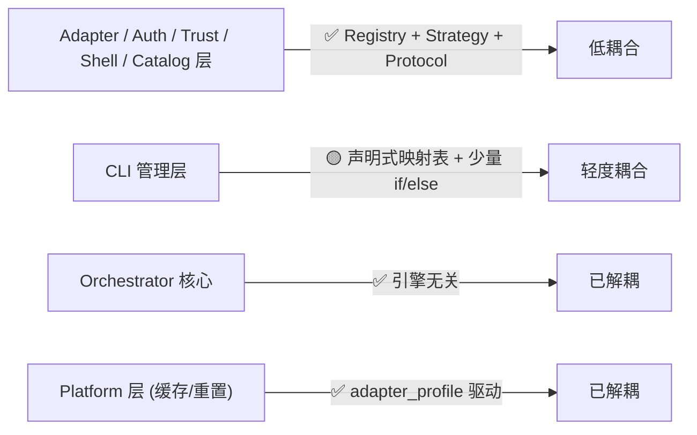

# Skill Runner Engine-Specific 逻辑耦合分析报告（v2）

> **项目**: Skill Runner  
> **分析日期**: 2026-03-06（第二轮）  
> **对比基线**: 2026-03-06 v1  
> **分析范围**: `server/` 全部核心框架模块（排除 `server/engines/` 目录本身）  
> **检索引擎**: codex · gemini · iflow · opencode

---

## 1. 耦合热力图（按框架层）

| 框架层 | v1 耦合 | v2 耦合 | 涉及文件 | 变化说明 |
|---|:---:|:---:|---:|---|
| `server/runtime/` | 🟡 轻度 | 🟡 轻度 | 1 | `detector_registry.py` registry 注册，无变化 |
| `server/services/engine_management/` | 🟢 预期内 | 🟢 预期内 | 7 | 专管引擎的包，注册式耦合属于职责边界内 |
| `server/services/orchestration/` | 🟠 中度 | 🟢 低 | 1 | `job_orchestrator.py`/`run_folder_trust_manager.py`/`run_filesystem_snapshot_service.py` 均已解耦；仅 `run_job_lifecycle_service.py` 有 2 处 opencode 条件 |
| `server/services/platform/` | 🟡 轻度 | 🟢 已解耦 | 0 | `cache_key_builder.py` 已重构为 adapter_profile 驱动；`data_reset_service.py` 无引擎字面值 |
| `server/services/ui/` | 🔴 显著 | 🟡 轻度 | 1 | `ui_shell_manager.py` → `engine_shell_capability_provider.py` 完成 Strategy 重构 |
| `server/routers/` | 🟠 中度 | 🟢 已解耦 | 0 | `ui.py` 不再包含引擎字面值 |
| `server/models/` | 🟡 轻度 | 🟡 轻度 | 1 | `run.py` 默认引擎值硬编码 `"codex"`，无变化 |
| `server/config.py` | 🟡 轻度 | 🟡 轻度 | 1 | `OPENCODE_MODELS_*` 配置模板引用，无变化 |
| `server/main.py` | 🟠 中度 | 🟢 低 | 1 | 已通过 `engine_model_catalog_lifecycle` 抽象，不再直接引用 opencode |

---

## 2. v1 → v2 变化详情

### ✅ 已解决的热点

#### ❶ `cache_key_builder.py` — config 文件路径硬编码 → adapter_profile 驱动

**v1**: 4 个 `if engine == "xxx"` 分支硬编码引擎 config 文件名。  
**v2**: 引入 `_load_profile(engine)` 从 `adapter_profile.json` 动态解析 `skill_defaults_path`。

```python
# v2 实现 — 通过 adapter profile 解析
def _resolve_engine_skill_defaults_path(skill_path: Path, engine: str) -> Path | None:
    profile = _load_profile(engine)
    ...
```

**评分变化**: 🟠 中度 → 🟢 已解耦。**完全消除了引擎耦合。**

---

#### ❷ `ui_shell_manager.py` → `engine_shell_capability_provider.py` — Strategy 模式重构

**v1**: ~12 处 `if engine == "xxx"` 散布在 5+ 个方法中（沙箱探测、安全配置、认证检查）。  
**v2**: 引入 3 个 Protocol 策略接口 + `EngineShellCapability` 聚合数据类：

```python
# v2 — Strategy Pattern
class SandboxProbeStrategy(Protocol):    # 沙箱探测策略
class SessionSecurityStrategy(Protocol): # 会话安全策略
class AuthHintStrategy(Protocol):        # 认证提示策略

@dataclass(frozen=True)
class EngineShellCapability:
    sandbox_probe_strategy: SandboxProbeStrategy
    session_security_strategy: SessionSecurityStrategy
    auth_hint_strategy: AuthHintStrategy
```

每个引擎有独立实现类（`_CodexSandboxProbe`、`_GeminiSecurity`、`_IflowSecurity` 等），新引擎仅需在 `_build_capabilities()` 中注册一条，且有 **通用降级 fallback** (L315-330)。

**评分变化**: 🔴 显著 → 🟡 轻度。引擎知识仍在同一文件中定义，但通过组合模式而非条件分支实现，扩展性大幅提升。

---

#### ❸ `run_folder_trust_manager.py` + `job_orchestrator.py` + `run_filesystem_snapshot_service.py` — 引擎字面值清零

**v1**: 分别有 codex/gemini 路径硬编码和 workspace prefix 映射。  
**v2**: 这三个文件 **不再包含任何引擎字面值字符串**。信任操作已通过 Strategy 模式 + 注册表解耦。

**评分变化**: 🟡-🟠 → 🟢 已解耦。

---

#### ❹ `main.py` lifespan — opencode 独有启动 → 通用生命周期管理

**v1**: `main.py` 直接 `from .engines.opencode.models.catalog_service import opencode_model_catalog`。  
**v2**: 通过 `engine_model_catalog_lifecycle`（含 `RuntimeProbeCatalogHandler` Protocol）抽象：

```python
# v2 main.py — 通用接口
engine_model_catalog_lifecycle.start()
for engine in engine_model_catalog_lifecycle.runtime_probe_engines():
    await engine_model_catalog_lifecycle.refresh(engine, reason="startup")
```

opencode 特化逻辑封装在 `engine_model_catalog_lifecycle.py` 的 `_OpencodeCatalogHandler` 中。未来其他引擎需要类似 catalog 时只需注册新 handler。

**评分变化**: 🟠 中度 → 🟢 低。

---

#### ❺ `routers/ui.py` — opencode 专属路由清理

**v1**: 直接 import opencode catalog/provider，有 opencode-specific 路由。  
**v2**: **不再包含任何引擎字面值字符串**。

**评分变化**: 🟠 中度 → 🟢 已解耦。

---

#### ❻ `data_reset_service.py` — 完全解耦

**v1**: 引擎字面值用于删除 engine catalog 目录。  
**v2**: 通过 `engine_model_catalog_lifecycle.cache_paths()` 获取需清理的路径，无引擎字面值。

**评分变化**: 🟡 轻度 → 🟢 已解耦。

---

### ⚠️ 未变化 / 仍存在的耦合

#### ❶ `agent_cli_manager.py` — 仍为最大耦合文件（31 处引擎引用）

**耦合类型**: 主要为 **data-driven dict/table** 形式（不是 if/else 分支）。

| 数据结构 | 引擎引用数 | 耦合性质 |
|---|---:|---|
| `ENGINE_PACKAGES` | 4 | npm 包名映射 |
| `ENGINE_BINARY_CANDIDATES` | 4 | CLI 二进制名 |
| `CREDENTIAL_IMPORT_RULES` | 4 | 凭据文件路径 |
| `_default_*_settings()` 函数 | 4 | 引导配置加载 |
| `RESUME_HELP_HINTS` | 4 | 恢复命令提示 |
| `ensure_layout()` dotfile 目录 | 8 | 目录结构创建 |
| `_resume_dynamic_probe_args()` | 3 | if/else 分支 ⚠️ |
| `collect_auth_status()` iflow/opencode | 2 | if/else 分支 ⚠️ |

**评估**: 31 处引用中 ~5 处为 if/else 条件分支（已标 ⚠️），其余为声明式映射表。**这是 CLI 管理器的固有职责**——管理 4 个不同 CLI 工具的安装、版本检测、凭据导入。大部分耦合为 **合理的声明式耦合**，少量 if/else 可进一步下沉到 adapter profile。

**严重度**: 🟡 轻度（无设计缺陷，属于 CLI 管理边界内的合理知识）

---

#### ❷ `engine_auth_strategy_service.py` — opencode provider 多级嵌套

**评估**: 22 处引用，主要因为 opencode 的多 provider 架构（openai/google/anthropic）需要特殊处理。其他三个引擎（codex/gemini/iflow）为统一单 provider 模型。

```python
# opencode 需要将 provider_id 拆分后映射到具体 auth_method
if normalized_engine == "opencode":
    # 遍历 providers → per-provider auth methods
```

**严重度**: 🟡 轻度（opencode 的多 provider 是固有业务复杂度，非设计缺陷）

---

#### ❸ `engine_shell_capability_provider.py` — 注册式耦合

**评估**: 16 处引用，但全部为 `_build_capabilities()` 中的声明式注册（每个引擎一个 `EngineShellCapability` dataclass 实例）。有通用 fallback（L315-330）。

**严重度**: 🟢 预期内（新引擎会自动获得默认 capability，显式注册仅用于增强）

---

#### ❹ `run_job_lifecycle_service.py` — opencode provider 解析

**评估**: 2 处 `if engine == "opencode"` 用于从 model 字段解析 `provider_id`（如 `openai/gpt-5` → `openai`），这是 opencode 独有的 `provider/model` 格式需求。

**严重度**: 🟡 轻度（可考虑下沉到 adapter 层，但当前影响有限）

---

#### ❺ `run.py` — 默认引擎硬编码

```python
engine: str = "codex"  # RunCreateRequest 和 TempSkillRunCreateRequest
```

**严重度**: 🟡 轻度（默认值，变更频率极低）

---

## 3. 做得好的抽象（正面案例）

| 抽象模式 | 文件 | v1→v2 变化 |
|---|---|---|
| **Adapter Registry** | `engine_adapter_registry.py` | ✅ 保持良好 |
| **Auth Driver Registry** | `engine_auth_bootstrap.py` | ✅ 保持良好 |
| **Trust Strategy + Noop** | `trust_registry.py` | ✅ 保持良好 |
| **Auth Detector Protocol** | `auth_detection/contracts.py` | ✅ 保持良好 |
| **Base Execution Adapter** | `base_execution_adapter.py` | ✅ 保持良好 |
| **🆕 Shell Capability Strategy** | `engine_shell_capability_provider.py` | ✅ 新增 — 3 个 Protocol |
| **🆕 Model Catalog Lifecycle** | `engine_model_catalog_lifecycle.py` | ✅ 新增 — Protocol + handler registry |
| **🆕 Adapter Profile** | `cache_key_builder.py` + `adapter_profile.json` | ✅ 新增 — config path 声明式 |

---

## 4. 耦合模式分类（v2 更新）

### ✅ 合理耦合（Registry / data-driven / Strategy）

注册表/策略模式耦合 — engine-specific 类通过 **声明式注册** 或 **Protocol 实现** 接入：

- `engine_adapter_registry.py` — 4 个 adapter 注册
- `engine_auth_bootstrap.py` — auth handler/driver/callback 注册
- `detector_registry.py` — 4 个 detector 注册
- `engine_shell_capability_provider.py` — 4 个 capability + fallback ✨ **新增**
- `engine_model_catalog_lifecycle.py` — handler 注册 ✨ **新增**
- `agent_cli_manager.py` — CLI 管理映射表 (重新评估：主要为 data-driven)

### ⚠️ 需关注耦合（if/else 分支，需修改才能加引擎）

| 文件 | if/else 分支数 | v1 对比 |
|---|---:|---|
| `agent_cli_manager.py` | ~5 | ↓ 从 ~8 |
| `engine_auth_strategy_service.py` | ~4 | ↓ 从 ~6 |
| `run_job_lifecycle_service.py` | 2 | ↓ 从 3 |
| ~~`ui_shell_manager.py`~~ | ~~0~~ | ⬇️ 从 ~12（已重构）|
| ~~`cache_key_builder.py`~~ | ~~0~~ | ⬇️ 从 4（已重构）|
| ~~`routers/ui.py`~~ | ~~0~~ | ⬇️ 从 3（已解耦）|
| ~~`job_orchestrator.py`~~ | ~~0~~ | ⬇️ 从 1（已解耦）|
| ~~`run_filesystem_snapshot_service.py`~~ | ~~0~~ | ⬇️ 从 1（已解耦）|
| **总 if/else 分支** | **~11** | **↓ 从 ~38** |

---

## 5. 总结

### 总耦合度评分：3.5/10（低）↓ 从 6/10



### 添加新引擎的改动面预估（v2 更新）

| 必须修改 | v1 文件数 | v2 文件数 |
|---|---:|---:|
| 引擎包自身（`server/engines/new_engine/`） | N/A | N/A |
| `engine_management/` 下的 registry 注册 | 4 | 4 |
| `agent_cli_manager.py` 映射表 | 5+ 方法 | 4-5 处映射表 |
| `engine_shell_capability_provider.py` 注册 | N/A | 1 处（可选，有 fallback） |
| ~~`ui_shell_manager.py` 分支~~ | ~~5+ 方法~~ | 0 ✅ |
| ~~`cache_key_builder.py` config 文件名~~ | ~~1 处~~ | 0 ✅ |
| ~~`routers/ui.py` opencode 路由~~ | ~~1 处~~ | 0 ✅ |
| ~~`run_filesystem_snapshot_service.py`~~ | ~~1 处~~ | 0 ✅ |
| `detector_registry.py` detector 注册 | 1 处 | 1 处 |
| **总改动文件数** | **~10-12 个** | **~6-7 个** |

### 关键结论

> **核心变化**：从 v1 的 "核心执行路径好，周边服务 if/else 散布" 演进为 "几乎所有层都采用了 Strategy/Registry/Protocol 抽象"。
>
> **数据**：
> - if/else 条件分支从 **~38 处降至 ~11 处**（↓ 71%）
> - 添加新引擎的文件改动面从 **~10-12 个降至 ~6-7 个**（↓ 40%）
> - 6 个之前有耦合的文件 **已完全解耦**
> - 3 个新的 Protocol 抽象引入（SandboxProbe、SessionSecurity、AuthHint + ModelCatalog Lifecycle）
>
> **剩余改进空间**：
> - `agent_cli_manager.py` 的少量 if/else（`_resume_dynamic_probe_args`、`collect_auth_status`）可下沉到 adapter/engine profile
> - `run_job_lifecycle_service.py` 的 opencode provider 解析可移至 adapter 层
> - `run.py` 默认引擎 `"codex"` 可考虑改为配置项
>
> **整体评价**：在"功能冻结不加引擎"的前提下，现有耦合度已经很低，不构成维护负担。即使需要添加第 5 个引擎，改动面已显著收窄，且大部分为声明式注册而非逻辑分支修改。
