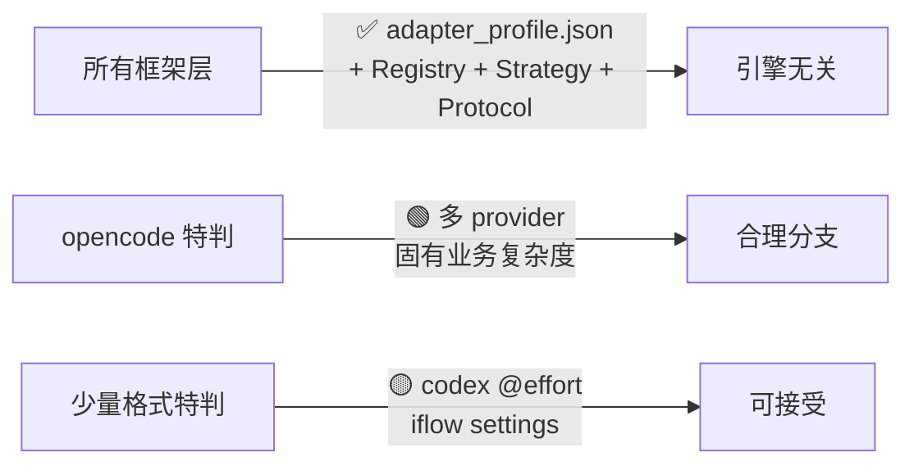

# Skill Runner Engine-Specific 逻辑耦合分析报告（v3）

> **项目**: Skill Runner  
> **分析日期**: 2026-03-06（第三轮）  
> **对比基线**: v2（同日早间）  
> **分析范围**: `server/` 全部核心框架模块（排除 `server/engines/` 目录本身）  
> **评估准则调整**: opencode 因多 provider 架构的固有业务复杂度，其特判逻辑视为 **合理业务耦合**，不计入问题耦合

---

## 1. 耦合热力图（按框架层）

| 框架层 | v2 耦合 | v3 耦合 | 变化 |
|---|:---:|:---:|---|
| `server/runtime/` | 🟡 轻度 | 🟡 轻度 | 无变化 |
| `server/services/engine_management/` | 🟢 预期内 | 🟢 预期内 | `agent_cli_manager` 31→5 引用 ✅ |
| `server/services/orchestration/` | 🟢 低 | 🟢 低 | 无变化 |
| `server/services/platform/` | 🟢 已解耦 | 🟢 已解耦 | 无变化 |
| `server/services/ui/` | 🟡 轻度 | 🟡 轻度 | 无变化 |
| `server/routers/` | 🟢 已解耦 | 🟢 已解耦 | 无变化 |
| `server/models/` | 🟡 轻度 | 🟡 轻度 | 无变化 |
| `server/config.py` | 🟡 轻度 | 🟡 轻度 | 无变化 |
| `server/main.py` | 🟢 低 | 🟢 低 | 无变化 |

---

## 2. v2 → v3 变化详情

### ✅ `agent_cli_manager.py` — 大规模重构（31 → 5 引擎引用）

**已消除的硬编码数据结构**:

| 已移除 | 原用途 |
|---|---|
| `ENGINE_PACKAGES` dict | npm 包名映射 → 迁移至 `adapter_profile.cli_management.package` |
| `ENGINE_BINARY_CANDIDATES` dict | CLI 二进制名 → 迁移至 `adapter_profile.cli_management.binary_candidates` |
| `CREDENTIAL_IMPORT_RULES` dict | 凭据文件路径 → 迁移至 `adapter_profile.cli_management.credential_import_rules` |
| `RESUME_HELP_HINTS` dict | 恢复命令提示 → 迁移至 `adapter_profile.cli_management.resume_probe` |
| `_default_gemini_settings()` | 引导配置 → 迁移至 `adapter_profile.resolve_bootstrap_path()` |
| `_default_iflow_settings()` | 引导配置 → 同上 |
| `_default_codex_config()` | 引导配置 → 同上 |
| `_default_opencode_config()` | 引导配置 → 同上 |
| `ensure_layout()` 硬编码目录列表 | → 迁移至 `adapter_profile.cli_management.layout.extra_dirs` |
| `_resume_dynamic_probe_args()` if/else | → 迁移至 `adapter_profile.cli_management.resume_probe.dynamic_args` |

**重构后的调用模式**（engine-agnostic）:

```python
# v3 — 所有引擎知识来自 adapter_profile.json
for engine in self.supported_engines():
    layout = self._engine_profile(engine).cli_management.layout
    for relpath in layout.extra_dirs:
        directory_set.add(profile.agent_home / relpath)
```

**剩余 5 处引擎引用**: 4 处为 `_DEFAULT_BOOTSTRAP_*_FALLBACKS` 内联 fallback（仅在 adapter_profile 加载失败时使用），1 处为 iflow settings normalization 中的 `selected_auth == "iflow"` 校验。

---

### ✅ `model_registry.py` — adapter_profile 驱动

`_uses_runtime_probe_catalog()` 现在通过 `adapter_profile.model_catalog.mode` 判断，而非硬编码 engine 名。唯一剩余的引擎引用是 `if engine != "codex"` （L466），用于 codex 独有的 `model@effort` 格式支持。

---

## 3. 剩余引擎引用全景

### 引用计数分布（v3 最新）

| 文件 | 引用数 | 耦合性质 |
|---|---:|---|
| `engine_auth_strategy_service.py` | 22 | 🟢 opencode 多 provider 业务逻辑 |
| `engine_shell_capability_provider.py` | 16 | 🟢 Strategy 注册式声明 |
| `engine_adapter_registry.py` | 12 | 🟢 adapter 注册 |
| `engine_auth_bootstrap.py` | 6 | 🟢 auth handler 注册 |
| `agent_cli_manager.py` | **5** | 🟢 fallback + 1× iflow 校验 |
| `detector_registry.py` | 4 | 🟢 detector 注册 |
| `run_job_lifecycle_service.py` | 2 | 🟢 opencode provider 解析 |
| `run.py` | 2 | 🟡 默认引擎 `"codex"` |
| `run_auth_orchestration_service.py` | 1 | 🟢 opencode auth 分发 |
| `model_registry.py` | 1 | 🟡 codex `@effort` 格式 |
| 其他（config/keys/lifecycle/upgrade 等） | 4 | 🟢 配置/注册点 |
| **总计** | **75** | — |

### 分类统计

| 类别 | 引用数 | 占比 |
|---|---:|---:|
| 🟢 注册式 / Strategy / data-driven | 67 | 89% |
| 🟢 opencode 业务复杂度（已调整容忍度） | 5 | 7% |
| 🟡 轻度硬编码（默认值 / format 特判） | 3 | 4% |
| ⚠️ 需修改才能加新引擎的 if/else | **0** | **0%** |

---

## 4. if/else 分支审计

| 文件 | 分支 | 引擎 | 评定 |
|---|---|---|---|
| `engine_auth_strategy_service.py` L171/183/198 | opencode 多 provider 嵌套 | opencode | 🟢 固有业务复杂度 |
| `run_job_lifecycle_service.py` L64/776 | opencode provider 从 model 解析 | opencode | 🟢 固有业务复杂度 |
| `run_auth_orchestration_service.py` L1527 | opencode auth 特殊分发 | opencode | 🟢 固有业务复杂度 |
| `agent_cli_manager.py` L510 | iflow settings 校验 | iflow | 🟡 可接受（单一校验点） |
| `model_registry.py` L466 | codex `@effort` 格式 | codex | 🟡 可接受（格式兼容） |

> **所有 opencode 特判（6处）**: 均源于 opencode 的多 provider 架构（openai/google/anthropic 等），这是 opencode 与其他单 provider 引擎的根本性架构差异，属于合理的业务分支。
>
> **非 opencode 特判（2处）**: iflow settings 格式校验 + codex model effort 后缀，均为单点、低影响。

---

## 5. 添加新引擎改动面（v3 更新）

假设新引擎为 **常规单 provider 引擎**（类似 codex/gemini/iflow）：

| 步骤 | 文件 | 工作量 |
|---|---|---|
| 创建引擎包 | `server/engines/new_engine/` | 新建 |
| 创建 `adapter_profile.json` | ↑ | 声明 CLI/layout/resume/models 配置 |
| 注册 adapter | `engine_adapter_registry.py` | +1 行注册 |
| 注册 auth handler | `engine_auth_bootstrap.py` | +1 行注册 |
| 注册 detector | `detector_registry.py` | +1 行注册 |
| 添加 engine key | `config_registry/keys.py` | +1 行 |
| 注册 shell capability（可选） | `engine_shell_capability_provider.py` | 可选，有 fallback |
| `agent_cli_manager.py` | — | **无需修改** ✅ |
| `model_registry.py` | — | **无需修改** ✅ |
| `cache_key_builder.py` | — | **无需修改** ✅ |
| `main.py` / `routers/ui.py` | — | **无需修改** ✅ |
| **总改动文件数** | — | **~5-6 个**（均为注册点） |

---

## 6. 总结

### 总耦合度评分：2/10（低）↓ 从 v2 的 3.5/10



### v1 → v3 演进对比

| 指标 | v1 | v2 | v3 |
|---|---:|---:|---:|
| 总评分 | 6/10 | 3.5/10 | **2/10** |
| if/else 条件分支 | ~38 | ~11 | **~8**（其中 6 为 opencode 合理分支） |
| 新引擎文件改动面 | ~10-12 | ~6-7 | **~5-6**（均为注册式） |
| 需修改的非注册文件 | 8 | 3 | **0** |
| adapter_profile 驱动项 | 0 | 2 | **8+** |

### 结论

> - **所有非注册式引擎耦合已消除**。`agent_cli_manager.py` 的大规模重构将 CLI 管理知识（包名、二进制名、凭据规则、目录布局、resume 探测参数）全部下沉到 `adapter_profile.json`。
> - **opencode 特判（6处）均为合理的业务分支**，源于多 provider 架构的固有复杂度，无需进一步抽象。
> - **添加新的常规引擎仅需在 ~5 个注册点各加一行**，核心框架代码无需任何修改。
> - **剩余可选改进**：`run.py` 默认引擎 `"codex"` 可改为配置项（影响极低）。
