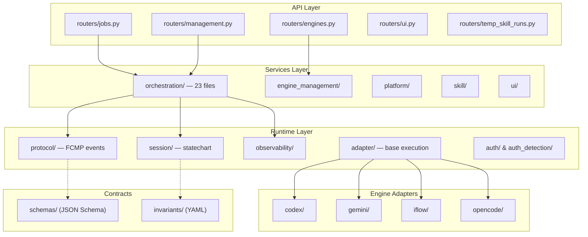

# Skill Runner 项目全面评审报告

> **项目**: Skill Runner v0.2.0  
> **评审日期**: 2026-03-06  
> **代码规模**: Server 236 files / 42,665 LOC · Tests 187 files / 33,971 LOC  
> **技术栈**: Python 3.11+ · FastAPI · Pydantic v2 · SQLite (aiosqlite) · yacs · Jinja2

---

## 1. 架构评估

### 1.1 分层架构



### 评价

| 维度 | 评分 | 说明 |
|---|:---:|---|
| 分层清晰度 | ⭐⭐⭐⭐ | Router → Services → Runtime → Engines 四层结构清晰，职责分明 |
| 依赖方向 | ⭐⭐⭐⭐ | 有 AST 级导入边界测试守护（`test_runtime_core_import_boundaries.py`） |
| 合同驱动 | ⭐⭐⭐⭐⭐ | JSON Schema + YAML invariants + SSOT 映射表，变更有硬门禁 |
| 协议收敛性 | ⭐⭐⭐⭐ | FCMP 对外单流 + RASP 审计内核，协议语义明确 |

**亮点**:
- **SSOT 治理体系**出色：`AGENTS.md` 定义 5 级冲突优先级、10 项漂移自检清单
- 运行时事件通过 `factories.py` 统一构建，禁止业务层手拼
- `OrchestratorDeps` 数据类实现显式依赖注入，支持测试替换

**问题**:
- 缺少独立的 **Domain Model 层** — 模型散在 `server/models/` 中仅作 API DTO，领域行为嵌入 Services
- `routers/jobs.py`（1267 行）和 `routers/temp_skill_runs.py`（908 行）承载了部分业务逻辑，越界到 Services 职责

---

## 2. 代码组织合理性

### 2.1 模块尺寸热力图（Top 10 源文件）

| 文件 | 行数 | 评价 |
|---|---:|---|
| `run_store.py` | 2,200 | 🔴 God Class — 81 个方法，承载全部持久化 |
| `run_observability.py` | 1,771 | 🟡 复杂但职责聚焦 |
| `run_auth_orchestration_service.py` | 1,570 | 🔴 过大，可拆解 |
| `event_protocol.py` | 1,496 | 🟡 协议核心，可接受 |
| `run_job_lifecycle_service.py` | 1,292 | 🔴 生命周期过重 |
| `routers/jobs.py` | 1,267 | 🔴 Router 不应此长度 |
| `job_orchestrator.py` | 935 | 🟡 重但 DI 做得好 |
| `routers/ui.py` | 919 | 🟡 UI 路由，模板渲染重 |
| `temp_skill_runs.py` | 908 | 🔴 Router 承担过多逻辑 |
| `base_execution_adapter.py` | 887 | 🟡 组合模式，恰当基类 |

### 2.2 命名与包结构

| 维度 | 评价 |
|---|---|
| 包层级 | ✅ 层次清晰，`server/{runtime,services,engines,routers,models,contracts}` |
| 文件命名 | ✅ `snake_case` 统一，`_service.py` / `_manager.py` 后缀区分角色 |
| `__init__.py` 导出 | ⚠️ `models/__init__.py` 导出 125+ 类型，`__all__` 与 import 语句冗余维护成本高 |
| 引擎适配器 | ✅ 4 引擎各占独立子包，结构对称 |

---

## 3. 代码规范性

### 3.1 优势

- **类型注解覆盖度高**: 函数签名普遍有类型标注，使用 `from __future__ import annotations`
- **Pydantic v2 模型**: 数据模型结构化、可校验
- **结构化日志**: `log_event` + `JsonFormatter` + `QuotaTimedRotatingFileHandler`
- **Docstring**: 核心模块基本有文档字符串

### 3.2 问题

| 问题 | 严重度 | 示例 |
|---|---|---|
| **config.py 残留注释** | 🟡 中 | 包含 `grep_search` 讨论、重构思路等开发过程注释（L29-43） |
| **没有 linter/formatter 配置** | 🟡 中 | `pyproject.toml` 无 ruff/black/isort/mypy 配置段，尽管有 `.ruff_cache`/`.mypy_cache` 目录 |
| **旧式类型标注混用** | 🟢 低 | 部分文件用 `Dict/List/Optional`（`typing` 模块），部分用内置 `dict/list/None` 联合 |
| **`# type: ignore` 注释** | 🟢 低 | `from fastapi import ...  # type: ignore[import-not-found]` |
| **debug 文件残留** | 🟢 低 | `debug_parse.py`、`debug_patch.py` 应更彻底清理而非仅 `.gitignore` |

---

## 4. 测试门禁覆盖率与冗余度

### 4.1 测试分层

| 测试层 | 文件数 | 行数 | 说明 |
|---|---:|---:|---|
| **unit** | 166 | ~28K | 核心层，涵盖所有关键模块 |
| **api_integration** | 6 | ~87K bytes | 数据库 + HTTP 客户端联合测试 |
| **engine_integration** | 15 | — | 引擎 CLI 集成验证 |
| **e2e** | 3 | — | 容器/本地/标准 3 套 E2E |
| **common** | 4 | — | 共享 fixtures、合同检查器 |

### 4.2 测试质量

**出色实践**:
- ✅ **合同测试**: `session_invariant_contract.py` 验证 statechart 与 YAML invariants 一致性
- ✅ **架构守护测试**: AST 级模块导入边界检查（~6 个 `test_runtime_*_boundaries*.py`）
- ✅ **属性测试**: `test_session_state_model_properties.py`、`test_fcmp_mapping_properties.py`
- ✅ **schema 回归测试**: `test_protocol_schema_registry.py` (505 行)
- ✅ **配对测试**: FCMP 事件配对、cursor、dedup 都有专属测试

**不足**:
| 问题 | 说明 |
|---|---|
| **没有 coverage 配置** | `pyproject.toml` 无 `[tool.coverage]` 或 `pytest-cov` 依赖，无法量化覆盖率 |
| **测试巨型化** | `test_job_orchestrator.py` 2,781 行、`test_engine_auth_flow_manager.py` 1,302 行 |
| **conftest 反模式** | `temp_config_dirs` 手动 defrost/freeze 全局 config 并逐字段保存/恢复 (L23-70)，脆弱且会随配置字段增加膨胀 |
| **无并行隔离** | 测试共享全局 `config` 单例，`pytest-xdist` 并行运行大概率失败 |
| **缺 CI 门禁** | `.github/workflows/` 为空，无自动化测试/lint/type-check 流水线 |

### 4.3 冗余度

部分路由测试（`test_v1_routes.py` 1,179 行 vs `test_runs_router_cache.py` 980 行 vs `test_jobs_interaction_routes.py`）可能存在重复覆盖同一 API 的不同场景，建议合并或建立更清晰的 test suite 组织。

---

## 5. 代码健壮性

### 5.1 优势

| 维度 | 实现 |
|---|---|
| **优雅降级** | 启动时 engine status/model catalog 失败仅 warning，不阻塞服务 |
| **进程管理** | POSIX/Windows 双路径进程树终止，SIGTERM → SIGKILL 升级策略 |
| **超时保护** | session_timeout, hard_timeout 双重超时机制 |
| **协议校验** | JSON Schema 验证 + ordering gate + dedup 多层保障事件流正确性 |
| **启动恢复** | `recover_incomplete_runs_on_startup()` 崩溃恢复机制 |
| **日志配额** | `QuotaTimedRotatingFileHandler` 防止日志撑爆磁盘 |

### 5.2 风险

| 风险 | 严重度 | 说明 |
|---|---|---|
| **无速率限制** | 🔴 高 | API 层无 rate limiting，支持创建无限 job |
| **SQLite 并发** | 🟡 中 | `RunStore` 使用 `asyncio.Lock` 保护初始化，但高并发写入可能触发 `database is locked` |
| **宽泛异常捕获** | 🟡 中 | 虽有 `test_no_unapproved_broad_exception.py` 守护，但启动代码仍 catch `(OSError, RuntimeError, ValueError, TypeError)` |
| **全局可变 config** | 🟡 中 | `config.defrost()` / `config.freeze()` 模式在并发环境不安全 |
| **进程泄漏风险** | 🟡 中 | `_active_processes` 管理 per-adapter，异常路径可能遗漏清理 |

---

## 6. 可维护性与可扩展性

### 6.1 可维护性

| 维度 | 评分 | 说明 |
|---|:---:|---|
| SSOT 治理 | ⭐⭐⭐⭐⭐ | 5 级优先级链 + 漂移自检清单，业界少见 |
| 文档完整度 | ⭐⭐⭐⭐ | `docs/` 27 份文档，openspec 807 条目 |
| OpenSpec 流程 | ⭐⭐⭐⭐ | 变更通过 change → delta spec → sync → archive |
| 测试守护 | ⭐⭐⭐⭐ | 架构边界、合同、属性、schema 多维度守护 |

### 6.2 可扩展性

| 维度 | 评价 |
|---|---|
| **新增引擎** | ✅ 良好 — 引擎适配器通过组件组装（command profiles、config composers）标准化，opencode 适配是最新范例 |
| **新增事件类型** | ✅ 有约束 — 需同步 schema + models + factories + tests（AGENTS.md 禁止项） |
| **水平扩展** | ⚠️ 受限 — SQLite 单文件数据库，进程内全局状态（config 单例、orchestrator 单例）不支持多实例 |
| **配置扩展** | ⚠️ 中等 — yacs CfgNode 不支持动态注册新 section，所有配置在 `core_config.py` 硬编码 |
| **认证扩展** | ✅ 良好 — auth driver registry + strategy 模式，新引擎认证可插拔 |

---

## 7. 主要脆弱风险点

### 🔴 高风险

1. **`run_store.py` God Object** — 2,200 行 / 81 方法。所有持久化逻辑集中在一个类中，涵盖 request CRUD、run CRUD、事件记录、状态管理、缓存、恢复状态、交互状态、auth session 状态。任何 schema 变更影响面极大。

2. **无 CI/CD 流水线** — `.github/workflows/` 为空。测试门禁、lint 检查、type-check、覆盖率报告均靠人工手动执行。

3. **SQLite 单点** — 生产环境中 SQLite 作为唯一持久化后端，并发写入受限，无连接池，无 WAL 模式配置可见。

### 🟡 中风险

4. **Router 层逻辑过重** — `jobs.py` 1,267 行包含大量 coerce/parse/validate 辅助函数应提取到 service 层。

5. **全局可变 Config 单例** — 测试中 `defrost/freeze` 模式不安全，若忘记 restore 会污染后续测试。

6. **`event_protocol.py` 膨胀** — 1,496 行单文件承载全部 FCMP 事件处理逻辑。

7. **进程生命周期管理** — CLI 子进程管理分散在 adapter / orchestrator / lifecycle service 三处，cancel/timeout 路径复杂。

### 🟢 低风险

8. **旧式 typing 混用** — `Dict/List/Optional` vs `dict/list|None`，统一性不足。
9. **debug 脚本残留** — `debug_parse.py`、`debug_patch.py` 在项目根目录。
10. **e2e_client/routes.py** — 52KB 单文件 HTML 模板渲染路由。

---

## 8. 技术债务评估

| 类别 | 债务项 | 工作量 | 优先级 |
|---|---|---|---|
| **架构** | 拆分 `RunStore` 为 Repository 层（RequestRepo / RunRepo / EventRepo / StateRepo） | L (大) | P0 |
| **架构** | 从 Router 提取业务逻辑到 Service — `jobs.py` 的 coerce/validate | M (中) | P1 |
| **基建** | 建立 CI/CD pipeline（lint + type-check + test + coverage） | M | P0 |
| **基建** | 配置 `pytest-cov`，设定覆盖率基线和门禁 | S (小) | P1 |
| **基建** | `pyproject.toml` 中正式配置 ruff / mypy rules | S | P1 |
| **代码** | 统一 typing style 到 Python 3.11 builtins (`dict|None`) | S | P2 |
| **代码** | 清理 `config.py` 开发过程注释 | S | P2 |
| **测试** | 替换 `conftest.py` 中 defrost/freeze 模式为 fixture-scoped config clone | M | P1 |
| **测试** | 拆分巨型测试文件（`test_job_orchestrator.py` 2,781 行） | M | P2 |
| **架构** | 拆分 `event_protocol.py` 为子模块 | M | P2 |
| **扩展** | 抽象持久化层为 Repository 接口，为 PostgreSQL 等后端做准备 | L | P2 |
| **运维** | 添加 API rate limiting 中间件 | S | P1 |
| **运维** | SQLite WAL 模式配置 + 连接池策略 | S | P1 |

---

## 9. 重构建议

### 9.1 即时建议（Sprint 内可完成）

1. **清理 `config.py` 残留注释** — 删除 L29-43 开发讨论，转为正式注释或 ADR。

2. **正式化 linter 配置** — 在 `pyproject.toml` 添加：
   ```toml
   [tool.ruff]
   target-version = "py311"
   select = ["E", "W", "F", "I", "UP", "B", "SIM", "TCH"]
   
   [tool.mypy]
   python_version = "3.11"
   strict = true
   ```

3. **添加 `pytest-cov`** — `dev` dependencies 添加 `pytest-cov`，设 80% 覆盖率门禁。

4. **SQLite WAL 模式** — 在 `RunStore._init_db` 中添加 `PRAGMA journal_mode=WAL`。

### 9.2 短期建议（1-2 Sprints）

5. **拆分 `RunStore`**:
   ```
   run_store.py → 
     request_repository.py   (request CRUD)
     run_repository.py       (run CRUD + cache)
     event_repository.py     (事件记录/查询)
     state_repository.py     (状态管理/恢复)
     interaction_repository.py (交互/auth session)
   ```

6. **Router 瘦身** — 将 `routers/jobs.py` 中 `_coerce_*`、`_build_runtime_policy_fields`、`_resolve_interactive_autoreply_runtime_options` 等提取到 `services/orchestration/run_request_validator.py`。

7. **Config 隔离** — 测试使用 fixture-scoped config 副本替代全局 defrost/freeze：
   ```python
   @pytest.fixture
   def isolated_config(tmp_path):
       cfg = get_cfg_defaults()
       cfg.SYSTEM.RUNS_DIR = str(tmp_path / "runs")
       # ... set test values ...
       cfg.freeze()
       return cfg
   ```
   并通过 DI 将 config 注入需要它的服务。

8. **创建 CI workflow** — `.github/workflows/ci.yml`，覆盖 lint → type-check → unit test → coverage 上报。

### 9.3 中长期建议（Roadmap）

9. **Repository 接口抽象** — 定义 `RunRepositoryProtocol`，当前 SQLite 实现作为其一种后端，为未来 PostgreSQL/DynamoDB 等做准备。

10. **事件协议模块化** — 将 `event_protocol.py` 拆分为 `event_types.py` + `event_handlers.py` + `event_validators.py`。

11. **API 安全加固** — 添加 rate limiting (FastAPI middleware)、request size limits、API key 认证。

12. **Observability 升级** — 引入 OpenTelemetry traces，替代当前自研的 structured trace logging。

---

## 总结

| 维度 | 得分 | 核心评价 |
|---|:---:|---|
| **架构** | 4/5 | 分层清晰，SSOT 治理出色，缺 Domain Model 层 |
| **代码组织** | 3.5/5 | 包结构合理，但存在多个超大文件 |
| **代码规范** | 3.5/5 | 类型注解好，但缺正式化的 linter 配置 |
| **测试体系** | 4/5 | 合同/边界/属性测试亮眼，缺覆盖率工具和 CI |
| **健壮性** | 3.5/5 | 多层防护到位，但 SQLite 并发和全局状态是隐患 |
| **可维护性** | 4/5 | OpenSpec + SSOT + 漂移自检，治理能力突出 |
| **可扩展性** | 3.5/5 | 引擎/认证可插拔，但水平扩展受限 |

> **总体评价**: Skill Runner 在**治理体系**和**协议设计**方面表现优异，SSOT 驱动的开发流程和合同测试体系体现了工程成熟度。主要改进方向集中在：拆解超大类/文件、建立 CI 门禁、正式化代码规范工具链、以及为水平扩展做持久化层抽象。
