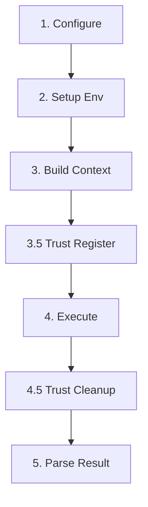

# Adapter Design & Specification

> Note: This document is primarily a design reference. For production API/runtime behavior, follow `docs/api_reference.md` and actual adapter implementation.

## 1. Overview

The **Standard Adapter Lifecycle** defines a rigorous 5-phase process for executing skills. All adapters (Gemini, Codex, etc.) **must** implement these phases to ensure consistent behavior regarding configuration layering, file handling, and output parsing.

## 2. The Standard Lifecycle

Each `run()` execution flows through these five distinct phases:



---

### Phase 1: Configuration (`_construct_config`)

**Goal**: Generate a fully resolved, engine-specific configuration file (e.g., `settings.json` or `config.toml`) in the run workspace.

**Requirements**:
1.  **Layered Loading**: Must implement the following precedence (highest priority last):
    -   *Layer 0*: **Base Defaults** (Hardcoded minimums, e.g. `quiet=true`)
    -   *Layer 1*: **Skill Defaults** (Loaded from `assets/<engine>_settings.json` or `config.toml`)
    -   *Layer 2*: **User Options** (Runtime overrides from API `model` + `runtime_options`)
    -   *Layer 3*: **System Enforced** (Loaded from `server/assets/configs/<engine>_enforced.json`)
2.  **Isolation**: The resulting config file must be written to `run_dir/.<engine>/` to avoid polluting global state.

**Interface Definition**:
```python
def _construct_config(self, skill: SkillManifest, run_dir: Path, options: Dict) -> Path:
    """
    Merges config layers and writes the result to the workspace.
    Returns: Path to the generated config file.
    """
```

---

### Phase 2: Environment Setup (`_setup_environment`)

**Goal**: Prepare the physical sandbox for execution.

**Requirements**:
1.  **Skill Installation**: Copy the skill directory to `run_dir/.<engine>/skills/<skill_id>`. This allows the CLI agent to "discover" the skill naturally.
2.  **Patching**: Modifies the installed `SKILL.md` (using `SkillPatcher`) to enforce that all artifacts are written to the `artifacts/` runner directory, overriding any relative paths.

**Interface Definition**:
```python
def _setup_environment(self, skill: SkillManifest, run_dir: Path, config_path: Path) -> Path:
    """
    Installs skill to workspace and patches SKILL.md.
    Returns: Path to the installed skill directory.
    """
```

---

### Phase 3: Context & Prompt (`_build_prompt`)

**Goal**: Resolve inputs and render the invocation instruction.

**Requirements**:
1.  **Strict File Resolution**: 
    - Iterate `input` schema keys.
    - Check for exact matches in `run_dir/uploads/`.
    - **CRITICAL**: If a declared input file is missing, raising a `MissingInputError` immediately. Do NOT fallback to string checks.
2.  **Template Rendering**:
    - Use Jinja2.
    - Inject resolved paths into `{{ input }}`.
    - Inject config values into `{{ parameter }}`.
3.  **Auditing**: Write the rendered string to `run_dir/logs/prompt.txt`.

**Interface Definition**:
```python
def _build_prompt(self, skill: SkillManifest, run_dir: Path, input_data: Dict) -> str:
    """
    Resolves files, renders Jinja2 template, and logs prompt.
    Returns: The final prompt string.
    """
```

---

### Phase 4: Execution (`_execute_process`)

**Goal**: Run the CLI subprocess safely.

**Requirements**:
1.  **Command Construction**:
    - Must use the config file generated in Phase 1.
    - Must target the specific skill (by name or prompt).
    - Must output JSON if possible.
2.  **Runtime Dependencies**:
    - Check `skill.runtime.dependencies`.
    - If present, wrap command with `uv run --with ...`.
3.  **IO Capture**:
    - Stream `stdout` and `stderr` to `run_dir/logs/`.

---

### Cross-Cutting: Run Folder Trust Lifecycle (Codex/Gemini)

**Goal**: Keep Codex/Gemini execution stable while avoiding persistent trust-table growth.

**Requirements**:
1. **Register Before Execute**:
   - Codex: write `projects."<run_dir>".trust_level = "trusted"` into `~/.codex/config.toml`.
   - Gemini: write `"<run_dir>": "TRUST_FOLDER"` into `~/.gemini/trustedFolders.json`.
2. **Cleanup In Finally**:
   - Always remove the per-run trust entry after adapter execution (success/failure).
3. **Best-Effort Error Policy**:
   - Trust cleanup failure must not overwrite run terminal status; log warning and rely on periodic stale cleanup.
4. **iFlow**:
   - No trust mutation (current design keeps iFlow as no-op for trust manager).

**Interface Definition**:
```python
async def _execute_process(self, cmd: List[str], run_dir: Path, env: Dict) -> Tuple[int, str, str]:
    """
    Spawns subprocess and captures output.
    Returns: (exit_code, stdout, stderr)
    """
```

---

### Phase 5: Result Parsing (`_parse_output`)

**Goal**: Extract structured data from the CLI's raw output.

**Requirements**:
1.  **Strategy**:
    - *Primary*: Attempt to parse entire stdout as JSON.
    - *Secondary*: If stdout is a JSON envelope, extract the primary response payload.
    - *Tertiary*: Look for markdown code fences (```json ... ```).
2.  **Normalization**: Ensure the returned dict matches the expected structure.

**Interface Definition**:
```python
def _parse_output(self, raw_stdout: str) -> Optional[Dict]:
    """
    Extracts result JSON from raw text.
    """
```

## 3. Implementation Plan (Refactoring)

The **GeminiAdapter** already follows this closely. The **CodexAdapter** needs to be refactored to align with this lifecycle:

1.  **Refactor Codex Config**: Move from `CodexConfigManager` (Global state modification) to **Workspace-Isolated Config** (passed via `-c` or specific profile path inside workspace). *Note: Codex CLI might require a named profile in `~/.codex/config.toml`; if so, we must ensure it points to workspace paths.*
2.  **Refactor Codex Env**: Stop executing "in place" (`skill.path`). Instead, copy to workspace and execute there to allow patching.
3.  **Refactor Codex Prompt**: Implement strict file resolution matching Gemini's logic.
