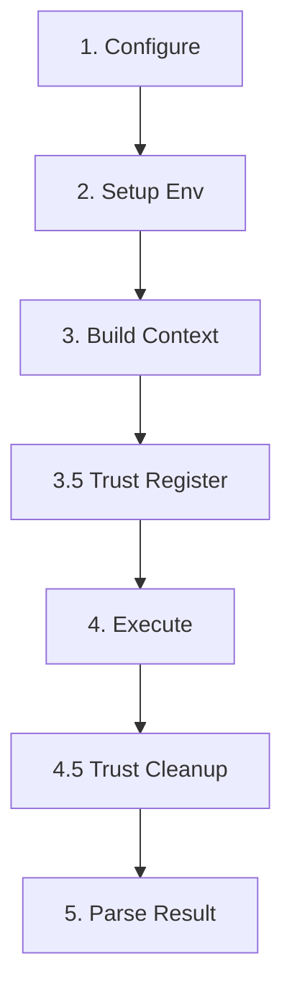

# Adapter Design & Specification

> Note: This document is primarily a design reference. For production API/runtime behavior, follow `docs/api_reference.md` and actual adapter implementation.

## 1. Overview

The **Standard Adapter Lifecycle** defines a rigorous 5-phase process for executing skills. All adapters (Gemini, Codex, etc.) **must** implement these phases to ensure consistent behavior regarding configuration layering, file handling, and output parsing.

## 2. The Standard Lifecycle

Each `run()` execution flows through these five distinct phases:


```mermaid
graph TD
    A[1. Configure] --> B[2. Setup Env]
    B --> C[3. Build Context]
    C --> T[3.5 Trust Register]
    T --> D[4. Execute]
    D --> U[4.5 Trust Cleanup]
    U --> E[5. Parse Result]
```

---

### Phase 1: Configuration (`_construct_config`)

**Goal**: Generate a fully resolved, engine-specific configuration file (e.g., `settings.json` or `config.toml`) in the run workspace.

**Requirements**:
1.  **Layered Loading**: Must implement the following precedence (highest priority last):
    -   *Layer 0*: **Base Defaults** (Hardcoded minimums, e.g. `quiet=true`)
    -   *Layer 1*: **Skill Defaults** (Loaded from `runner.json.engine_configs.<engine>` when resolvable, otherwise from the engine's fixed fallback filename)
    -   *Layer 2*: **User Options** (Runtime overrides from API `model` + `runtime_options`)
    -   *Layer 3*: **System Enforced** (Loaded from `server/engines/<engine>/config/enforced.*`)
2.  **Isolation**: The resulting config file must be written to `run_dir/.<engine>/` to avoid polluting global state.

**Interface Definition**:
```python
def _construct_config(self, skill: SkillManifest, run_dir: Path, options: dict[str, Any]) -> Path:
    """
    Merges config layers and writes the result to the workspace.
    Returns: Path to the generated config file.
    """
```

---

### Phase 2: Environment Setup (`_setup_environment`)

**Goal**: Prepare the physical sandbox for execution.

**Requirements**:
1.  **Skill Installation**: Copy the skill directory to `run_dir/.<engine>/skills/<skill_id>`. This allows the CLI agent to "discover" the skill naturally.
2.  **Patching**: Modifies the installed `SKILL.md` (using `SkillPatcher`) to enforce that all artifacts are written to the `artifacts/` runner directory, overriding any relative paths.

**Interface Definition**:
```python
def _setup_environment(self, skill: SkillManifest, run_dir: Path, config_path: Path) -> Path:
    """
    Installs skill to workspace and patches SKILL.md.
    Returns: Path to the installed skill directory.
    """
```

---

### Phase 3: Context & Prompt (`_build_prompt`)

**Goal**: Resolve inputs and render the invocation instruction.

**Requirements**:
1.  **Strict File Resolution**: 
    - Iterate `input` schema keys.
    - Check for exact matches in `run_dir/uploads/`.
    - **CRITICAL**: If a declared input file is missing, raising a `MissingInputError` immediately. Do NOT fallback to string checks.
2.  **Template Rendering**:
    - Use Jinja2.
    - Inject resolved paths into `{{ input }}`.
    - Inject config values into `{{ parameter }}`.
3.  **Auditing**: Write the rendered string to `run_dir/logs/prompt.txt`.
4.  **Schema Resolution**:
    - `input/parameter/output` schema reads must use the shared declaration-plus-fallback resolver.
    - `runner.json.schemas.<key>` has priority.
    - Missing/invalid declarations fall back to `assets/<key>.schema.json`.

**Interface Definition**:
```python
def _build_prompt(self, skill: SkillManifest, run_dir: Path, input_data: dict[str, Any]) -> str:
    """
    Resolves files, renders Jinja2 template, and logs prompt.
    Returns: The final prompt string.
    """
```

---

### Phase 4: Execution (`_execute_process`)

**Goal**: Run the CLI subprocess safely.

**Requirements**:
1.  **Command Construction**:
    - Must use the config file generated in Phase 1.
    - Must target the specific skill (by name or prompt).
    - Must output JSON if possible.
2.  **Runtime Dependencies**:
    - Check `skill.runtime.dependencies`.
    - If present, first probe `uv` dependency injection.
    - Probe success: wrap command with `uv run --with ...`.
    - Probe failure: emit warning and fallback to direct command execution (best-effort).
3.  **IO Capture**:
    - Stream `stdout` and `stderr` to `run_dir/logs/`.

---

### Cross-Cutting: Run Folder Trust Lifecycle

**Goal**: Keep engine execution stable while avoiding persistent trust-table growth.

**Requirements**:
1. **Register Before Execute** (engine-specific):
   - Codex: write `projects."<run_dir>".trust_level = "trusted"` into `~/.codex/config.toml`.
   - Gemini: write `"<run_dir>": "TRUST_FOLDER"` into `~/.gemini/trustedFolders.json`.
   - iFlow: No trust mutation needed (current design treats iFlow as no-op for trust manager).
   - OpenCode: No trust mutation needed (no trust table concept).
2. **Cleanup In Finally**:
   - Always remove the per-run trust entry after adapter execution (success/failure).
3. **Best-Effort Error Policy**:
   - Trust cleanup failure must not overwrite run terminal status; log warning and rely on periodic stale cleanup.

> **Note**: Trust 策略注册/取消注册现已由 `adapter_profile.json` 中的引擎标识驱动，由 `run_folder_trust_manager.py` 统一管理。

**Interface Definition**:
```python
async def _execute_process(self, cmd: list[str], run_dir: Path, env: dict[str, str]) -> tuple[int, str, str]:
    """
    Spawns subprocess and captures output.
    Returns: (exit_code, stdout, stderr)
    """
```

---

### Phase 5: Result Parsing (`_parse_output`)

**Goal**: Extract structured data from the CLI's raw output.

**Requirements**:
1.  **Strategy**:
    - *Primary*: Attempt to parse entire stdout as JSON.
    - *Secondary*: If stdout is a JSON envelope, extract the primary response payload.
    - *Tertiary*: Look for markdown code fences (```json ... ```).
2.  **Normalization**: Ensure the returned dict matches the expected structure.

**Interface Definition**:
```python
def _parse_output(self, raw_stdout: str) -> AdapterTurnResult:
    """
    Extracts result JSON from raw text.
    """
```

### CodeBuddy Execution Contract

CodeBuddy uses two canonical providers, `codebuddy-cn` and `codebuddy-global`, each with an isolated credential vault, persistent CLI directory, and resume lineage. Its provider-qualified models are read through the generic model registry from `server/engines/codebuddy/models/manifest.json`; listing models never runs the CLI or reads credentials. Every start or resume runs in the request workspace and writes `CODEBUDDY.md`, managed `.codebuddy/settings.json`, `.codebuddy/mcp.json`, and installed skills. Resume adds only `-r <session-id>`; the prompt/reply remains the final argv element.

The adapter always passes `--mcp-config` and `--strict-mcp-config`. Its run-local MCP file has an explicit `mcpServers` root and transport type for STDIO, HTTP, and SSE; resolved MCP secrets never enter logs, errors, audit payloads, or tests. Structured output is passed as the inline JSON schema and follows the shared result-validation pipeline.

CodeBuddy framing and parsing are stateful: malformed frames may resynchronize, but only a non-error `result.success` terminal result completes a turn. A zero process exit with an error result or no terminal result is failed, and high-confidence provider auth signals retain priority.

Missing and expired credentials are represented as engine-neutral preflight auth signals before any CodeBuddy task subprocess starts. Runtime auth evidence is evaluated from redacted stdout and stderr. Both paths enter the canonical `waiting_auth` lifecycle; successful browser authentication automatically requeues once, using exact session resume when a handle exists and a fresh start otherwise.

The inline CodeBuddy TUI uses the same engine-local managed-environment builder as headless execution. It requires an explicit signed-in provider, starts the real interactive CLI with project-only settings, writes enforced Plan/deny-all settings inside the isolated UI-shell directory, and passes a session-local empty MCP configuration in strict mode.

### Kilo MCP and model-catalog lifecycle

Kilo uses the same governed native MCP shape as OpenCode: the shared registry renderer writes servers under the top-level `mcp` key, while skill and runtime configuration cannot provide MCP roots directly. Kilo model probing is installation-gated; startup, interval, manual, and post-install refreshes run only after the cached engine-status probe confirms the managed CLI is present without an error.

## 3. Implementation Status

> [!NOTE]
> **✅ COMPLETED** — 本节描述的重构计划已于 v0.3 中完成。
>
> 所有引擎（Codex / Gemini / iFlow / OpenCode）现已统一继承 `server/runtime/adapter/base_execution_adapter.py`，
> 遵循 5 阶段生命周期。工作区隔离配置、信任文件夹管理等均已实现。
