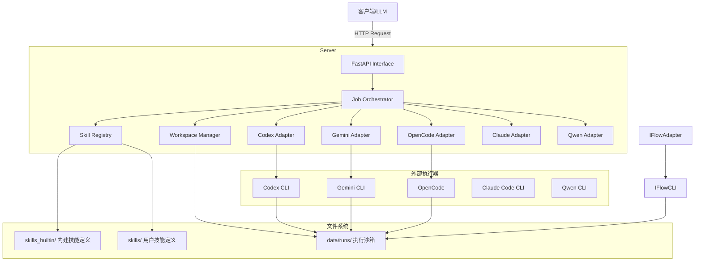

# 架构总览 (Architecture Overview)

## 简介
Skill Runner 是一个专为 AI Agent 设计的技能执行框架。它允许 LLM（如 Gemini）通过标准化的协议发现、配置并执行本地或通过 MCP (Model Context Protocol) 定义的各种“技能” (Skills)。该系统旨在解决复杂任务自动化、本地环境交互以及工具链集成的需求。

## 核心设计理念
1.  **标准化 (Standardization)**: 所有技能遵循统一的定义规范 (`runner.json`, `SKILL.md`) 和输入/输出协议。
2.  **隔离性 (Isolation)**: 每次技能执行 (Run) 都在独立的工作区目录中进行，互不干扰。
3.  **可扩展性 (Extensibility)**: 支持多种对接入 (Native, Docker, MCP)，目前核心支持基于 Codex CLI、Gemini CLI、OpenCode、Claude Code、Qwen 的 Native 执行。
4.  **无状态与有状态结合**: 服务本身无状态，但通过文件系统 (`data/runs`) 持久化执行上下文。

## 系统架构图 (概念)



## 目录结构约定

系统的核心逻辑高度依赖于文件系统的目录结构，主要分为两部分：

### 1. 技能库（`skills_builtin/` + `skills/`）
- `skills_builtin/`: 内建技能定义（随仓库发布，默认只读来源）。
- `skills/`: 用户技能定义（运行时安装目录，允许覆盖同 `skill_id` 的内建技能）。

每个技能一个子目录，目录名为 `skill_id`。

```text
skills_builtin/ 或 skills/
├── demo-prime-number/       # 技能 ID
│   ├── assets/
│   │   ├── runner.json          # 核心配置文件：定义元数据、Schema、Prompt等
│   │   ├── input.schema.json   # 文件输入定义
│   │   ├── parameter.schema.json # 参数定义
│   │   ├── output.schema.json  # 输出定义
│   │   ├── codex_config.toml   # 可选：Codex 推荐配置
│   │   ├── gemini_settings.json # 可选：Gemini 推荐配置
│   │   └── opencode.json       # 可选：OpenCode 推荐配置
│   ├── SKILL.md                 # 技能的 Prompt 模板/核心指令
│   └── ...
└── ...
```

### 2. 运行数据 (`data/runs/`)
存放每次执行的实例数据。

```text
data/runs/
├── <run_id>/   (内部)
│   ├── uploads/             # 用户上传的文件存放于此
│   ├── artifacts/           # 技能生成的产物
│   ├── .state/              # run 当前状态真相
│   ├── .audit/              # 审计日志（按 attempt 编号）
│   ├── result/              # 最终结构化结果
│   ├── bundle/              # 运行结果打包 (zip + manifest)
│   ├── .<engine>/           # 引擎隔离工作区（.codex/.gemini/.opencode/.claude/.qwen 等）
│   └── ...

data/requests/
└── <request_id>/
    ├── uploads/             # 请求阶段上传文件
    ├── request.json         # 请求原始参数
    └── input_manifest.json  # 输入文件哈希清单
```

## 技术栈
- **语言**: Python 3.11+
- **Web 框架**: FastAPI
- **模板引擎**: Jinja2 (用于 Prompt 渲染)
- **校验**: JSON Schema (jsonschema)
- **后端 AGENT CLI 引擎**: (通过 `subprocess` 调用)
  - [Codex](https://openai.com/codex/)
  - [Gemini CLI](https://geminicli.com/)
  - [OpenCode](https://opencode.ai/)
  - [Claude Code](https://www.anthropic.com/claude-code)
  - [Qwen CLI](https://github.com/QwenLM/qwen-code)

## 日志配置
日志默认输出到终端与 `data/logs/`。

- 持久化且可由 `/ui/settings` 修改的最小日志设置存放在 `data/system_settings.json`
  - `level`
  - `format`
  - `retention_days`
  - `dir_max_bytes`
- 只读运行时日志输入继续由系统配置/环境变量提供
  - `LOG_DIR`
  - `LOG_FILE_BASENAME`
  - `LOG_ROTATION_WHEN`
  - `LOG_ROTATION_INTERVAL`

管理首页 `/ui` 不再直接放置 data reset 危险区；危险操作与日志设置统一位于 `/ui/settings`。
