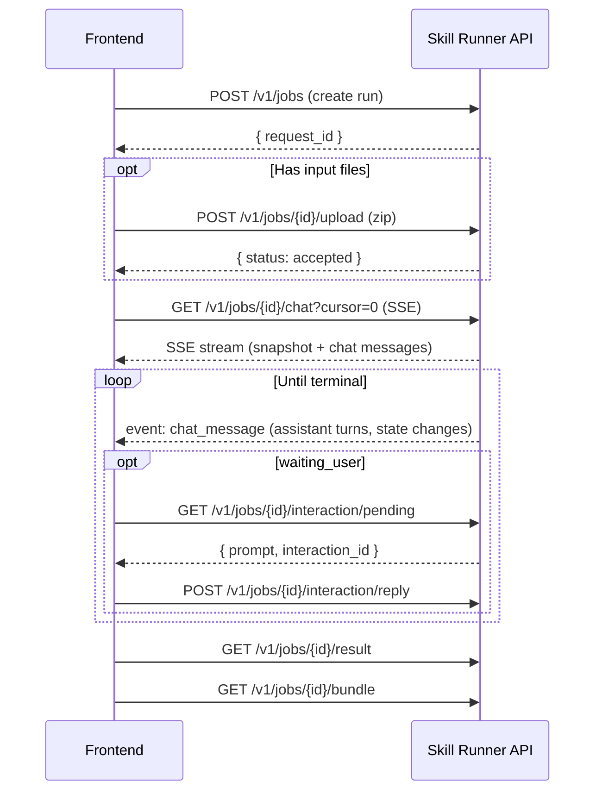

# Frontend Design Guide

This guide helps developers and coding agents build frontend clients for Skill Runner.
It covers the API surface, SSE event streaming, the FCMP protocol, the canonical chat history channel, and recommended UI patterns.

> **Reference Implementation**: The built-in E2E example client (`e2e_client/`) provides a fully working frontend.
> See [E2E Example Client UI Reference](../e2e_example_client_ui_reference.md) for its UI specification.

---

## 1. API Surface Overview

### 1.1 REST Endpoints (Key Subset)

| Category | Method | Path | Purpose |
|----------|--------|------|---------|
| **Skills** | `GET` | `/v1/skills` | List installed skills |
| | `GET` | `/v1/management/skills/{skill_id}` | Skill detail (engines, modes, metadata) |
| | `GET` | `/v1/management/skills/{skill_id}/schemas` | Input/parameter/output JSON schemas |
| **Jobs** | `POST` | `/v1/jobs` | Create a run |
| | `POST` | `/v1/jobs/{request_id}/upload` | Upload input files (zip) |
| | `GET` | `/v1/jobs/{request_id}` | Current run state |
| | `GET` | `/v1/jobs/{request_id}/result` | Terminal result (only after completion) |
| | `GET` | `/v1/jobs/{request_id}/artifacts` | Artifact file list |
| | `GET` | `/v1/jobs/{request_id}/bundle` | Download artifact bundle (zip) |
| **Interaction** | `GET` | `/v1/jobs/{request_id}/interaction/pending` | Current pending prompt |
| | `POST` | `/v1/jobs/{request_id}/interaction/reply` | Submit user reply |
| **SSE (Events)** | `GET` | `/v1/jobs/{request_id}/events?cursor=N` | FCMP protocol event stream |
| | `GET` | `/v1/jobs/{request_id}/events/history` | FCMP event history (query) |
| **SSE (Chat)** | `GET` | `/v1/jobs/{request_id}/chat?cursor=N` | Canonical chat bubble stream |
| | `GET` | `/v1/jobs/{request_id}/chat/history` | Chat history (query) |
| **Raw Logs** | `GET` | `/v1/jobs/{request_id}/logs/range` | Byte-range log preview |
| **Engines** | `GET` | `/v1/engines` | List engines |
| | `GET` | `/v1/management/engines/{engine}` | Engine detail + model list |

> Full specification: [API Reference](../api_reference.md)

### 1.2 Run Lifecycle (REST)



---

## 2. Dual SSE Channels

Skill Runner exposes **two parallel SSE endpoints** per run. Understanding when to use each is the most critical frontend design decision.

### 2.1 Channel Comparison

| Aspect | `/events` (FCMP Protocol) | `/chat` (Canonical Chat) |
|--------|--------------------------|-------------------------|
| **Purpose** | Runtime observability & protocol semantics | Chat bubble rendering |
| **Event types** | `snapshot`, `chat_event`, `heartbeat` | `snapshot`, `chat_message`, `heartbeat` |
| **Content** | FCMP envelope with full protocol fields (`seq`, `type`, `data`, `meta`, `raw_ref`) | Pre-projected chat messages (role, content, metadata) |
| **Use for** | Debugger/admin tools, state machine tracking, protocol consumers | Chat-style conversation UI |
| **State changes** | `conversation.state.changed` events with `from`/`to`/`trigger` | State transitions projected as system messages |
| **Auth events** | Full auth lifecycle (`auth.required`, `auth.challenge.updated`, etc.) | Auth prompts projected as system/assistant messages |
| **Cursor** | Based on FCMP global `seq` | Based on chat message `seq` |

### 2.2 Choosing Your Channel

```
┌──────────────────────────────────────────────┐
│ Are you building a chat-style conversation   │
│ UI (like ChatGPT / Claude)?                  │
├────────┬─────────────────────────────────────┤
│  YES   │  Use /chat + /chat/history          │
│        │  (pre-projected bubbles, simpler)   │
├────────┼─────────────────────────────────────┤
│  NO    │  Use /events + /events/history      │
│        │  (full FCMP protocol, more control) │
└────────┴─────────────────────────────────────┘
```

**Recommendation for most frontends**: Use `/chat` for the main conversation panel.
Optionally subscribe to `/events` in parallel for an advanced observability/debugger panel.

### 2.2.1 Structured Output Display Rule

Structured-output display is backend-driven:

- `assistant.message.final.data.text` remains the raw/compat final payload for protocol compatibility.
- `assistant.message.final.data.display_text` is the backend-projected frontend display text.
- `assistant.message.final.data.display_format` describes how that projected text should be rendered.
- `/chat` and `/chat/history` are derived from the projected display text, so normal chat UIs do **not** need to parse structured JSON themselves.

Frontend rule of thumb:

- conversation panel: consume `/chat`
- pending prompt card: consume `/interaction/pending`
- do not parse `__SKILL_DONE__`, `message`, or `ui_hints` out of chat text on the client

### 2.3 SSE Connection Pattern

Both channels follow the same SSE contract:

```javascript
// Connect with cursor-based position tracking
const eventSource = new EventSource(
  `/v1/jobs/${requestId}/chat?cursor=${lastCursor}`
);

eventSource.addEventListener('snapshot', (e) => {
  // First frame: current state snapshot
  const snapshot = JSON.parse(e.data);
  // snapshot.status: 'queued' | 'running' | 'waiting_user' | ...
  // snapshot.cursor: current position for reconnection
  // snapshot.pending_interaction_id: set if waiting for user
});

eventSource.addEventListener('chat_message', (e) => {
  const msg = JSON.parse(e.data);
  // Append to conversation panel
  appendMessage(msg);
  // Track cursor for reconnection
  lastCursor = msg.seq;
});

eventSource.addEventListener('heartbeat', (e) => {
  // Transport keepalive — no action needed
});

// Reconnect on disconnect
eventSource.onerror = () => {
  eventSource.close();
  setTimeout(() => reconnect(lastCursor), 2000);
};
```

### 2.4 Disconnect Compensation

When the SSE connection drops and reconnects:

1. **Option A (recommended)**: Reconnect SSE with `cursor=lastCursor`. The backend will resume from the missed position, delivering any events that occurred during disconnection.

2. **Option B (catch-up supplement)**: Call the history endpoint to fetch missed events, then reconnect SSE:

```javascript
// Fetch missed events
const history = await fetch(
  `/v1/jobs/${requestId}/chat/history?from_seq=${lastCursor}`
);
const missed = await history.json();
missed.events.forEach(appendMessage);

// Reconnect SSE from latest position
const newCursor = missed.cursor ?? lastCursor;
reconnectSSE(newCursor);
```

### 2.5 History Endpoint Query Parameters

Both `/events/history` and `/chat/history` support:

| Parameter | Type | Description |
|-----------|------|-------------|
| `from_seq` | int | Start from this sequence number (inclusive) |
| `to_seq` | int | End at this sequence number (inclusive) |
| `from_ts` | string | Start from this ISO timestamp |
| `to_ts` | string | End at this ISO timestamp |

---

## 3. FCMP Protocol (for `/events` consumers)

If your frontend consumes the `/events` channel (for admin/debugger tools or advanced UIs), you need to understand the FCMP protocol.

### 3.1 FCMP Envelope Structure

Every `chat_event` from the `/events` SSE carries this envelope:

```json
{
  "protocol_version": "fcmp/1.0",
  "run_id": "run-xxx",
  "seq": 5,
  "ts": "2026-02-24T12:34:56.000000",
  "engine": "codex",
  "type": "assistant.message.final",
  "data": {},
  "meta": {
    "attempt": 2,
    "local_seq": 3
  },
  "raw_ref": null
}
```

Key fields:
- **`seq`**: Global sequence number across all attempts. Use as cursor.
- **`type`**: Event type (see §3.2).
- **`meta.attempt`**: Which execution attempt this event belongs to.
- **`meta.local_seq`**: Sequence number within the current attempt.
- **`raw_ref`**: If present, links to a byte range in stdout/stderr logs for evidence jump.

For structured-output runs, `assistant.message.final.data` may also carry:

- **`display_text`**: backend-projected chat text
- **`display_format`**: `plain_text` or `markdown`
- **`display_origin`**: projection source such as `pending_branch`, `final_branch`, or `repair_fallback`

### 3.2 Event Types

| Event Type | Semantics | Frontend Action |
|------------|-----------|-----------------|
| `conversation.state.changed` | State machine transition | Update status indicator |
| `assistant.message.final` | Engine produced output | Display as assistant bubble using backend-projected display text |
| `user.input.required` | Waiting for user reply | Show input prompt, enable reply |
| `interaction.reply.accepted` | Reply was accepted | Show confirmation, disable input |
| `interaction.auto_decide.timeout` | Auto-reply timeout fired | Show system notification |
| `auth.required` | Auth challenge started | Show auth prompt |
| `auth.challenge.updated` | Auth challenge updated | Update auth UI |
| `auth.input.accepted` | Auth input received | Show pending status |
| `auth.completed` | Auth succeeded | Hide auth UI |
| `auth.failed` | Auth failed | Show error |
| `diagnostic.warning` | Non-fatal warning | Show in diagnostics panel |
| `raw.stdout` / `raw.stderr` | Raw output chunks | Append to log panel |

### 3.3 State Machine Transitions

The `conversation.state.changed` event carries `data.from` and `data.to`:

```
queued → running → succeeded
                 → failed
                 → canceled
       → waiting_user → queued → running → ...
       → waiting_auth → queued → running → ...
                       → failed
```

**Terminal detection**: When `data.to` is `succeeded`, `failed`, or `canceled`, the run is complete.
The `data.terminal` object will contain the final status and any error details.

### 3.4 Interaction Reply Contract

When the frontend receives `user.input.required`:

1. Read `data.prompt` for the prompt text to display.
2. Fetch `/interaction/pending` for complete pending details (including `interaction_id`).
3. Submit reply via `POST /interaction/reply` with `{ "content": "user text" }`.
4. Wait for `interaction.reply.accepted` event to confirm.
5. Disable input until next `user.input.required`.

Structured-output split for interactive runs:

- chat bubble: use `/chat`, which already contains the backend-projected pending `message`
- pending card title/body: use `pending.ui_hints.prompt`
- pending card hint text: use `pending.ui_hints.hint`
- pending card actions/upload hints: use `pending.ui_hints.options` / `pending.ui_hints.files`
- do **not** repeat the pending `message` inside the prompt card

If `ui_hints.prompt` is missing or the run falls back to default waiting behavior, the prompt card should degrade to a stable default open-text prompt rather than reusing chat text.

> **Important**: Only `user.input.required` is the canonical signal for enabling reply input.
> Do not infer reply availability from state names alone.

---

## 4. Chat History Mechanism

### 4.1 Architecture

```
┌─────────────────┐     ┌────────────────────┐     ┌──────────────────┐
│ Live Parser      │────▶│ FcmpLiveJournal     │────▶│ SSE /events      │
│ (engine output)  │     │ (in-memory ring)    │     │ (FCMP protocol)  │
└─────────────────┘     └────────┬───────────┘     └──────────────────┘
                                 │
                                 ▼
                        ┌────────────────────┐     ┌──────────────────┐
                        │ Chat Projector      │────▶│ SSE /chat        │
                        │ (bubble projection) │     │ (chat bubbles)   │
                        └────────┬───────────┘     └──────────────────┘
                                 │
                                 ▼
                        ┌────────────────────┐
                        │ .audit/ files       │
                        │ (persistent backup) │
                        └────────────────────┘
```

- **Live runs**: SSE and history read from the in-memory live journal first.
- **Completed runs**: Fall back to `.audit/fcmp_events.{attempt}.jsonl` files.
- **Latency**: Events are available via SSE immediately upon generation; audit file writes are async.

### 4.2 Cursor Semantics

- The `cursor` is an integer based on the global `seq` of events (FCMP or chat, respectively).
- `cursor=0` means "start from the beginning."
- On reconnection, use the `seq` of the last received event as the cursor.
- The cursor is **cross-attempt monotonic**: when a run resumes after auth or interaction reply, new events continue the global seq without resetting.

### 4.3 Chat vs Events Cursor Independence

The `/chat` and `/events` channels have **independent cursor spaces**.
A `seq` from an `/events` event cannot be used as a cursor for `/chat`, and vice versa.
Each channel must track its own `lastCursor` independently.

---

## 5. Recommended UI Layout

### 5.1 Minimal Chat Client

For the simplest useful frontend — a chat-style interface:

```
┌──────────────────────────────────────────┐
│ Skill Runner — run-xxxx        [Status]  │
├──────────────────────────────────────────┤
│                                          │
│  ┌─────────────────────────────────────┐ │
│  │ 🤖 Assistant: I'll analyze the...  │ │
│  │                                     │ │
│  │ 👤 You: Continue with step 2       │ │
│  │                                     │ │
│  │ 🤖 Assistant: Here are the results │ │
│  │                                     │ │
│  │ ⚙️ System: Run completed           │ │
│  └─────────────────────────────────────┘ │
│                                          │
│  ┌─────────────────────────┐  ┌────────┐ │
│  │ Type your reply...      │  │  Send  │ │
│  └─────────────────────────┘  └────────┘ │
├──────────────────────────────────────────┤
│ [View Result]  [Download Bundle]         │
└──────────────────────────────────────────┘
```

**Implementation**:
1. Subscribe to `/chat?cursor=0`.
2. Render each `chat_message` as a bubble.
3. On `snapshot.status === 'waiting_user'`, enable reply input.
4. On terminal state, show result/download links.

### 5.2 Full Observation Client (E2E Reference)

For a developer-facing observation tool — the layout used by the built-in E2E client:

```
┌──────────────────────────────────────────────────────────────────┐
│ Run: xxxx-xxxx  │ Status: running  │ [Result] [Replay]          │
├────────────────────────────────┬─────────────────────────────────┤
│ FCMP Conversation Panel        │ Stderr Panel                   │
│ (scrollable, fixed height)     │ (scrollable)                   │
│                                │                                │
│ chat_event messages            │ raw stderr output              │
│ with low-confidence badges     │                                │
│ and raw_ref jump buttons       │                                │
├────────────────────────────────┴─────────────────────────────────┤
│ Event Relations Panel                                            │
│ seq │ type                          │ correlation │ confidence   │
│ ─── │ ───────────────────────────── │ ─────────── │ ──────────── │
│   1 │ conversation.state.changed    │ -           │ 1.00         │
│   2 │ assistant.message.final       │ -           │ 0.95         │
│   3 │ user.input.required           │ -           │ 1.00         │
├──────────────────────────────────────────────────────────────────┤
│ Pending: "What should I do next?"                                │
│ ┌─────────────────────────────────────┐ ┌──────┐                 │
│ │ Your reply...                       │ │ Send │                 │
│ └─────────────────────────────────────┘ └──────┘                 │
└──────────────────────────────────────────────────────────────────┘
```

**Implementation**:
1. Subscribe to `/events?cursor=0` for the FCMP panel + events table.
2. Optionally subscribe to `/chat?cursor=0` for a separate chat-style view.
3. Use `raw_ref` fields to create clickable evidence jump links to `/logs/range`.
4. Poll `/interaction/pending` when state enters `waiting_user`.

### 5.3 Run Form Design

Before execution, the frontend needs a skill run configuration form:

1. **Fetch skill detail** → `GET /v1/management/skills/{skill_id}`
   - Extract `engines`, `execution_modes` for selector dropdowns.
2. **Fetch schemas** → `GET /v1/management/skills/{skill_id}/schemas`
   - Dynamically generate input/parameter form fields from JSON Schema.
3. **Fetch engine models** → `GET /v1/management/engines/{engine}`
   - Populate model selector per engine.
4. **Conditional runtime options**:
   - Show `interactive_auto_reply` + `interactive_reply_timeout_sec` only when `execution_mode=interactive`.
   - Show `interactive_reply_timeout_sec` only when `interactive_auto_reply=true`.

---

## 6. Implementation Checklist

### Minimal Viable Frontend

- [ ] Skill list page with run button
- [ ] Run form with engine/mode/model selectors + schema-driven input fields
- [ ] Job creation (`POST /v1/jobs`) + optional upload
- [ ] SSE subscription to `/chat` with cursor tracking
- [ ] Chat bubble rendering (assistant / user / system)
- [ ] Reply input (enabled on `waiting_user`, disabled otherwise)
- [ ] Terminal detection and result display
- [ ] SSE reconnection with cursor

### Advanced Features

- [ ] FCMP `/events` subscription for observability panel
- [ ] Event relations table (seq / type / correlation / confidence)
- [ ] Low-confidence badge on events with `confidence < 0.7`
- [ ] `raw_ref` evidence jump (byte-range log preview)
- [ ] Stderr log panel
- [ ] Bundle explorer (file tree + preview)
- [ ] Recording / replay view
- [ ] Auth challenge UI (for `auth.required` / `auth.challenge.updated`)

---

## 7. Common Pitfalls

| Pitfall | Correct Approach |
|---------|-----------------|
| Using `/events` for chat bubbles | Use `/chat` — it provides pre-projected bubbles |
| Inferring reply-ability from state name | Only enable reply on `user.input.required` event |
| Reading `result/result.json` for current state | Read from SSE snapshot or `/v1/jobs/{id}` |
| Mixing `/events` and `/chat` cursors | Each channel has independent cursor space |
| Not handling SSE reconnection | Always track `lastCursor` and reconnect with it |
| Assuming `auth.completed` means run resumed | Wait for `conversation.state.changed(queued→running)` |
| Building forms without schema introspection | Use `/schemas` endpoint for dynamic form generation |
