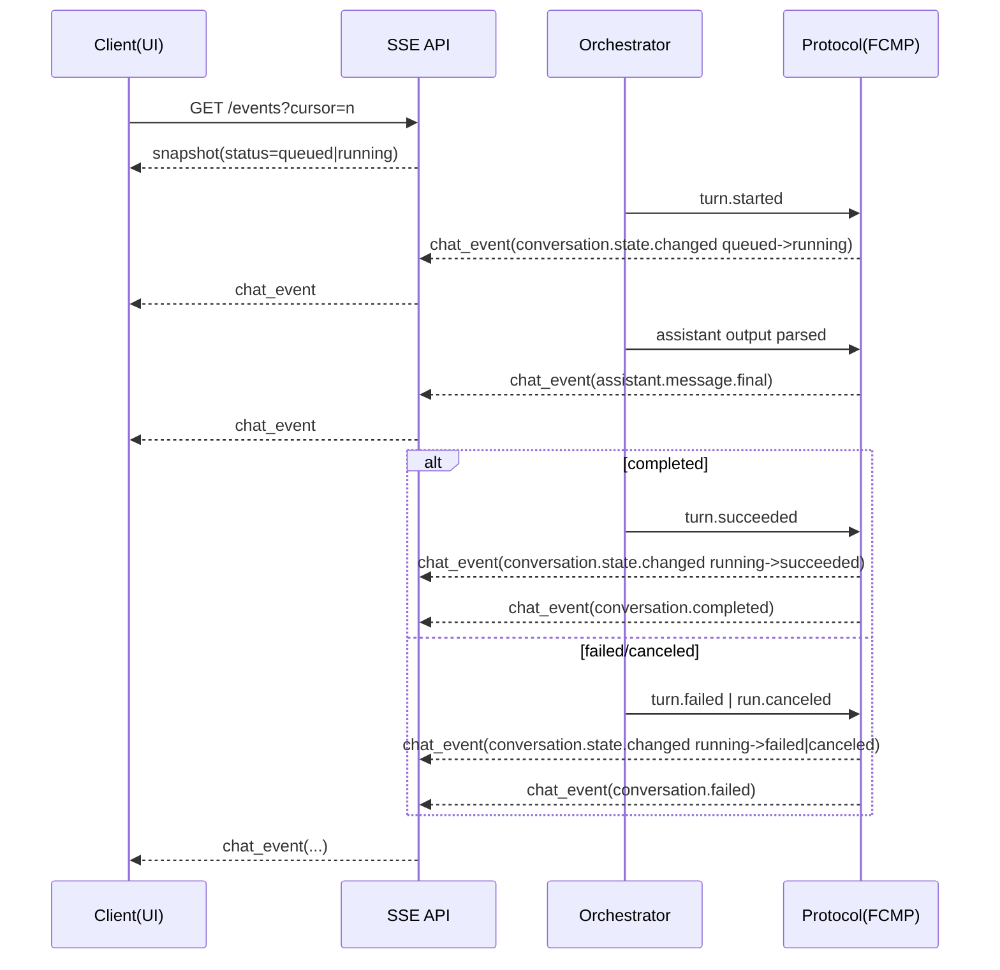
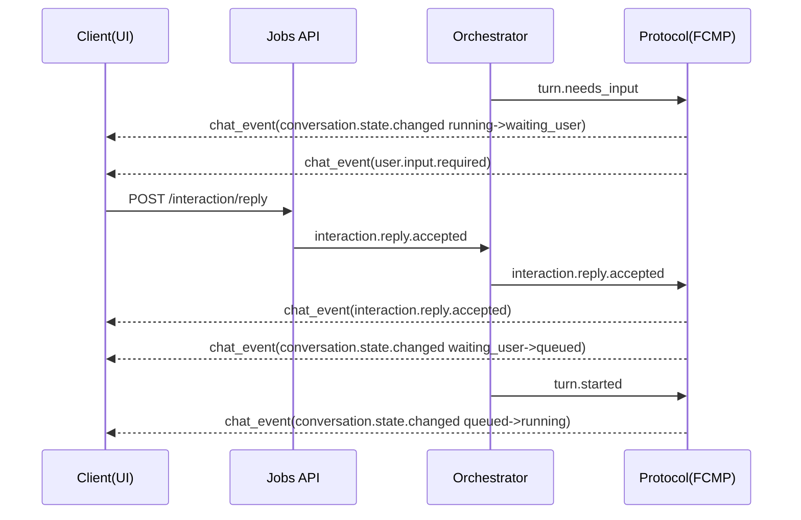
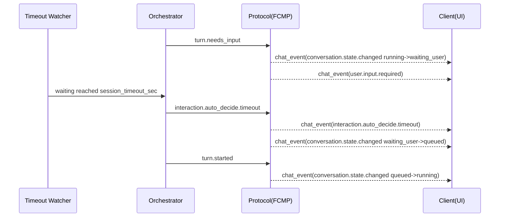
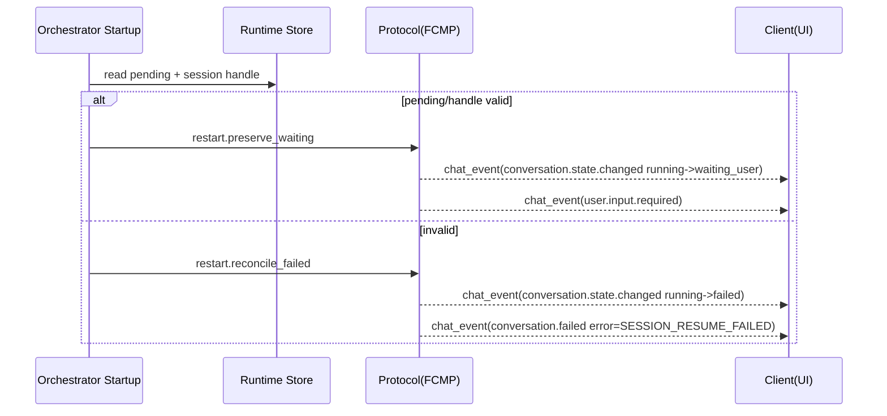

# Session Event Flow (FCMP Single-Stream SSOT)

本文档给出 FCMP 单流后的端到端事件时序图，作为 `docs/session_runtime_statechart_ssot.md` 的事件流视角补充。

## 1) 主执行流（queued -> running -> terminal）

## 2) 交互回复流（waiting_user -> queued -> running）

## 3) strict=false 超时自动决策流

## 4) 重启恢复流（preserve / reconcile）

## 5) Statechart 映射说明

- `turn.started` -> `conversation.state.changed(... to=running)`
- `turn.needs_input` -> `conversation.state.changed(... to=waiting_user)` + `user.input.required`
- `interaction.reply.accepted` -> `interaction.reply.accepted` + `conversation.state.changed(waiting_user->queued)`
- `interaction.auto_decide.timeout` -> `interaction.auto_decide.timeout` + `conversation.state.changed(waiting_user->queued)`
- `turn.succeeded` -> `conversation.state.changed(... to=succeeded)` + `conversation.completed`
- `turn.failed` / `run.canceled` -> `conversation.state.changed(... to=failed|canceled)` + `conversation.failed`
