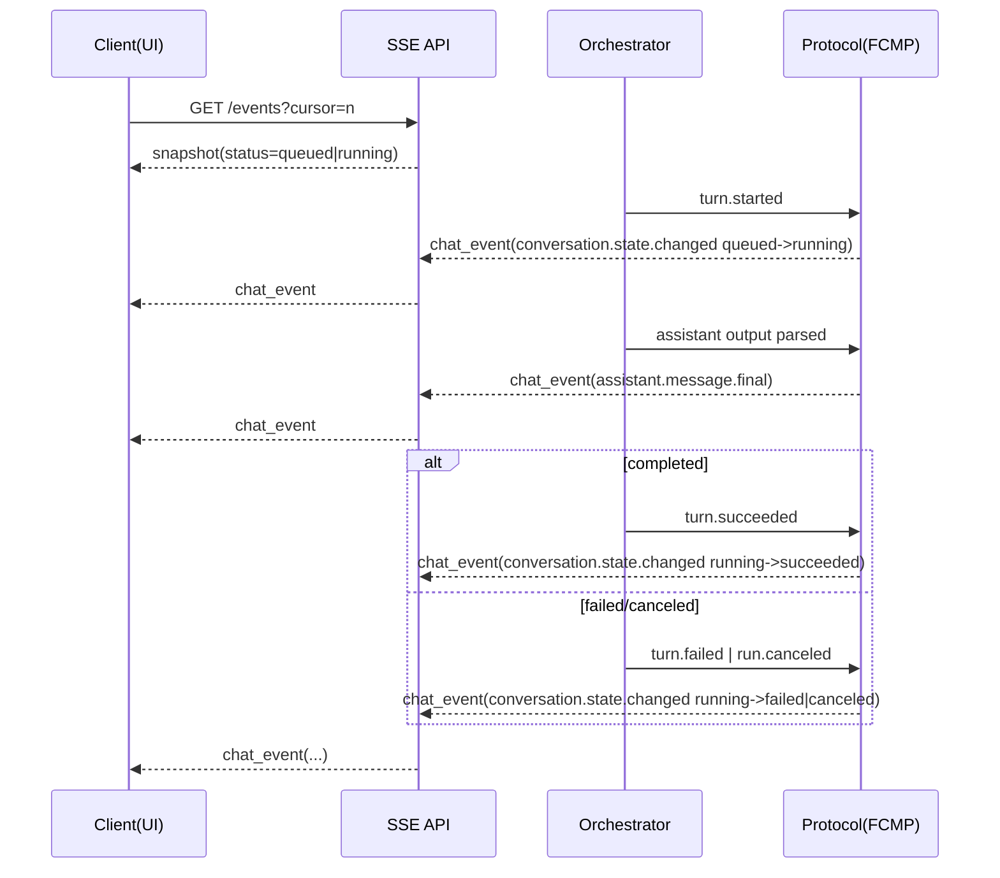
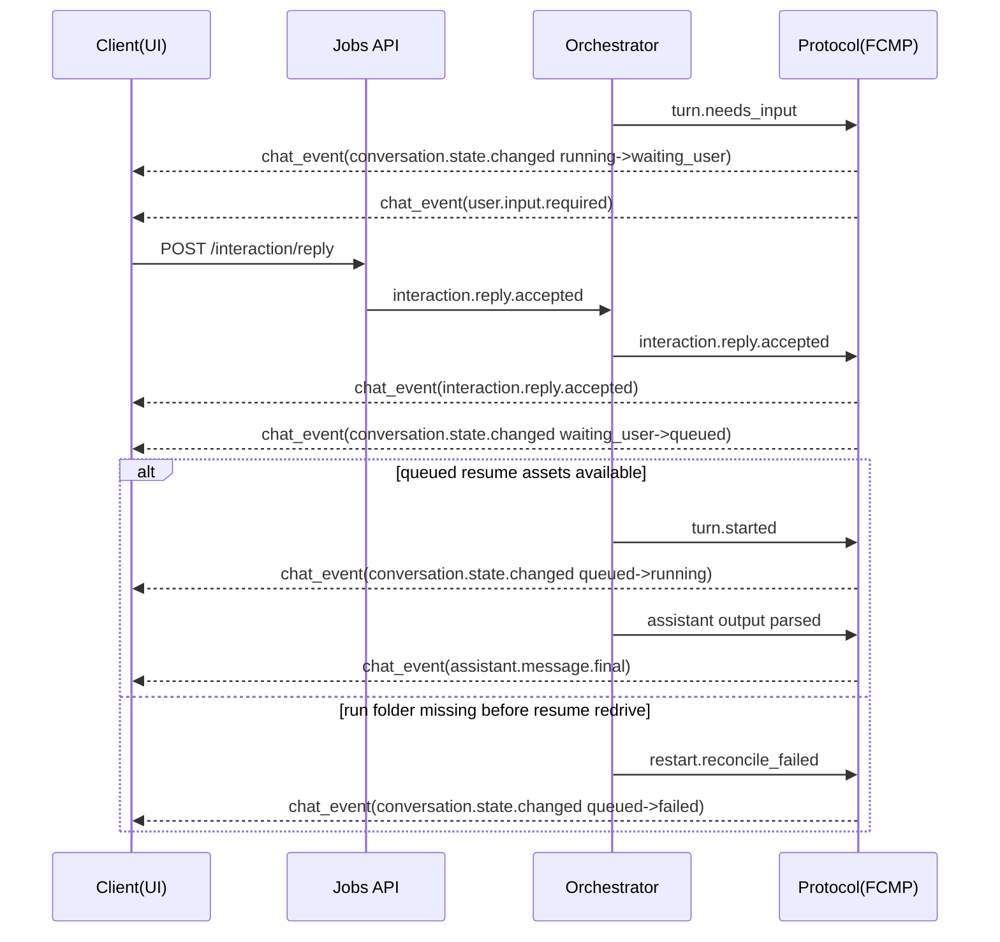
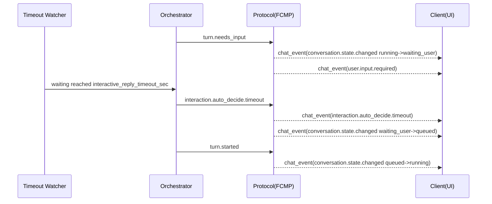
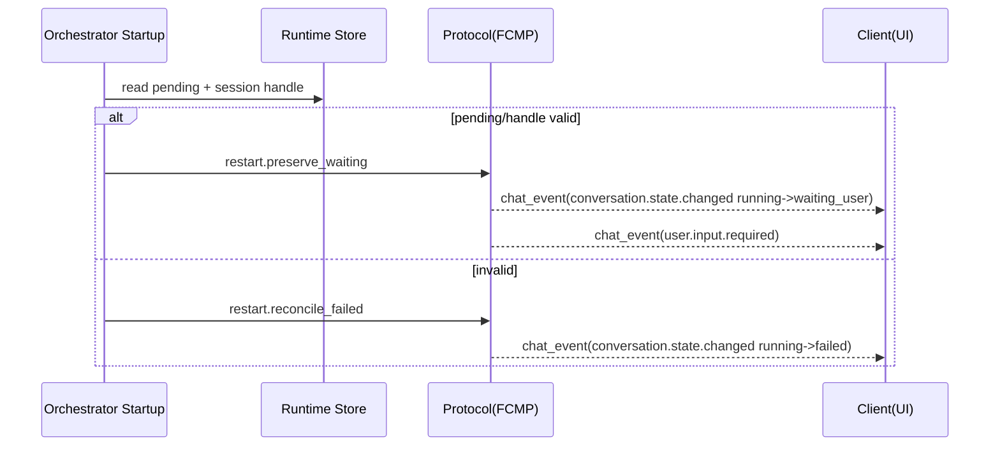
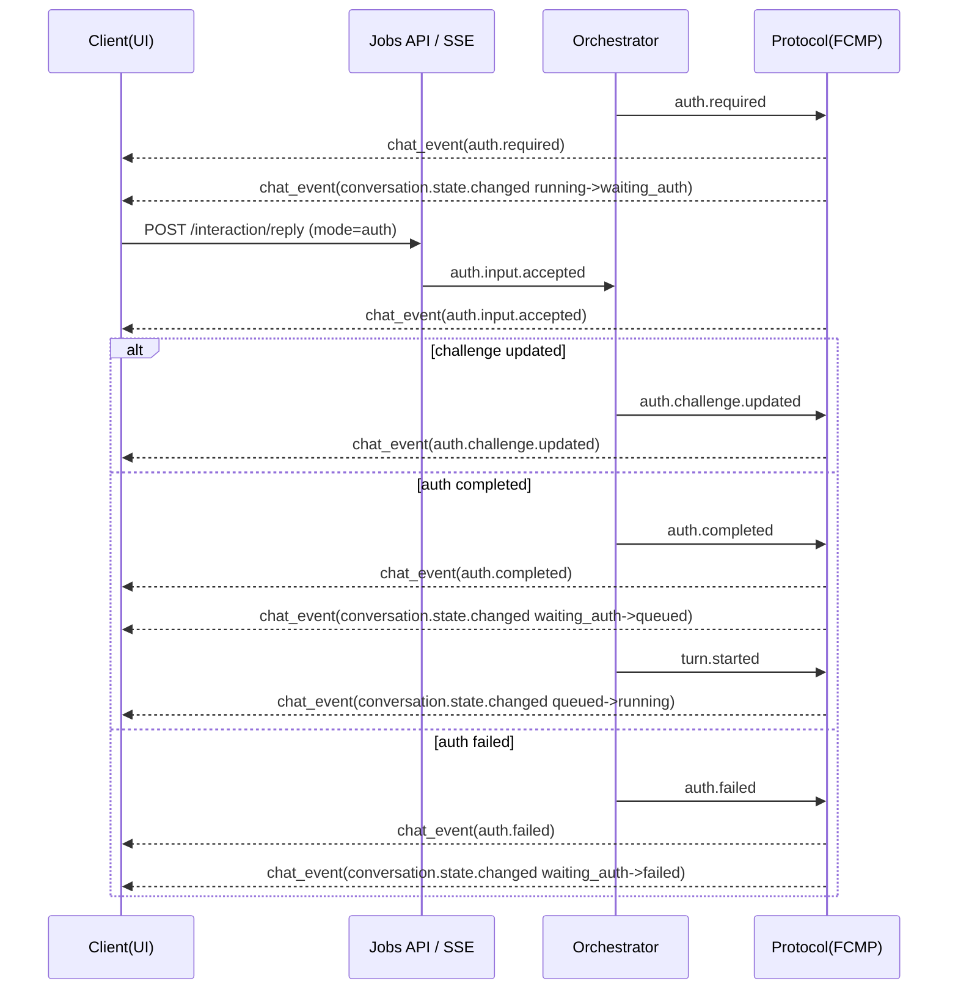
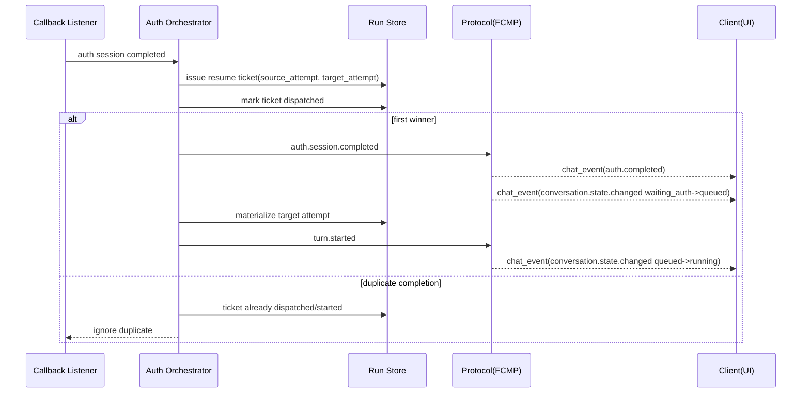
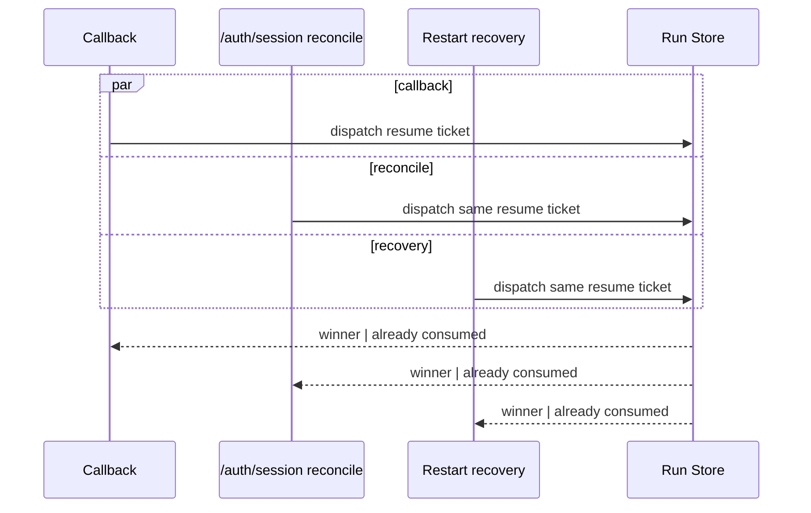
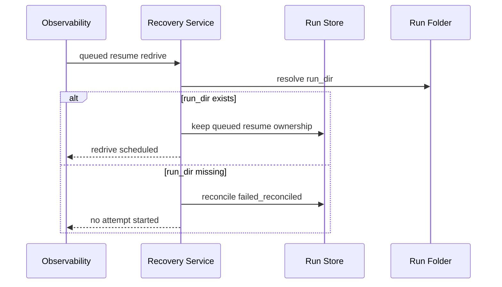
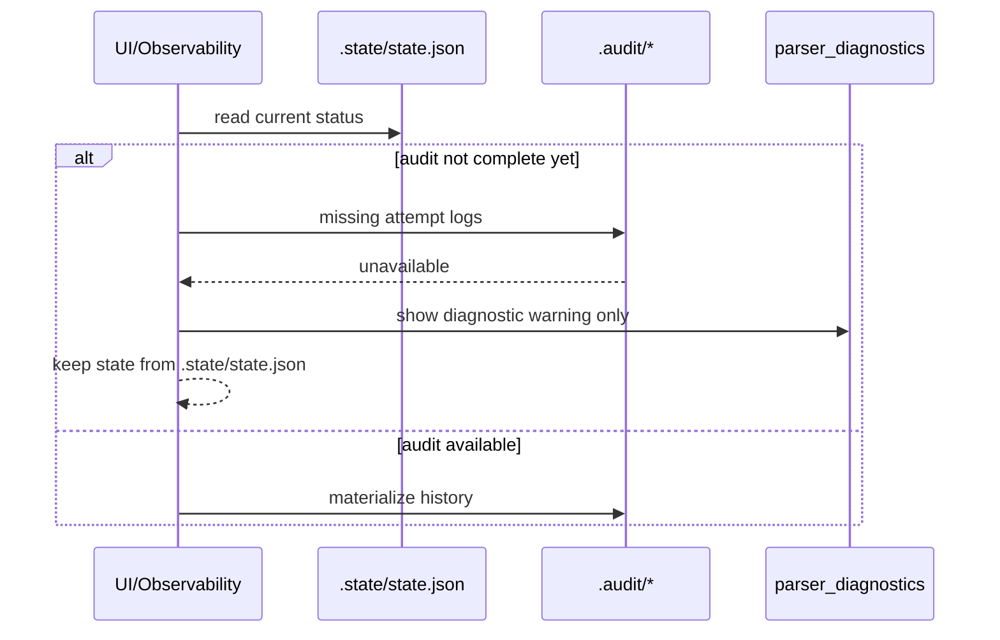
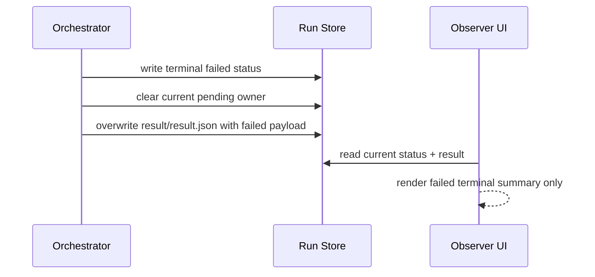

# Session Event Flow (FCMP Single-Stream SSOT)

本文档给出 FCMP 单流后的端到端事件时序图，作为 `docs/session_runtime_statechart_ssot.md` 的事件流视角补充。

补充说明：

- FCMP 仍是 runtime 协议与状态语义流。
- 聊天气泡的 live/history 重放已经收敛到独立的 canonical chat replay 通道。
- 因此前端聊天窗口不得直接从 FCMP 解释用户/助手/system 气泡，而应只消费 `/chat` 与 `/chat/history`。

## Live Publish Note

对活跃 run，FCMP 不再通过“先 materialize audit file，再读 history”的方式驱动 SSE。  
当前顺序是：

1. orchestration 或 live parser 生成语义事件
2. FCMP publisher 分配全局 `seq`
3. 事件写入 `FcmpLiveJournal`
4. SSE / history 从 live journal 消费
5. audit mirror 异步写入 `.audit/fcmp_events.<attempt>.jsonl`

因此 terminal final message、waiting_user prompt 以及其他近期事件，不应再因为 audit mirror 延迟而只能刷新后可见。

## 1) 主执行流（queued -> running -> terminal）

不变量锚点：`TR-01`、`TR-05`、`TR-06`、`TR-09`、`FM-01`、`FM-05`、`FM-06`、`FM-07`、`OR-01`。


```mermaid
sequenceDiagram
    participant C as Client(UI)
    participant API as SSE API
    participant O as Orchestrator
    participant P as Protocol(FCMP)

    C->>API: GET /events?cursor=n
    API-->>C: snapshot(status=queued|running)
    O->>P: turn.started
    P-->>API: chat_event(conversation.state.changed queued->running)
    API-->>C: chat_event
    O->>P: assistant output parsed
    P-->>API: chat_event(assistant.message.final)
    API-->>C: chat_event
    alt completed
      O->>P: turn.succeeded
      P-->>API: chat_event(conversation.state.changed running->succeeded)
    else failed/canceled
      O->>P: turn.failed | run.canceled
      P-->>API: chat_event(conversation.state.changed running->failed|canceled)
    end
    API-->>C: chat_event(...)
```

## 2) 交互回复流（waiting_user -> queued -> running|failed）

不变量锚点：`TR-02`、`TR-03`、`FM-02`、`FM-03`、`PE-01`、`OR-02`、`OR-04`、`OR-23`、`OR-24`。


```mermaid
sequenceDiagram
    participant C as Client(UI)
    participant API as Jobs API
    participant O as Orchestrator
    participant P as Protocol(FCMP)

    O->>P: turn.needs_input
    P-->>C: chat_event(conversation.state.changed running->waiting_user)
    P-->>C: chat_event(user.input.required)

    C->>API: POST /interaction/reply
    API->>O: interaction.reply.accepted
    O->>P: interaction.reply.accepted
    P-->>C: chat_event(interaction.reply.accepted)
    P-->>C: chat_event(conversation.state.changed waiting_user->queued)

    alt queued resume assets available
      O->>P: turn.started
      P-->>C: chat_event(conversation.state.changed queued->running)
      O->>P: assistant output parsed
      P-->>C: chat_event(assistant.message.final)
    else run folder missing before resume redrive
      O->>P: restart.reconcile_failed
      P-->>C: chat_event(conversation.state.changed queued->failed)
    end
```

## 3) strict=false 超时自动决策流

不变量锚点：`TR-02`、`TR-04`、`FM-02`、`FM-04`、`PE-02`、`OR-02`。


```mermaid
sequenceDiagram
    participant Timer as Timeout Watcher
    participant O as Orchestrator
    participant P as Protocol(FCMP)
    participant C as Client(UI)

    O->>P: turn.needs_input
    P-->>C: chat_event(conversation.state.changed running->waiting_user)
    P-->>C: chat_event(user.input.required)

    Timer->>O: waiting reached interactive_reply_timeout_sec
    O->>P: interaction.auto_decide.timeout
    P-->>C: chat_event(interaction.auto_decide.timeout)
    P-->>C: chat_event(conversation.state.changed waiting_user->queued)

    O->>P: turn.started
    P-->>C: chat_event(conversation.state.changed queued->running)
```

## 4) 重启恢复流（preserve / reconcile）

不变量锚点：`TR-10`、`TR-11`、`TR-12`、`TR-13`。


```mermaid
sequenceDiagram
    participant Boot as Orchestrator Startup
    participant Store as Runtime Store
    participant P as Protocol(FCMP)
    participant C as Client(UI)

    Boot->>Store: read pending + session handle
    alt pending/handle valid
      Boot->>P: restart.preserve_waiting
      P-->>C: chat_event(conversation.state.changed running->waiting_user)
      P-->>C: chat_event(user.input.required)
    else invalid
      Boot->>P: restart.reconcile_failed
      P-->>C: chat_event(conversation.state.changed running->failed)
    end
```

## 5) Statechart 映射说明

不变量锚点：`FM-01` ~ `FM-07`、`PE-01`、`PE-02`、`OR-03`、`OR-04`。

- `turn.started` -> `conversation.state.changed(... to=running)`
- `turn.needs_input` -> `conversation.state.changed(... to=waiting_user)` + `user.input.required`
- `interaction.reply.accepted` -> `interaction.reply.accepted` + `conversation.state.changed(waiting_user->queued)`
- `interaction.auto_decide.timeout` -> `interaction.auto_decide.timeout` + `conversation.state.changed(waiting_user->queued)`
- `turn.succeeded` -> terminal `conversation.state.changed(... to=succeeded, data.terminal.status=succeeded)`
- `turn.failed` / `run.canceled` -> terminal `conversation.state.changed(... to=failed|canceled, data.terminal.status=failed|canceled)`
- interactive 回合在命中 `<ASK_USER_YAML>` 或其他 ask-user 证据时，必须先走 `turn.needs_input`，不得被 soft completion 绕过
- interactive soft completion 仅在无 ask-user 证据、structured output 提取成功且 schema/artifact 校验通过时成立
- interactive 若提取到 JSON 但 schema 无效，仍走 `turn.needs_input` 而不是 `turn.failed`
- failed/canceled terminal SHOULD 在 `data.terminal.error.code/message` 中携带错误摘要（message 为长度受控摘要）。
- 过程语义映射：`agent.reasoning/tool_call/command_execution` 必须映射为 `assistant.reasoning/tool_call/command_execution`。
- `agent.turn_start/agent.turn_complete` 仅属于 RASP 审计层，不映射到 FCMP（FCMP 不允许 `assistant.turn_*`）。
- `agent.turn_complete.data` 允许承载结构化统计信息，但该数据不参与 FCMP 状态机映射。
- `lifecycle.run_handle` 仅属于 RASP 审计层，用于承载 run 句柄（`data.handle_id`），不映射到 FCMP/chat。
- 同一 `message_id` 的收敛顺序固定为 `assistant.message.promoted -> assistant.message.final`。

## 6) 会话中鉴权流（waiting_auth -> queued -> running）

不变量锚点：`TR-03` ~ `TR-07`、`FM-03` ~ `FM-05`、`PE-01`。


```mermaid
sequenceDiagram
    participant C as Client(UI)
    participant API as Jobs API / SSE
    participant O as Orchestrator
    participant P as Protocol(FCMP)

    O->>P: auth.required
    P-->>C: chat_event(auth.required)
    P-->>C: chat_event(conversation.state.changed running->waiting_auth)

    C->>API: POST /interaction/reply (mode=auth)
    API->>O: auth.input.accepted
    P-->>C: chat_event(auth.input.accepted)

    alt challenge updated
      O->>P: auth.challenge.updated
      P-->>C: chat_event(auth.challenge.updated)
    else auth completed
      O->>P: auth.completed
      P-->>C: chat_event(auth.completed)
      P-->>C: chat_event(conversation.state.changed waiting_auth->queued)
      O->>P: turn.started
      P-->>C: chat_event(conversation.state.changed queued->running)
    else auth failed
      O->>P: auth.failed
      P-->>C: chat_event(auth.failed)
      P-->>C: chat_event(conversation.state.changed waiting_auth->failed)
    end
```

补充约束：

- 多方式鉴权时，`auth.method.selection.required` 必须先于依赖该选择的 `auth.challenge.updated`
- 单方式鉴权时，不存在 `method_selection` 步骤，challenge 可直接进入 `challenge_active`
- 单方式若命中 `auth session already active`，系统必须重投影现有 challenge，不得再向客户端暴露“选择鉴权方式”
- `auth.completed` 只允许来自 canonical auth completion；credential readiness / `auth_ready` / busy / challenge update 都不得触发 `waiting_auth -> queued`

## 7) callback 自动完成流（winner-only resume）

不变量锚点：`TR-06`、`FM-04`、`PE-01`、`OR-06`、`OR-07`、`OR-08`、`OR-13`。


```mermaid
sequenceDiagram
    participant CB as Callback Listener
    participant O as Auth Orchestrator
    participant Store as Run Store
    participant P as Protocol(FCMP)
    participant C as Client(UI)

    CB->>O: auth session completed
    O->>Store: issue resume ticket(source_attempt, target_attempt)
    O->>Store: mark ticket dispatched
    alt first winner
      O->>P: auth.session.completed
      P-->>C: chat_event(auth.completed)
      P-->>C: chat_event(conversation.state.changed waiting_auth->queued)
      O->>Store: materialize target attempt
      O->>P: turn.started
      P-->>C: chat_event(conversation.state.changed queued->running)
    else duplicate completion
      O->>Store: ticket already dispatched/started
      O-->>CB: ignore duplicate
    end
```

## 8) callback / reconcile / recovery 竞争流

不变量锚点：`OR-06`、`OR-07`、`OR-08`、`OR-13`。


```mermaid
sequenceDiagram
    participant CB as Callback
    participant API as /auth/session reconcile
    participant Boot as Restart recovery
    participant Store as Run Store

    par callback
      CB->>Store: dispatch resume ticket
    and reconcile
      API->>Store: dispatch same resume ticket
    and recovery
      Boot->>Store: dispatch same resume ticket
    end

    Store-->>CB: winner | already consumed
    Store-->>API: winner | already consumed
    Store-->>Boot: winner | already consumed
```

## 8.1) queued redrive 资产守卫

不变量锚点：`OR-23`、`OR-24`、`OR-25`。


```mermaid
sequenceDiagram
    participant Obs as Observability
    participant Recovery as Recovery Service
    participant Store as Run Store
    participant FS as Run Folder

    Obs->>Recovery: queued resume redrive
    Recovery->>FS: resolve run_dir
    alt run_dir exists
      Recovery->>Store: keep queued resume ownership
      Recovery-->>Obs: redrive scheduled
    else run_dir missing
      Recovery->>Store: reconcile failed_reconciled
      Recovery-->>Obs: no attempt started
    end
```

## 9) waiting_user 恢复流（attempt-scoped interaction）

不变量锚点：`TR-08`、`TR-09`、`FM-06`、`FM-07`、`PE-02`、`PE-03`、`OR-08`、`OR-10`、`OR-11`。

```mermaid
sequenceDiagram
    participant C as Client(UI)
    participant API as Jobs API
    participant O as Orchestrator
    participant Store as Run Store
    participant P as Protocol(FCMP)

## 10) create -> dispatch -> worker claim -> running

```mermaid
sequenceDiagram
    participant API as Create Run API
    participant State as Run State Service
    participant Queue as Concurrency / Dispatch
    participant Worker as Job Worker
    participant Audit as Audit Contract Service

    API->>State: write .state/state.json(status=queued)
    API->>State: write .state/dispatch.json(phase=created)
    Queue->>State: advance dispatch phase -> admitted
    Queue->>State: advance dispatch phase -> dispatch_scheduled
    Worker->>State: claim dispatch -> worker_claimed
    Worker->>State: advance dispatch phase -> attempt_materializing
    Worker->>Audit: initialize attempt audit skeleton
    Worker->>State: transition queued -> running
```

## 11) projection-first while audit lags


```mermaid
sequenceDiagram
    participant UI as UI/Observability
    participant State as .state/state.json
    participant Audit as .audit/*
    participant Diag as parser_diagnostics

    UI->>State: read current status
    alt audit not complete yet
      UI->>Audit: missing attempt logs
      Audit-->>UI: unavailable
      UI->>Diag: show diagnostic warning only
      UI-->>UI: keep state from .state/state.json
    else audit available
      UI->>Audit: materialize history
    end
```

    C->>API: POST /interaction/reply
    API->>Store: issue resume ticket(source_attempt, target_attempt)
    API->>Store: dispatch ticket
    O->>P: interaction.reply.accepted
    P-->>C: chat_event(interaction.reply.accepted)
    P-->>C: chat_event(conversation.state.changed waiting_user->queued)
    O->>Store: materialize target attempt
    O->>P: turn.started
    P-->>C: chat_event(conversation.state.changed queued->running)
```

## 10) terminal failed 覆盖 stale waiting 结果

不变量锚点：`OR-10`、`OR-12`。


```mermaid
sequenceDiagram
    participant O as Orchestrator
    participant Store as Run Store
    participant UI as Observer UI

    O->>Store: write terminal failed status
    O->>Store: clear current pending owner
    O->>Store: overwrite result/result.json with failed payload
    UI->>Store: read current status + result
    UI-->>UI: render failed terminal summary only
```

## 11) 模式 / 客户端能力矩阵

- `session + auto + auth`
  `running -> waiting_auth -> queued -> running`
- `session + interactive + user reply`
  `running -> waiting_user -> queued -> running`
- `non_session + interactive-only skill`
  create-run 先归一化为 `interactive_auto_reply=true` 且 `interactive_reply_timeout_sec=0`
  不得形成真实 `waiting_user`
- `non_session + auth`
  不得进入 `waiting_auth`
  必须直接走 fail-fast 终态

补充约束：

- `waiting_user -> queued` 与 `waiting_auth -> queued` 只更新 current projection，不写 terminal `result/result.json`
- `result/result.json` 只在 terminal 路径写入
- UI 当前状态必须从 current projection + FCMP 增量读取，不得从旧 waiting result 快照反推
