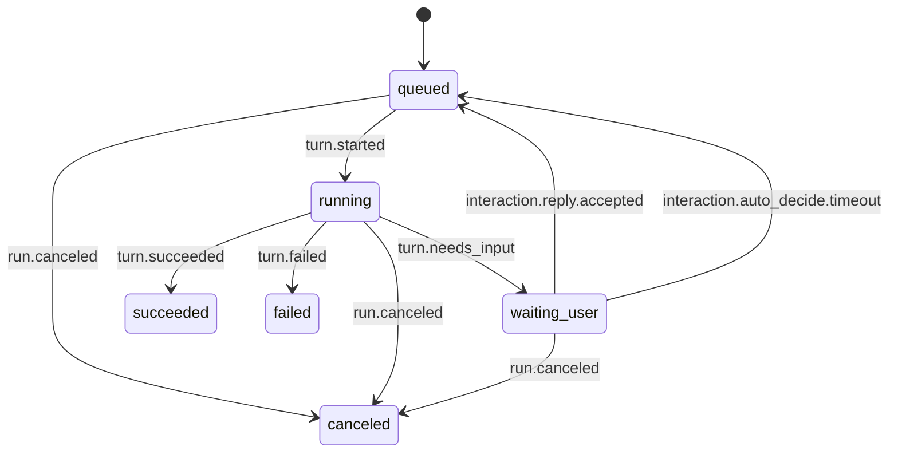
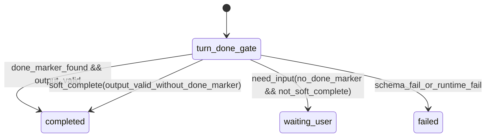
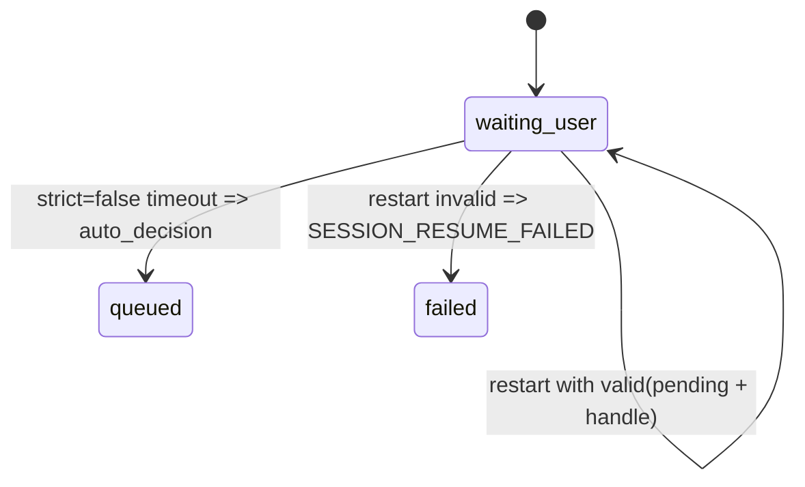

# Session Runtime Statechart SSOT

## 1. Scope

本文档定义 Session 运行时的唯一状态机（SSOT），用于约束 `interactive` 与 `auto` 的统一编排语义。

- 核心范式：单一可恢复（single resumable）
- `auto`：`interactive` 的受限子集（不进入 `waiting_user` 交互闭环）
- 状态机实现锚点：`server/services/session_statechart.py`

## 2. Layer A: Run Lifecycle Main Chart

## 3. Layer B: Turn Decision Subchart

决策优先级：

1. `done-marker` 强证据
2. `soft-complete`（无 marker 但 schema 通过）
3. `need-input`（进入 `waiting_user`）
4. `schema/runtime` 失败

## 4. Layer C: Timeout and Recovery Subchart

约束：

- `strict=true`：超时不自动失败，持续等待用户回复或显式取消
- `strict=false`：超时触发自动决策并走统一 resume 路径（`waiting_user -> queued`）

## 5. Canonical States / Events / Guards / Actions

来源：`server/services/session_statechart.py`

- States: `queued`, `running`, `waiting_user`, `succeeded`, `failed`, `canceled`
- Events:
  - `turn.started`
  - `turn.needs_input`
  - `interaction.reply.accepted`
  - `interaction.auto_decide.timeout`
  - `turn.succeeded`
  - `turn.failed`
  - `run.canceled`
  - `restart.preserve_waiting`
  - `restart.reconcile_failed`
- Guards:
  - `interactive_require_user_reply == false`（可触发 auto decision）
  - `has_pending_interaction && has_valid_handle`（可保留 waiting）
- Actions:
  - `acquire_slot`
  - `persist_pending`
  - `requeue_resume_turn`
  - `requeue_auto_resume_turn`

## 6. Auto as Interactive Subset

- `auto` 沿用同一运行时状态机，但通常直接 `queued -> running -> terminal`
- `auto` 不依赖 `waiting_user` 回答环
- 当启用自动决策分支时，`interactive` 与 `auto` 共用 `queued` 恢复入口

## 7. Legacy Mapping Appendix

### 7.1 Legacy -> Canonical Mapping

- `resumable waiting` -> `waiting_user`（保留）
- `sticky_process waiting` -> `waiting_user`（语义删除，仅保留 canonical 名）
- `resume reply direct running` -> `interaction.reply.accepted -> queued`
- `timeout watchdog inject` -> `interaction.auto_decide.timeout -> queued`

### 7.2 Removed Items

- `sticky_process` 档位语义
- `process-binding` / `slot-hold` / `wait_deadline_at` 专属路径
- `interactive_profile.kind` 外露与控制分支
- 错误码：
  - `INTERACTION_WAIT_TIMEOUT`
  - `INTERACTION_PROCESS_LOST`

## 8. Canonical Invariants

为避免状态机文档与测试漂移，当前 canonical 不变量已收敛为机器可读合同文件：

- `docs/contracts/session_fcmp_invariants.yaml`

该合同覆盖：

1. `canonical` 状态集合与初始/终态定义。
2. `transitions` 状态机转移（与 `server/services/session_statechart.py` 对齐）。
3. `fcmp_mapping`（状态迁移到 FCMP 事件的映射、配对规则）。
4. `ordering_rules`（终态唯一性、waiting_user 输入配对、`seq` 连续递增）。

测试锚点：

- `tests/unit/test_session_invariant_contract.py`
- `tests/unit/test_session_state_model_properties.py`
- `tests/unit/test_fcmp_mapping_properties.py`
