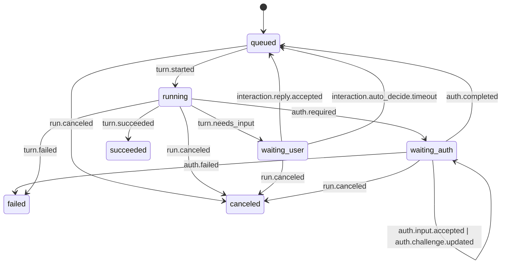
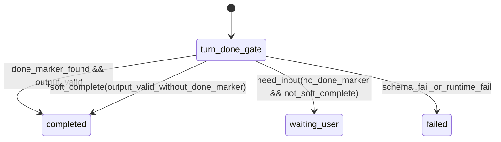
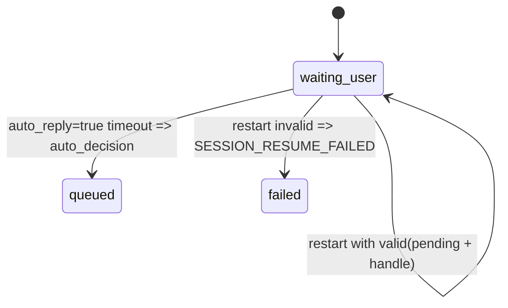
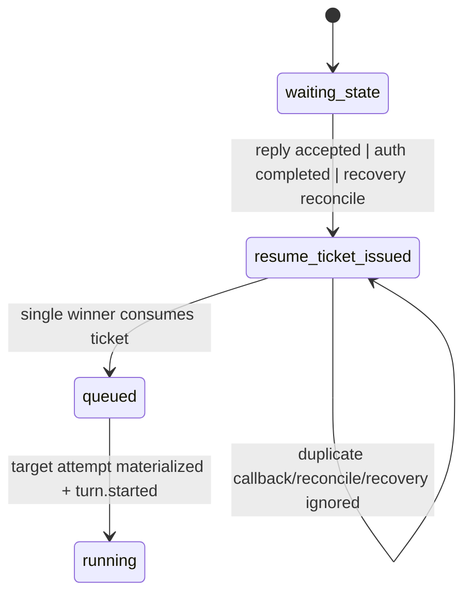
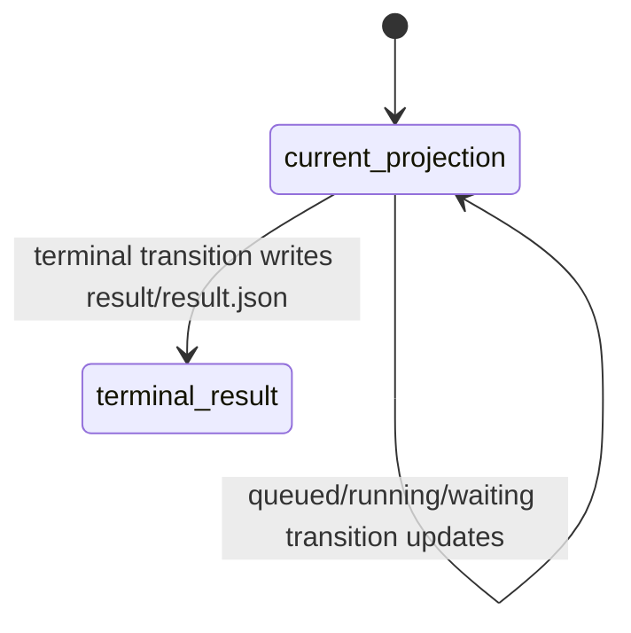

# Session Runtime Statechart SSOT

## 1. Scope

本文档定义 Session 运行时的唯一状态机（SSOT），用于约束 `interactive` 与 `auto` 的统一编排语义。

- 核心范式：单一可恢复（single resumable）
- `execution_mode` 与 `client_metadata.conversation_mode` 是两个正交维度
- `waiting_auth` 只由 `conversation_mode=session` 决定，可覆盖 `auto` 与 `interactive`
- `waiting_user` 只对 `conversation_mode=session` 的 `interactive` 生效
- 状态机实现锚点：`server/runtime/session/statechart.py`

## 2. Layer A: Run Lifecycle Main Chart

```mermaid
stateDiagram-v2
    [*] --> queued
    queued --> running: turn.started
    running --> waiting_user: turn.needs_input
    running --> waiting_auth: auth.required
    waiting_user --> queued: interaction.reply.accepted
    waiting_user --> queued: interaction.auto_decide.timeout
    waiting_auth --> waiting_auth: auth.input.accepted | auth.challenge.updated
    waiting_auth --> queued: auth.completed
    waiting_auth --> failed: auth.failed
    running --> succeeded: turn.succeeded
    running --> failed: turn.failed
    queued --> canceled: run.canceled
    running --> canceled: run.canceled
    waiting_user --> canceled: run.canceled
    waiting_auth --> canceled: run.canceled
```

## 3. Layer B: Turn Decision Subchart

```mermaid
stateDiagram-v2
    [*] --> turn_done_gate
    turn_done_gate --> completed: done_marker_found && output_valid
    turn_done_gate --> completed: soft_complete(output_valid_without_done_marker)
    turn_done_gate --> waiting_user: need_input(no_done_marker && not_soft_complete)
    turn_done_gate --> failed: schema_fail_or_runtime_fail
```

决策优先级：

1. `done-marker` 强证据
2. `soft-complete`（无 marker 但 schema 通过）
3. `auth-required`（进入 `waiting_auth`）
4. `need-input`（进入 `waiting_user`）
5. `schema/runtime` 失败

## 4. Layer C: Timeout and Recovery Subchart

```mermaid
stateDiagram-v2
    [*] --> waiting_user
    waiting_user --> waiting_user: auto_reply=false (interactive_auto_reply=false)
    waiting_user --> queued: auto_reply=true timeout => auto_decision
    waiting_user --> waiting_user: restart with valid(pending + handle)
    waiting_user --> failed: restart invalid => SESSION_RESUME_FAILED
```

约束：

- `auto_reply=false`：超时不自动继续，持续等待用户回复或显式取消
- `auto_reply=true`：超时触发自动决策并走统一 resume 路径（`waiting_user -> queued`）

## 5. Layer D: Resume / Ownership Subchart

```mermaid
stateDiagram-v2
    [*] --> waiting_state
    waiting_state --> resume_ticket_issued: reply accepted | auth completed | recovery reconcile
    resume_ticket_issued --> queued: single winner consumes ticket
    queued --> running: target attempt materialized + turn.started
    resume_ticket_issued --> resume_ticket_issued: duplicate callback/reconcile/recovery ignored
```

约束：

- `waiting_auth -> queued` 与 `waiting_user -> queued` 表示 resume ticket 已创建并被唯一 winner 消费
- `queued -> running` 表示新 attempt 已 materialize；callback 完成本身不等价于 started
- `pending_auth_method_selection` 与 `pending_auth` 是 `waiting_auth` 的互斥 read-model，不允许并存为两个当前 owner
- `waiting_user` 与 `waiting_auth` 都必须满足 single-owner / single-resume-winner
- `waiting_auth -> queued` 的唯一合法触发是 canonical `auth.completed`
- `auth.completed` 的唯一合法来源是 auth session terminal success 或显式 callback/submission completion
- `waiting_auth` 内部必须区分两条子路径：
  - 多方式：`method_selection -> challenge_active`
  - 单方式：直接 `challenge_active`
- 单方式鉴权若命中 `auth session already active`，系统必须恢复或重投影现有 `challenge_active`，不得降级成 `method_selection`
- `auth_ready` 为 retired semantics，不得再用来驱动 resume 或 state transition

## 6. Layer E: Current Projection Subchart

```mermaid
stateDiagram-v2
    [*] --> current_projection
    current_projection --> current_projection: queued/running/waiting transition updates
    current_projection --> terminal_result: terminal transition writes result/result.json
```

约束：

- `.state/state.json` 是 current truth 的唯一文件化投影
- `.state/dispatch.json` 是 dispatch truth 的唯一文件化投影
- `result/result.json` 不属于 waiting/running current projection 层
- waiting payload 内嵌于 `.state/state.json.pending`
- `pending_*`、`status.json`、`current/projection.json` 均视为 legacy，不再属于 canonical state contract

## 7. Canonical States / Events / Guards / Actions

来源：`server/runtime/session/statechart.py`

- States: `queued`, `running`, `waiting_user`, `waiting_auth`, `succeeded`, `failed`, `canceled`
- Events:
  - `turn.started`
  - `turn.needs_input`
  - `auth.required`
  - `auth.input.accepted`
  - `auth.challenge.updated`
  - `auth.completed`
  - `auth.failed`
  - `interaction.reply.accepted`
  - `interaction.auto_decide.timeout`
  - `turn.succeeded`
  - `turn.failed`
  - `run.canceled`
  - `restart.preserve_waiting`
  - `restart.reconcile_failed`
- Guards:
  - `interactive_auto_reply == true`（可触发 auto decision）
  - `has_pending_interaction && has_valid_handle`（可保留 waiting）
- Actions:
  - `acquire_slot`
  - `persist_pending`
  - `persist_pending_auth`
  - `process_auth_input`
  - `requeue_auth_resume_turn`
  - `requeue_resume_turn`
  - `requeue_auto_resume_turn`
  - `issue_resume_ticket`
  - `consume_resume_ticket`
  - `materialize_target_attempt`

## 8. Mode / Capability Applicability Matrix

- `session + auto`
  `waiting_auth=yes`, `waiting_user=no`
- `session + interactive`
  `waiting_auth=yes`, `waiting_user=yes`
- `non_session + auto`
  `waiting_auth=no`, `waiting_user=no`
- `non_session + interactive`
  `waiting_auth=no`, `waiting_user=no(real)`, `interactive_auto_reply=true`, `interactive_reply_timeout_sec=0`

约束：

- `conversation_mode=session` 是进入 `waiting_auth` 的唯一前提
- `conversation_mode=non_session` 命中鉴权时必须走 fail-fast，而不是进入 `waiting_auth`
- 非会话客户端若最终落到 `interactive` 执行，只能以零秒 auto-reply 的伪 interactive 方式运行
- 客户端是否具备会话能力必须来自 `client_metadata.conversation_mode`，不得从 `execution_mode` 反推

## 9. Legacy Mapping Appendix

### 7.1 Legacy -> Canonical Mapping

- `resumable waiting` -> `waiting_user`（保留）
- `auth challenge waiting` -> `waiting_auth`（新增）
- `sticky_process waiting` -> `waiting_user`（语义删除，仅保留 canonical 名）
- `resume reply direct running` -> `interaction.reply.accepted -> queued`
- `timeout watchdog inject` -> `interaction.auto_decide.timeout -> queued`

### 7.2 Removed Items

- `sticky_process` 档位语义
- `process-binding` / `slot-hold` / `wait_deadline_at` 专属路径
- `interactive_profile.kind` 外露与控制分支
- 错误码：
  - `INTERACTION_WAIT_TIMEOUT`
  - `INTERACTION_PROCESS_LOST`

## 10. Canonical Invariants

为避免状态机文档与测试漂移，当前 canonical 不变量已收敛为机器可读合同文件：

- `docs/contracts/session_fcmp_invariants.yaml`

该合同覆盖：

1. `canonical` 状态集合与初始/终态定义。
2. `transitions` 状态机转移（与 `server/runtime/session/statechart.py` 对齐）。
3. `fcmp_mapping`（状态迁移到 FCMP 事件的映射、配对规则）。
4. `ordering_rules`（终态唯一性、resume 单次消费、attempt 单调、pending/history/result 一致性、`seq` 连续递增、续跑 reply 先于 assistant 输出）。

测试锚点：

- `tests/unit/test_session_invariant_contract.py`
- `tests/unit/test_session_state_model_properties.py`
- `tests/unit/test_fcmp_mapping_properties.py`

## 11. Layer F: Dispatch Subchart

`queued` 内部新增 durable dispatch phase：

- `created`
- `admitted`
- `dispatch_scheduled`
- `worker_claimed`
- `attempt_materializing`

这些 phase 不属于新的 top-level state，而是 `queued` 的内部 lifecycle。

约束：

- create-run 后必须立刻持久化 dispatch phase
- `worker_claimed` 必须先于 `turn.started`
- `attempt_materializing` 必须先于 attempt 审计骨架初始化完成

## 12. Layer G: State File Ownership Layer

current truth 与 history truth 必须分层：

- `.state/state.json`
  唯一 current truth
- `.state/dispatch.json`
  唯一 dispatch truth
- `result/result.json`
  terminal-only
- `.audit/*`
  attempt-scoped history-only

因此：

- waiting payload 必须嵌入 `.state/state.json.pending`
- `result/result.json` 不再表示 waiting/running/queued
- `.audit/parser_diagnostics.*.jsonl` 只表示 diagnostics，不能覆盖 current state
